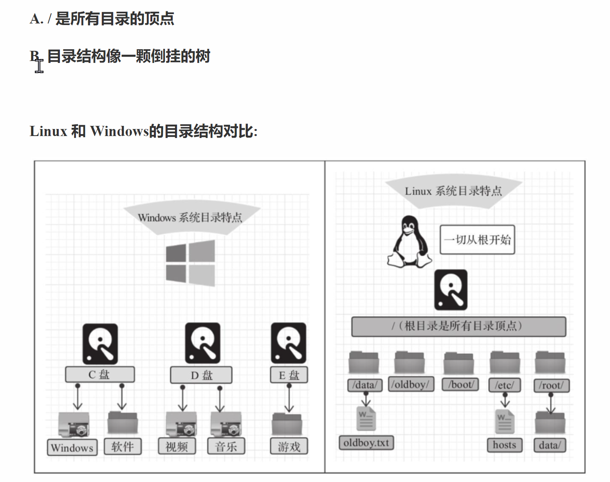

linux目录的结构




根目录下各个目录的作用和含义说明

目录-含义

/bin		存放二进制可执行文件

/boot	存放系统引导时使用的各种文件

/dev		存放设备文件

/etc		存放系统文件

/home	存放系统用户的文件（普通用户的存储信息位置）

/lib		存放程序运行所需的共享库和内核模块

/opt		额外安装的可选应用程序包所放置的位置

/root		超级用户目录

/sbin	存放二进制可执行文件，只有root用户才能访问

/tmp		存放临时文件

/usr		存放系统应用程序

/var		存放运行时需要改变数据的文件，例如日志文件

主要的常用命令

命令-对应英文-错用

ls[目录名]		list	查看当前目录下的内容

pws		print work directory		查看当前所在目录

cd[目录名]	change directory	切换目录

touch[文件名]	touch	如果文件不存在，创建文件

mkdir[目录名]	make directory	创建目录

rm[文件名]	remove	删除指定文件

另外用到删除目录

删除空目录

```bash
rmdir 目录名
```

删除非空目录

```bash
rm -r 目录名
```

cd ../..	..的意思是找爹。这里是找两个爹

注意在linux中文件是没后缀名的。比如1.txt的可以知道这是一个文本文件，而如果在linux中1.txt就只是个见名之意的文件名

注意：删除文件时的提示信息显示为乱码


需要修改linux的编码

```bash

#注意这里的etc是根目录下（\）的存放系统文件的目录，所以需要回到/（根目录）下去操作
# 1.把LANG="en_us.UTF-8"的配置追加到etc/profile配置文件:
	echo 'LANG="en_US.UTF-8"' >> /etc/profile
	说明：echo表示输出的意思
# 2.追加完后重新加载etc/profile
	source /etc/profile
```

linux命令使用的技巧

1. Tab键自动补全

1. 连续两次Tab键，给出操作提示

1. 使用上下箭头快速调出使用的命令

1. 使用clear清空屏幕

linux命令的格式

```bash
command [-options] [parameter]
说明:
        command：命令名
        [-options]: 选项，可用来对命令进行控制，也可以省略
        [parameter]: 传命令的参数，可以是零个、一个或多个
注意：
    []    代表可选
    命令名、选项、参数之间有空格进行分隔
```

文件目录操作命令

```bash
ls
作用：显示指定目录下的内容list
语法：ls [-al]  [dir]
说明：
    -a 显示所有文件及目录(. 开头的隐藏文件也会列出)-all
    -l 除了文件名外，同时将文件的形态（d表示目录，-表示文件，l表示软件连的文件、权限、拥有者、文件大小等详细信息列出）
    
注意：
    由于我们使用的ls命令时经常要加入-l选项，所以linux为ls -lmingl提供了一种简写方式，即ll

常见用法
    ls -al 查看当前目录的所有文件及目录详细信息
    ls -al/etc    查看/etc目录下所有文件及目录详细信息
    ll    查看当前目录文件及目录的相信信息
```

ls列出指定目录下的文件和文件夹（掌握）

```bash
ls   list列出当前目录的所有内容
ls -a  列出当前目录下的所有内容，包括隐藏的。隐藏的以.开始
ls -l  查看当前目录的详细信息
ls -al 指定目录： 查看指定目录下的所有文件的详细信息
ll  使用ls -l的简写
```

```bash
rm -f 1.log 1.conf #删除1.log 1.conf文件
```

cd  change directory

```bash
作用：用于切换当前工作目录，即进入指定目录
语法：cd [dirName]

特殊说明：
    ~    表示用户的home目录
         如果当前用户是root，则切换到root用户下，普通用户则切换到home目录下
    .    表示目前所在的目录
    ..   表示目前所在目录位置的上级目录

举例：
    cd ..    切换到当前目录的上级牡蛎
    cd ~     切换到用户的home牡蛎
    cd /usr/local    切换到/usr/local目录
    
备注：
    用户的home目录对应关系
    root用户    /root
    其他用户    /home/xxx
```

cat

```bash
作用：用于显示文件内容
特点：一次性全量查看文件内容
使用场景：一般用在小文件读取的场景（大文件不适用）
语法：cat [-n] fileName

说明：
    -n ： 由1开始对所有输出的行数编号（显示行号-number）

举例：
    cat /etc/profile    查看/etc目录下的profile文件内容
    cat -n /etc/profile
```

注意：cat指令会一次性查看文件的所有内容，如果文件比较多，这个时候查起来就不方便，此时用more指令

more

```bash
作用：以分页的形式显示文件的内容
语法：more fileName
特点：独占一个命令终端窗口。适合读取大的文件内容并按百分比显示
使用场景：读取一些大文件，且从头开始读取的场景
操作说明：
    回车键    向下滚动一行
    空格键    向下滚动一屏
    b         返回上一屏
    q或者Ctrl+C    退出more
    
举例
    more /etc/profile    以分页的方式显示/etc目录下的profile文件内容
```

tail

```bash
作用：查看文件末尾的内容
语法：tail [-f] fileName
使用场景：   可以实施查看文件末尾的动态变化，方便实时追踪
说明：   
    -f ： 实时的动态读取文件末尾内容并显示，通常用于日志文件的内容输出

举例：
    tail /etc/protile  显示/etc目录下的profile文件末尾10行内容
    tail  -20 /etc/protile  显示/etc目录下的profile文件末尾20行内容
    tail -f /itcast/my.log 动态读取/itcast目录下的my.log文件末尾内容并显示
            一旦使用了-f后，命令会独占一个终端窗口; 使用ctrl + c退出
```

mkdir

```bash
作用：创建目录
语法：mkdir [-p] dirName

说明：
    -p: 确保目录名称存在，不存在就创建一个。通过此项，可以实现多层目录的同时创建

举例：
    mkdir itcast    在当前目录下，建立一个名为itcast的子目录
    mkdir -p itcast/test     在工作目录下的itcast目录中建立一个名为test的子目录，若itcast不存在，则建立一个
```

rmdir

```bash
作用：删除空目录（remove directory）
语法：rmdir [-p] dirName

说明：
    -p : 当子目录被删除后使父目录为空目录的话，则一并删除
         反之，如果父目录不为空，则不删除

举例：
    rmdir itcast  删除名为itcast的空目录
    rmdir -p itcast/test  删除itcast目录中名为test的子目录，若test目录删除后itcast目录变为空目录，则也会删除
    rmdir itcast* 删除名称以itcast开始的空目录
```

rm

```bash
作用：删除文件或者目录
语法：rm [-rf] name

说明：
    -r : 将目录及目录中所有文件(目录)逐一删除，即递归删除（逐一确认）
    -f : 无需确认，直接删除(force)

举例：
    rm -r itcast/     删除名为itcast的目录和目录中的所有文件，删除前需要确认
    rm -rf itcast/    无需确认，直接删除名为itcast的目录的目录中的所有文件
                        可删除一切的目录和文件，无需确认
    rm -f hello.txt    无需确认，直接删除hello.txt文件
    rm -rf *.log     删除当前路径下以log结尾的目录或者文件目录
```

拷贝移动命令

cp

```bash
作用：用于复制文件或目录
语法：cp [-r] source dest
    -r ：表示对目录递归复制
    source：源文件/目录
    dest：目的地
说明：
    -r ：如果复制的是目录需要使用该选项，此时将目录复制到该目录下所有的子目录和文件

举例：
    cp hello.txt itcast/    将hello.txt复制到itcast目录中
    cp hello.txt ./hi.txt    将hello.txt复制到当前目录，并改名为hi.txt
    cp -r itcast/ ./itheima/ 将itcast目录和目录下的所有文件复制到itheima目录下
    cp -r itcast/* ./itheima/  将itcast目录下所有文件复制到itheima目录下
```