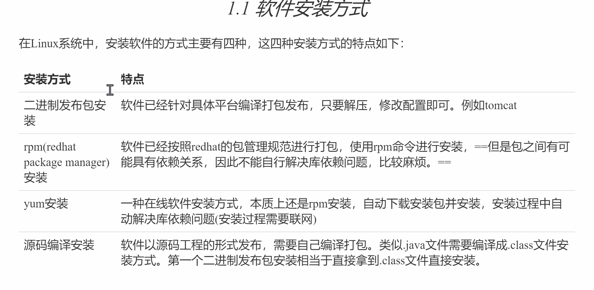
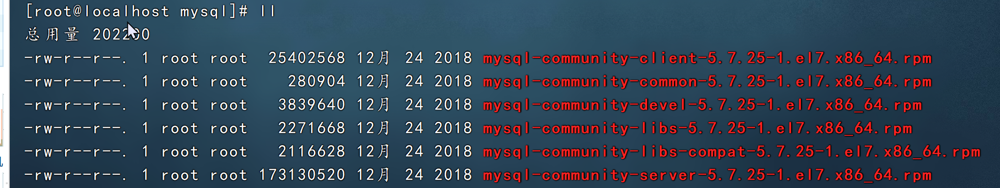
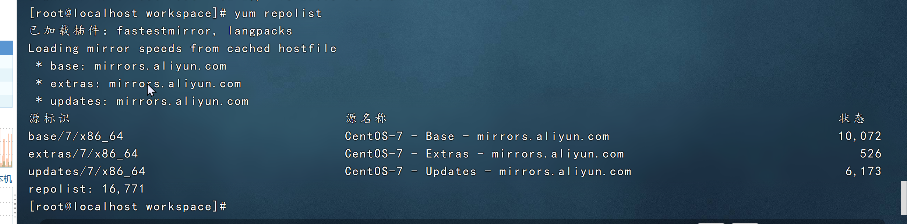
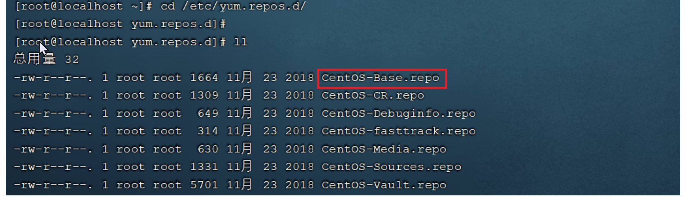

在linux系统中我们一般将软件安装到根路目录下的/usr/local目录中，我们在这个目录下可以创建一个自定义的目录，然后将jdk tomact等软件放到这个目录下

安装jvm

```bash
操作步骤：
1、在/usr/local目录下创建的自定义soft目录
2、使用finalshell自带的上传工具将jdk的二进制发布包上传到Linux
3、切换到soft目录下
4、解压安装包，命令为tar -zxvf jdk-8u171-linux-x64.tar.gz
5、配置环境变量，使用vim命令修改/etc/profile文件，在文件末尾加入如下配置，按字母G跳转到文件尾部
    #注意 /usr/local/soft/jdk1.8.9_171 路径不固定，是你的jdk路径位置，复制下面的路径到配置文件/etc/profile
    JAVA_HOME=/usr/local/soft/jdk1.8.0_171
    CLASSPATH=.:$JAVA_HOME/lib
    PATH=$JAVA_HOME/bin:$PATH
    export JAVA_HOME CLASSPATH PATH
6、重新加载profile文件，使更改配置立即生效，命令为source /etc/profile
7、检查安装是否成功，命令为java -version
```

安装tomact

tomact的安装和上述JDK的安装采用相同的方式，都是使用二进制发布包的形式进行安装

```bash
#切换到soft目录下
cd /usr/local/soft
查看目录内容
ll
解压tomact到soft目录下
tar -zxvf apache-tomcat-8.5.27.tar.gz

#启动tomact的bin目录启动服务。执行命令为
cd /usr/local/apache-tomcat-8.5.27/

cd bin

./startup.sh

#Tomact进程查看
#验证Tomact是否正常运行，那么我们验证Tomact启动是否成功，有多种方式，下面介绍几种
1)查询系统进程
ps -aux | grep tomact
    说明：ps命令是linux下非常强大的进行查看命令，通过ps -aux可以查看当前运行的所有进程的详细信息
    "|"在Linux中称为管道符，可以将前一个命令的结果输出给后一个命令作为输入
    使用ps命令查看进程时，经常配合管道符和查找命令grep一起使用，来查看特定的进程
```

防火墙操作

已经验证了Tomact服务已经启动了，接下来就可以尝试访问一下，但是发现访问不到

为什么访问不到呢？原因在与Linux系统的防火墙，系统安装完毕之后，系统启动时，防火墙自动启动，防火墙拦截了所有端口的访问。

防火墙类似于一个关卡检查人员，当你访问其他人的电脑，或者其他人访问你的电脑，都要进行拦截并进行处理，有的阻止，有的放行。默认情况下防火墙在开机就自动启动了。

如：windows的防火墙


防火墙引发的问题


防火墙指令：

操作-指令-备注

1. 查看防火墙

1. systemctl status firewalld / firewall-cmd-state

1. 关闭防火墙

1. sustemctl stop firewalld

1. 永久关闭防火漆

1. systemctl disable firewalld

1. 下次启动才生效

1. 永久开启防火墙（启用开机自启）

1. systemctl enable firewalld

1. 下次启动，才生效

1. 重启防火墙

1. systemctl restart firewalld

1. 开放指定端口

1. firewalld-cmd --zone=public --add-port=8080/tcp --permanent

1. 关闭指定端口

1. firewalld-cmd --zone=public --remove-port=8080/tcp --permanent

1. 需要重新加载生效

1. 立即生效

1. firewalld-cmd --reload

1. 查看开放端口

1. firewalld-cmd --zone=public --list-ports

注意：

1. systemctl是管理Linux中服务的命令，可以对服务进行启动、停止、重启、查看状态等操作

1. firewall-cmd是Linux中专门用于控制防火墙的命令

1. 为了保证系统安全，服务器的防火墙不建议关闭

关闭防火墙

```bash
systemctl stop firewalld
```

关闭之后，tomact就可以访问了。但是注意，关闭防火墙并不安全，不建议关闭。

开放tomact的端口8080

执行命令

```bash
1.先开启系统防火墙
systemctl start firewalld

2.再开放8080的端口号
firewall-cmd --zone=public --add-port=8080/tcp --permanent

3.重新加载防火墙
firewall-cmd --reload
```

解析

1. firewall-cmd

1. 向防火墙中添加或删除指定端口号

1. zone=public

1. 添加指定的端口号，使用TCP协议

1. --remove-port=端口号/tcp

1. 删除指定的端口号，使用TCP协议

1. --permanent

1. 永久的添加，主机重启了也是起作用的

1. --list-all	显示所有已经添加的端口号

1. --reloa	重启加载端口的规则，让新的端口号起作用

停止Tomact

1)运行停止tomact脚本的文件

在tomact目录中，其中bin目录中的shutdown.sh就是用于停止tomact的

命令：

```bash
./shutdown.sh
```

2）结束Tomact进程

可以先通过ps -ef | grep tomact 指令查看tomact进程的信息，从进程信息中获取tomact服务的进程号。然后通过kill -9的形式，来kill进程


通过上述的指令，我们可以获取tomact的进程号79947。接下来，我们就可以通过指令，来killtomact的进程

```bash
kill -9 79947
```

执行完上述命令之后，tomact就访问不到了

注意：

kill命令是Linux提供的用于结束进程的命令，-9表示强制结束；

虽然关闭tomact有两种方式，但还是推荐第一种。如果第一种不管用，那再用第二种

安装mysql

对于mysql数据库的安装，我们将要使用rpm进行安装。

rpm：全称为red-hat package manager，rpm软件包管理器，是红帽Linux用于管理和安装软件的工具

我们要通过rpm，进行mysql数据库的安装，主要步骤如下：

1）检测当前系统是否安装过mysql相关数据库

需要通过rpm相关指令，来查询当前系统中是否存在已安装的mysql软件包，执行指令如下

```bash
rpm -aq   查询当前系统中安装的所有软件
rpm -qa | grep mysql  查询当前系统中安装的名称带mysql的软件
rpm -qa | grep mariadb    查询当前系统中安装的名称带mariadb的软件
```

通过rpm -qa查询到系统通过rpm安装的所有软件，但可以通过grep 快速查询；

2).卸载现有的mysql数据库

在rpm中，卸载软件的语法为：

```bash
rpm -e --nodeps 软件名称
```

那么，对mariadb进行卸载

```bash
rpm -e --nodeps mariadb-libs-5.5.60-1.el7_5.x86_64
```

再次查看发现已经卸载掉了

然后将准备好的mysql放到虚拟机中解压


解压命令

```bash
tar -zxvf mysql-5.7.25-1.el7.x86_64.rpm-bundle.tar.gz -C /usr/local/soft/mysql
```

4）按照顺序安装rpm安装包

将mysql中的文件全部解压



命令

```bash
rpm -ivh mysql-community-common-5.7.25-1.el7.x86_64.rpm
rpm -ivh mysql-community-libs-5.7.25-1.el7.x86_64.rpm
rpm -ivh mysql-community-devel-5.7.25-1.el7.x86_64.rpm
rpm -ivh mysql-community-libs-compat-5.7.25-1.el7.x86_64.rpm
rpm -ivh mysql-community-client-5.7.25-1.el7.x86_64.rpm
yum install net-tools
rpm -ivh mysql-community-server-5.7.25-1.el7.x86_64.rpm
```

说明：

1. 因为rpm安装方式，是不会自动处理依赖关系的，需要我们自己处理，所以对于上面的rpm包的安装的顺序是不能随意更改的

1. 安装过程中提示缺少net-tools依赖，使用yum按照（yum是一种在线按照方式，需要保证联网）

1. 可以通过指令（yum update）升级现有的软件及系统内核

MySQL启动

mysql安装完成之后，会自动注册为系统的服务，服务名为mysqld。那么，我们就可以通过systemctl指令来查看mysql的状态、启动mysql、停止mysql

```bash
systemctl status mysqld    查看mysql服务状态
systemctl start mysqld 启动mysql服务
systemctl stop mysqld 停止mysql服务
```

说明：

1. mysqld其实是SQL后台程序（也就说MySQL服务器）。它是关于服务器端的一个程序，mysqld意思是mysql daemon，在后台运行，监听3306端口，如果你想要使用客户端程序，这个程序必须运行，因为客户端是通过连接服务器来访问数据库的。你只有启动了mysqld.exe，你的mysql数据库才能工作

1. mysql是一个客户端软件，可以对任何主机的mysql服务（即后台运行的mysqld）发起连接，mysql自带的客户端程序一般都在cmd或者终端下进行操作

注意：可以设置开机时启动mysql服务，避免每次开机启动mysql。执行如下指令

```bash
systemctl enable mysqld
```

但是这里不建议，因为会和后面的docker的中的端口号有冲突

可以通过如下两种方式，来判定mysql是否启动

```bash
netstat -tunlp    查看已经启动的服务
netstat -tunlp | grep mysql   查看mysql的服务信息
ps -aux | grep mysql    查看mysql进程
```

备注：

1. netstat命令用来打印Linux中网络系统的状态信息，可让你得知整个Linux系统的网络情况

1. 参数说明

1. -l 或 -listening：现实监控中的服务器Socket;

1. -n 或 00numeric：直接使用ip地址，而不通过域名服务器

1. -p 或--programs：显示正在使用Socket的程序识别码和程序名称

1. -t 或--tcp：显示TCP传输协议的连线情况

1. -u或--udp：显示UDP传输协议的连线情况；

1. ps命令用于查看Linux中的进程数据

Mysql登录

1)查阅临时密码

MySQL启动起来之后，就可以测试一下登录操作，但是要想登录MySQL，需要一个访问密码，而刚才在安装MySQL的过程中，并没有看到让我们设置的密码，那这个密码是什么呢？

实际上，对于rpm安装的mysql，在mysql第一次启动时，会自动帮我们生成root用户的访问密码，并且输出在mysql的日志文件/var/log/mysqld.log中，我们可以查看这份日志文件，从而获取到访问密码

命令

```bash
cat /var/log/mysqld.log | grep password
```

result


登录mysql

获取到root用户的临时密码之后，就可以登录mysql数据库，修改root密码，为root设置一个新的密码。并且还需要开启root用户远程访问该数据库的权限，这样就可以在Windows上访问这个数据库。

执行命令如下：

```bash
1）登录mysql（复制日志中的临时密码）
    mysql -uroot -p
    
2）修改密码 必须一步一步执行
    set global validate_password_length=4;      设置密码长度最低位数
    set global validate_password_policy=LOW;     设置密码的安全等级为低，便于密码可以修改成root
    set password = password('1234');    设置密码为1234

3)开启访问权限
    -- 给root指定的所有权限，在任何电脑上可以远程登录，注意我的数据库密码是1234，这里要改成你的数据库密码
    grant all on *.* to 'root'@'%' identified by '1234'
    -- 从mysql数据库中的授权重新载入权限
    flush privileges;

操作完上面的指令之后，数据库root用户的密码以及远程访问的配置就完成了。可以执行exit退出mysql，再次通过新的密码进行登录
```

注意：要想在windows上能够访问MySQL，还需要开放防火墙3306端口，执行如下指令

```bash
#开放的端口永久保存到防火墙
firewall-cmd --zone=public --add-port=3306/tcp --permanent;
firewall-cmd --reload;
```

在windows上连接虚拟机上的mysql

由于我使用的mysql是：


是2018年的，版本比较老

所以要对url进行一些更改

```bash
jdbc:mysql://你的IP:3306/数据库名?useSSL=false&allowPublicKeyRetrieval=true&serverTimezone=Asia/Shanghai
```

关键参数说明

1. useSSL

1. false

1. 关闭SSL（MySQL默认不强制SSL，关闭可避免TLS握手问题）

1. allowPublicKeyRetrieval

1. true

1. 允许公钥检索（某些场景需要）

1. serverTimezone

1. Asia/Shanghai

1. 设置时区，避免时间错误

修改MySQL默认编码

```bash
vim /etc/my.cnf
# 修改 /etc/my.cnf 文件  这个my.cnf是mysql的核心配置文件
[mysqld]
init_connect = 'SET NAMES utf8'
character-set-server = utf8
collation-server =utf8_general_ci
```

安装lrzsz(主要是练习时Yum安装软件)

lrzsz是用于Linux系统中文件上传下载的软件。除了finalshell之后，很多远程连接实际上并不支持上传文件

对于lrzsz的安装，需要通过第三种软件安装方式yum来进行安装。

yum（大黄狗）能够从指定的服务器自动下载包并且按照，可以自行处理依赖关系，一次性安装所有依赖的软件包，无须繁琐地一次次下载，安装。

```bash
yum|参数|命令|<安装包>    说明
参数：-y                在软件安装过程中所有的提示回答yes
命令：install           安装指定的软件
命令：remove            删除指定的安装包
命令：list              搜索指定的安装包
```

安装lrzsz的步骤如下

```bash
yum list lrzsz


#在线安装
yum install lrzsz.x86_64

#测试，命令行输入rz
rz


```

yum拓展知识

1. 如果在不更改软件来源的情况下，是需要联网才能使用yum的，那么我们按照的软件是从哪里下载的呢？yum源

1. 查看yum源：yum repolist



1. 网络yum源配置文件位于/etc/yum.repos.d/目录下，文件扩展名为"*.repo"



可以看到，该目录下有7个yum配置文件，通常情况下CentOS-Base.repo文件生效

1. 添加阿里云yum源

1. 先通过yum install wget，按照wget命令

1. 说明：wget表示上网下载。安装之前先去下载

1. 备份默认的yum源，执行指令

1. 切换目录：cd /etc/yum.repos.d/

1. 创建备份目录:mkdir bak

1. 移动现有的yum源文件到bak: mv *.repo bak/

1. 下载阿里云的yum源

1. wget -O /etc/yum.repos.d/CentOS-Base.repo 

1. 说明：这里的-O表示阿里云的资源下载到/etc/yum.repos.d/CentOS-Base.repo文件中，即表示下载的指定文件

1. 

1. yum clean all

1. 说明：清除yum缓存

1. yum makecache

1. 说明：是将服务器上的软件包信息存放到本地缓存，以提高搜索、按照软觉得速度

1. 再次查看yum源

项目部署

查看8080端口号的pid

```bash
 netstat -tlnp | grep :8080
```

然后停掉

部署期间发生的错误