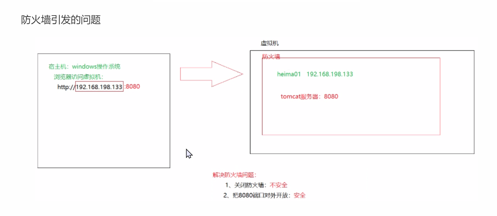
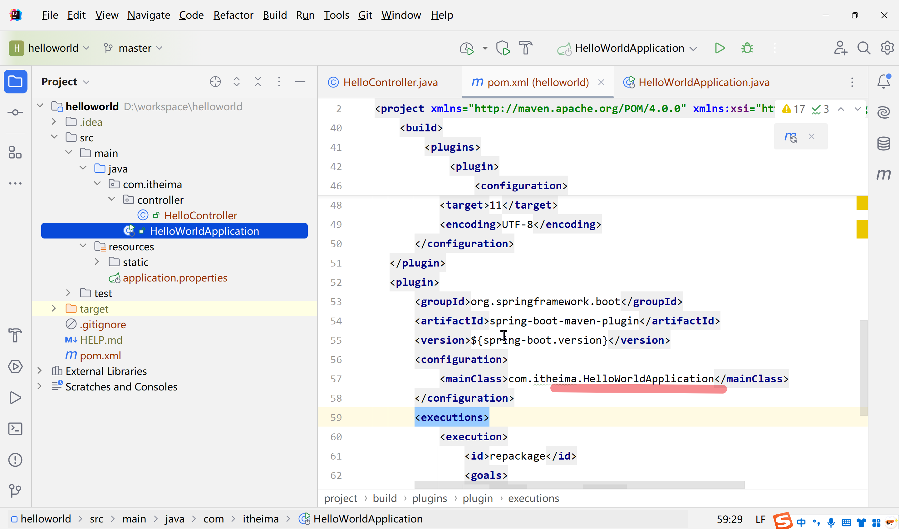
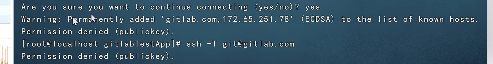
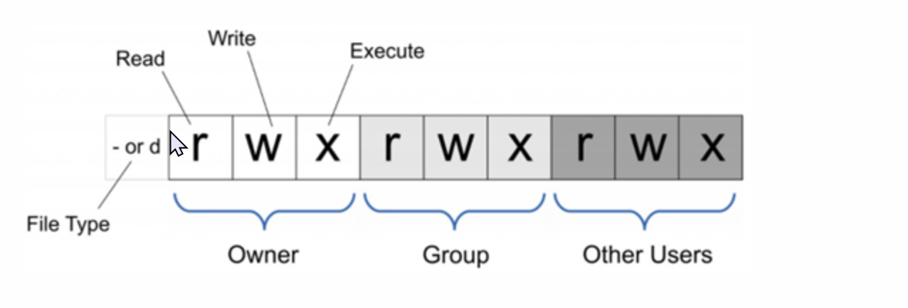
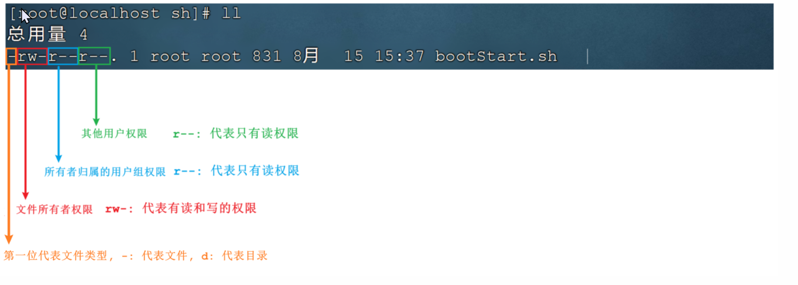
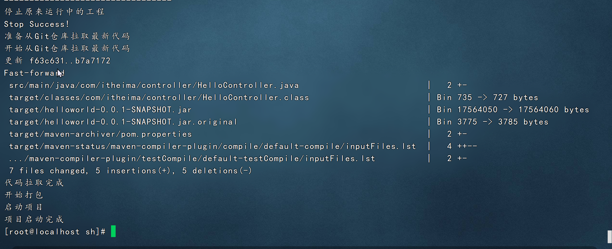

在linux系统中我们一般将软件安装到根路目录下的/usr/local目录中，我们在这个目录下可以创建一个自定义的目录，然后将jdk tomact等软件放到这个目录下

安装jvm

```bash
操作步骤：
1、在/usr/local目录下创建的自定义soft目录
2、使用finalshell自带的上传工具将jdk的二进制发布包上传到Linux
3、切换到soft目录下
4、解压安装包，命令为tar -zxvf jdk-8u171-linux-x64.tar.gz
5、配置环境变量，使用vim命令修改/etc/profile文件，在文件末尾加入如下配置，按字母G跳转到文件尾部
    #注意 /usr/local/soft/jdk1.8.9_171 路径不固定，是你的jdk路径位置，复制下面的路径到配置文件/etc/profile
    JAVA_HOME=/usr/local/soft/jdk1.8.0_171
    CLASSPATH=.:$JAVA_HOME/lib
    PATH=$JAVA_HOME/bin:$PATH
    export JAVA_HOME CLASSPATH PATH
6、重新加载profile文件，使更改配置立即生效，命令为source /etc/profile
7、检查安装是否成功，命令为java -version
```

安装tomact

tomact的安装和上述JDK的安装采用相同的方式，都是使用二进制发布包的形式进行安装

```bash
#切换到soft目录下
cd /usr/local/soft
查看目录内容
ll
解压tomact到soft目录下
tar -zxvf apache-tomcat-8.5.27.tar.gz

#启动tomact的bin目录启动服务。执行命令为
cd /usr/local/apache-tomcat-8.5.27/

cd bin

./startup.sh

#Tomact进程查看
#验证Tomact是否正常运行，那么我们验证Tomact启动是否成功，有多种方式，下面介绍几种
1)查询系统进程
ps -aux | grep tomact
    说明：ps命令是linux下非常强大的进行查看命令，通过ps -aux可以查看当前运行的所有进程的详细信息
    "|"在Linux中称为管道符，可以将前一个命令的结果输出给后一个命令作为输入
    使用ps命令查看进程时，经常配合管道符和查找命令grep一起使用，来查看特定的进程
```

防火墙操作

已经验证了Tomact服务已经启动了，接下来就可以尝试访问一下，但是发现访问不到

为什么访问不到呢？原因在与Linux系统的防火墙，系统安装完毕之后，系统启动时，防火墙自动启动，防火墙拦截了所有端口的访问。

防火墙类似于一个关卡检查人员，当你访问其他人的电脑，或者其他人访问你的电脑，都要进行拦截并进行处理，有的阻止，有的放行。默认情况下防火墙在开机就自动启动了。

如：windows的防火墙


防火墙引发的问题



防火墙指令：

操作-指令-备注

1. 查看防火墙

1. systemctl status firewalld / firewall-cmd-state

1. 关闭防火墙

1. sustemctl stop firewalld

1. 永久关闭防火漆

1. systemctl disable firewalld

1. 下次启动才生效

1. 永久开启防火墙（启用开机自启）

1. systemctl enable firewalld

1. 下次启动，才生效

1. 重启防火墙

1. systemctl restart firewalld

1. 开放指定端口

1. firewalld-cmd --zone=public --add-port=8080/tcp --permanent

1. 关闭指定端口

1. firewalld-cmd --zone=public --remove-port=8080/tcp --permanent

1. 需要重新加载生效

1. 立即生效

1. firewalld-cmd --reload

1. 查看开放端口

1. firewalld-cmd --zone=public --list-ports

注意：

1. systemctl是管理Linux中服务的命令，可以对服务进行启动、停止、重启、查看状态等操作

1. firewall-cmd是Linux中专门用于控制防火墙的命令

1. 为了保证系统安全，服务器的防火墙不建议关闭

关闭防火墙

```bash
systemctl stop firewalld
```

关闭之后，tomact就可以访问了。但是注意，关闭防火墙并不安全，不建议关闭。

开放tomact的端口8080

执行命令

```bash
1.先开启系统防火墙
systemctl start firewalld

2.再开放8080的端口号
firewall-cmd --zone=public --add-port=8080/tcp --permanent

3.重新加载防火墙
firewall-cmd --reload
```

解析

1. firewall-cmd

1. 向防火墙中添加或删除指定端口号

1. zone=public

1. 添加指定的端口号，使用TCP协议

1. --remove-port=端口号/tcp

1. 删除指定的端口号，使用TCP协议

1. --permanent

1. 永久的添加，主机重启了也是起作用的

1. --list-all	显示所有已经添加的端口号

1. --reloa	重启加载端口的规则，让新的端口号起作用

停止Tomact

1)运行停止tomact脚本的文件

在tomact目录中，其中bin目录中的shutdown.sh就是用于停止tomact的

命令：

```bash
./shutdown.sh
```

2）结束Tomact进程

可以先通过ps -ef | grep tomact 指令查看tomact进程的信息，从进程信息中获取tomact服务的进程号。然后通过kill -9的形式，来kill进程


通过上述的指令，我们可以获取tomact的进程号79947。接下来，我们就可以通过指令，来killtomact的进程

```bash
kill -9 79947
```

执行完上述命令之后，tomact就访问不到了

注意：

kill命令是Linux提供的用于结束进程的命令，-9表示强制结束；

虽然关闭tomact有两种方式，但还是推荐第一种。如果第一种不管用，那再用第二种

安装mysql

对于mysql数据库的安装，我们将要使用rpm进行安装。

rpm：全称为red-hat package manager，rpm软件包管理器，是红帽Linux用于管理和安装软件的工具

我们要通过rpm，进行mysql数据库的安装，主要步骤如下：

1）检测当前系统是否安装过mysql相关数据库

需要通过rpm相关指令，来查询当前系统中是否存在已安装的mysql软件包，执行指令如下

```bash
rpm -aq   查询当前系统中安装的所有软件
rpm -qa | grep mysql  查询当前系统中安装的名称带mysql的软件
rpm -qa | grep mariadb    查询当前系统中安装的名称带mariadb的软件
```

通过rpm -qa查询到系统通过rpm安装的所有软件，但可以通过grep 快速查询；

2).卸载现有的mysql数据库

在rpm中，卸载软件的语法为：

```bash
rpm -e --nodeps 软件名称
```

那么，对mariadb进行卸载

```bash
rpm -e --nodeps mariadb-libs-5.5.60-1.el7_5.x86_64
```

再次查看发现已经卸载掉了

然后将准备好的mysql放到虚拟机中解压


解压命令

```bash
tar -zxvf mysql-5.7.25-1.el7.x86_64.rpm-bundle.tar.gz -C /usr/local/soft/mysql
```

4）按照顺序安装rpm安装包

将mysql中的文件全部解压


命令

```bash
rpm -ivh mysql-community-common-5.7.25-1.el7.x86_64.rpm
rpm -ivh mysql-community-libs-5.7.25-1.el7.x86_64.rpm
rpm -ivh mysql-community-devel-5.7.25-1.el7.x86_64.rpm
rpm -ivh mysql-community-libs-compat-5.7.25-1.el7.x86_64.rpm
rpm -ivh mysql-community-client-5.7.25-1.el7.x86_64.rpm
yum install net-tools
rpm -ivh mysql-community-server-5.7.25-1.el7.x86_64.rpm
```

说明：

1. 因为rpm安装方式，是不会自动处理依赖关系的，需要我们自己处理，所以对于上面的rpm包的安装的顺序是不能随意更改的

1. 安装过程中提示缺少net-tools依赖，使用yum按照（yum是一种在线按照方式，需要保证联网）

1. 可以通过指令（yum update）升级现有的软件及系统内核

MySQL启动

mysql安装完成之后，会自动注册为系统的服务，服务名为mysqld。那么，我们就可以通过systemctl指令来查看mysql的状态、启动mysql、停止mysql

```bash
systemctl status mysqld    查看mysql服务状态
systemctl start mysqld 启动mysql服务
systemctl stop mysqld 停止mysql服务
```

说明：

1. mysqld其实是SQL后台程序（也就说MySQL服务器）。它是关于服务器端的一个程序，mysqld意思是mysql daemon，在后台运行，监听3306端口，如果你想要使用客户端程序，这个程序必须运行，因为客户端是通过连接服务器来访问数据库的。你只有启动了mysqld.exe，你的mysql数据库才能工作

1. mysql是一个客户端软件，可以对任何主机的mysql服务（即后台运行的mysqld）发起连接，mysql自带的客户端程序一般都在cmd或者终端下进行操作

注意：可以设置开机时启动mysql服务，避免每次开机启动mysql。执行如下指令

```bash
systemctl enable mysqld
```

但是这里不建议，因为会和后面的docker的中的端口号有冲突

可以通过如下两种方式，来判定mysql是否启动

```bash
netstat -tunlp    查看已经启动的服务
netstat -tunlp | grep mysql   查看mysql的服务信息
ps -aux | grep mysql    查看mysql进程
```

备注：

1. netstat命令用来打印Linux中网络系统的状态信息，可让你得知整个Linux系统的网络情况

1. 参数说明

1. -l 或 -listening：现实监控中的服务器Socket;

1. -n 或 00numeric：直接使用ip地址，而不通过域名服务器

1. -p 或--programs：显示正在使用Socket的程序识别码和程序名称

1. -t 或--tcp：显示TCP传输协议的连线情况

1. -u或--udp：显示UDP传输协议的连线情况；

1. ps命令用于查看Linux中的进程数据

Mysql登录

1)查阅临时密码

MySQL启动起来之后，就可以测试一下登录操作，但是要想登录MySQL，需要一个访问密码，而刚才在安装MySQL的过程中，并没有看到让我们设置的密码，那这个密码是什么呢？

实际上，对于rpm安装的mysql，在mysql第一次启动时，会自动帮我们生成root用户的访问密码，并且输出在mysql的日志文件/var/log/mysqld.log中，我们可以查看这份日志文件，从而获取到访问密码

命令

```bash
cat /var/log/mysqld.log | grep password
```

result


登录mysql

获取到root用户的临时密码之后，就可以登录mysql数据库，修改root密码，为root设置一个新的密码。并且还需要开启root用户远程访问该数据库的权限，这样就可以在Windows上访问这个数据库。

执行命令如下：

```bash
1）登录mysql（复制日志中的临时密码）
    mysql -uroot -p
    
2）修改密码 必须一步一步执行
    set global validate_password_length=4;      设置密码长度最低位数
    set global validate_password_policy=LOW;     设置密码的安全等级为低，便于密码可以修改成root
    set password = password('1234');    设置密码为1234

3)开启访问权限
    -- 给root指定的所有权限，在任何电脑上可以远程登录，注意我的数据库密码是1234，这里要改成你的数据库密码
    grant all on *.* to 'root'@'%' identified by '1234'
    -- 从mysql数据库中的授权重新载入权限
    flush privileges;

操作完上面的指令之后，数据库root用户的密码以及远程访问的配置就完成了。可以执行exit退出mysql，再次通过新的密码进行登录
```

注意：要想在windows上能够访问MySQL，还需要开放防火墙3306端口，执行如下指令

```bash
#开放的端口永久保存到防火墙
firewall-cmd --zone=public --add-port=3306/tcp --permanent;
firewall-cmd --reload;
```

在windows上连接虚拟机上的mysql

由于我使用的mysql是：


是2018年的，版本比较老

所以要对url进行一些更改

```bash
jdbc:mysql://你的IP:3306/数据库名?useSSL=false&allowPublicKeyRetrieval=true&serverTimezone=Asia/Shanghai
```

关键参数说明

1. useSSL

1. false

1. 关闭SSL（MySQL默认不强制SSL，关闭可避免TLS握手问题）

1. allowPublicKeyRetrieval

1. true

1. 允许公钥检索（某些场景需要）

1. serverTimezone

1. Asia/Shanghai

1. 设置时区，避免时间错误

修改MySQL默认编码

```bash
vim /etc/my.cnf
# 修改 /etc/my.cnf 文件  这个my.cnf是mysql的核心配置文件
[mysqld]
init_connect = 'SET NAMES utf8'
character-set-server = utf8
collation-server =utf8_general_ci
```

安装lrzsz(主要是练习时Yum安装软件)

lrzsz是用于Linux系统中文件上传下载的软件。除了finalshell之后，很多远程连接实际上并不支持上传文件

对于lrzsz的安装，需要通过第三种软件安装方式yum来进行安装。

yum（大黄狗）能够从指定的服务器自动下载包并且按照，可以自行处理依赖关系，一次性安装所有依赖的软件包，无须繁琐地一次次下载，安装。

```bash
yum|参数|命令|<安装包>    说明
参数：-y                在软件安装过程中所有的提示回答yes
命令：install           安装指定的软件
命令：remove            删除指定的安装包
命令：list              搜索指定的安装包
```

安装lrzsz的步骤如下

```bash
yum list lrzsz


#在线安装
yum install lrzsz.x86_64

#测试，命令行输入rz
rz


```

yum拓展知识

1. 如果在不更改软件来源的情况下，是需要联网才能使用yum的，那么我们按照的软件是从哪里下载的呢？yum源

1. 查看yum源：yum repolist


1. 网络yum源配置文件位于/etc/yum.repos.d/目录下，文件扩展名为"*.repo"


可以看到，该目录下有7个yum配置文件，通常情况下CentOS-Base.repo文件生效

1. 添加阿里云yum源

1. 先通过yum install wget，按照wget命令

1. 说明：wget表示上网下载。安装之前先去下载

1. 备份默认的yum源，执行指令

1. 切换目录：cd /etc/yum.repos.d/

1. 创建备份目录:mkdir bak

1. 移动现有的yum源文件到bak: mv *.repo bak/

1. 下载阿里云的yum源

1. wget -O /etc/yum.repos.d/CentOS-Base.repo 

1. 说明：这里的-O表示阿里云的资源下载到/etc/yum.repos.d/CentOS-Base.repo文件中，即表示下载的指定文件

1. 

1. yum clean all

1. 说明：清除yum缓存

1. yum makecache

1. 说明：是将服务器上的软件包信息存放到本地缓存，以提高搜索、按照软觉得速度

1. 再次查看yum源

项目部署

Linux查看8080端口号的pid

```bash
 netstat -tlnp | grep :8080
```

然后停掉

windows查看8080端口号的pid

```bash
netstat -ano | findstr :8080
```

部署期间发生的错误



问题出在这里，包名没有和application一致。

总结来看

问题一：mainClass中skip没有去掉，导致打包体积太小（100KB以下），取消skip即可完整打包

问题二：mainClass中的包名一定要和application的入口类的名一致，否则无法运行

又出问题了：

版本问题

```java
Exception in thread "main" java.lang.UnsupportedClassVersionError: 
com/itheima/HelloWorldApplication has been compiled by a more recent version of the Java Runtime 
(class file version 55.0), this version of the Java Runtime only recognizes class file versions up to 52.0
```

可见版本不兼容

由于我们打包的时候使用的是java的version是11，所以错误。

但是仅仅改了版本之后还是错误

```xml
<properties>
    <java.version>8</java.version>
</properties>
```

那么改了以下部分就没有错误了

```xml
<properties>
    <java.version>8</java.version>
    <maven.compiler.source>1.8</maven.compiler.source>
    <maven.compiler.target>1.8</maven.compiler.target>
</properties>


专门用来打包的部分
<plugin>
    <groupId>org.apache.maven.plugins</groupId>
    <artifactId>maven-compiler-plugin</artifactId>
    <version>3.8.1</version>
    <configuration>
        <source>1.8</source>     改了这里
        <target>1.8</target>        和这里
        <encoding>UTF-8</encoding>
    </configuration>
</plugin>
```

这样就成功在虚拟机中运行了

但是一旦把当前的窗口关闭了，该程序就无法运行了

目前程序运行的问题

1. 线上程序不会采用控制台霸屏的形式运行程序，而是将程序在后台运行

1. 线上程序不会讲日志输出到控制台，而是输出到日志文件，方便运维查阅信息

后台运行程序

```bash
nohup命令：no hang up（不挂起），用于不挂断地运行指定命令，退出终端不会影响程序的运行
语法格式：nohup command Arg
参数说明：
    Command：要执行的命令
    Arg：一些参数，可以指定输出文件
    &：让命令在后台运行
举例：
    nohup java -jar boot工程.jar &> hello.log&
    含义是：后台运行java -jar命令，并将日志输出到hello.log文件
    
```

要想让程序在后台运行

```bash
nohup java -jar helloworld-1.0-SNAPSHOT.jar &> hello.log &
```

输出pid

然后通过

```bash
ps -ef | grep java
```

查看到其在后台运行

基于shell脚本自动部署（掌握，开发使用，环境安装全部由运维完成）

以上的为手动部署，

下面是为了简化手动部署而生的自动部署

流程如下：


操作步骤：

1. 在Gitee/gitlab上创建远程仓库，并将本地的项目代码推送到远程仓库中

1. 在Linux中安装Git，克隆代码

1. 在Linux中安装Maven

1. 编写Shell脚本（拉取代码、编译、打包、启动）

1. 为用户授予Shell脚本权限

1. 执行Shell

在gitlab上创建helloworld_heima100，然后部署目标位空

本地gitlab的配置

分为几步

1 创建一个全新的、专门用于gitlab的ssh秘钥。要生成一个全新的rsa秘钥对，并且起一个无歧义的名字（id_rsa_gitlab），已免覆盖现有的key

在git bash中执行以下命令

```bash
ssh-keygen -t rsa -b 4096 -C "your_email@example.com"
```

注意：不要直接回车，因为直接回车的话就会在当前git bash here的目录下创建rsa秘钥。要输入手动输入新的文件路径名然后一直回车即可

```bash
/c/Users/11423/.ssh/id_rsa_gitlab
```

完成的标志是：Your identification has been saved in ...

2 配置 ~/.ssh/config文件进行映射。现在需要告诉ssh客户端，“当我们访问gitlab.com时，使用刚才的秘钥

   1 打开/创建config文件，在git bash中输入

```bash
nano ~/.ssh/config

然后添加配置内容
--- GitLab 配置 (新增的) ---
Host gitlab.com
HostName gitlab.com
User git
IdentityFile ~/.ssh/id_rsa_gitlab
IdentitiesOnly yes

---------------------------分割线
说明：
    Host gitlab.com
    如果使用的是公有云就是gitlab.com
    如果使用的是私有云就http://47.96.143.141
    写法为：
        Host 47.96.143.141
            HostName 47.96.143.141
            User git
            IdentityFile ~/.ssh/id_rsa_gitlab
            IdentitiesOnly yes
            

```

3 将公钥添加到gitlab

```bash
cat ~/.ssh/id_rsa_gitlab.pub
```

然后添加到gitlab的ssh keys中

4 测试

```bash
ssh -T git@gitlab.com
```

在linux上安装git

```bash
yum list git			列出git安装包
yum install git			在线安装git
```

安装好之后用git --verison验证是否安装成功

配置公钥的方法和Windows一致

```bash
ssh-keygen -t rsa
```

同样的方法，把公钥在gitlab上添加keys以下即可

但是在linux的环境下测试

```bash
ssh -T git@gitlab.com
```

显示的是



被拒绝了。

这个问题的原因是：

ssh客户端在连接的时候，默认尝试使用标准名称的私钥，比如

- /root/.ssh/id_rsa

- /root/.ssh/id_ecdsa

- /root/.ssh/id_ed25519

它不会默认使用id_rsa_gitlab 这样的非标准文件，所以即使是把公钥添加到gitlab中的keys中也无法连接。

需要手动的配置mapping

让ssh自动知道访问gitlab.com时使用什么钥匙

1 编辑config文件

```bash
nano ~/.ssh/config
```

2 添加内容

```bash
Host gitlab.com
    HostName gitlab.com
    User git
    IdentityFile /root/.ssh/id_rsa_gitlab
    IdentitiesOnly yes
```

3 再次测试

```bash
ssh -T git@gitlab.com
```

测试成功

然后对gitlab的项目进行克隆

```bash
 git clone git@gitlab.com:Tom4471/helloworld_heima100.git
```

上传资料提供的maven包

解压maven

```bash
tar -zxvf apache-maven-3.5.4-bin.tar.gz
```

在/etc/profile中配置环境变量

```bash
vim /etc/profile

修改配置文件，进入到命令模式，按G切换到最后一行，按a/i/o进入插入模式，然后在最后加入如下内容 :
MAVEN_HOME=/usr/local/soft/apache-maven-3.5.4
PATH=$JAVA_HOME/bin:$MAVEN_HOME/bin:$PATH

然后按ESC进入到命令模式，输入 :wq 保存并退出
```

刷新/etc/profile的配置

```bash
source /etc/profile
```

测试环境变量是否配置成功

```bash
mvb -v
```

可以查看是否成功

之后修改maven的setting.xml配置文件，配置本地仓库的地址

1 切换目录

```bash
cd /usr/local/soft/apache-maven-3.5.4/conf
```

2 编辑setting.xml文件

```bash
vim settings.xml
```

3 在/etc/profile配置文件中配置环境变量

```bash
vim /etc/profile

修改配置文件，进入到命令模式，按G切换到最后一行，按a/i/o进入插入模式，然后在最后加入如下内容 :
MAVEN_HOME=/usr/local/soft/apache-maven-3.5.4
PATH=$JAVA_HOME/bin:$MAVEN_HOME/bin:$PATH

然后按ESC进入到命令模式，输入 :wq 保存并退出
```

 使得配置的环境变量生效

```bash
source /etc/profile
```

4 修改maven中的setting.xml配置文件，配置本地仓库的地址

 a 切换目录

```bash
cd /usr/local/soft/apache-maven-3.5.4/conf
```

 b 编辑setting.xml文件

```bash
vim settings.xml
```

添加

```xml
    <localRepository>/usr/local/soft/repo</localRepository>
    
    <mirror> 
    <id>alimaven</id> 
    <mirrorOf>central</mirrorOf> 
    <name>aliyun maven</name> 
    <url>http://maven.aliyun.com/nexus/content/groups/public/</url>
</mirror> 
```

 c 创建本地仓库/usr/local/soft/repo

shell脚本准备

```bash
shell脚本，是一种Linux系统中的脚本程序。使用shell脚本编程类似JavaScript、java编程，只要有一个能编写代码的文本编辑器和一个能解释执行的脚本编辑器就可以了
```

在usr/local/soft 中创建sh目录

在该目录中创建bootStart.sh

```bash
#!/bin/sh
#记事本打开，修改编码格式为utf8，可解决上传centos后中文乱码问题
echo =================================
echo  自动化部署脚本启动
echo =================================

echo 停止原来运行中的工程
APP_NAME=helloworld
# 查询系统中正在运行的helloworld的进程，并停止进程
tpid=`ps -aux|grep $APP_NAME|grep -v grep|grep -v kill|awk '{print $2}'`
if [ ${tpid} ]; then
    echo 'Stop Process...'
    kill -15 $tpid
fi
sleep 2
tpid=`ps -aux|grep $APP_NAME|grep -v grep|grep -v kill|awk '{print $2}'`
# 停止后再次查询，如果还存在，则通过kill -9 强制杀死
if [ ${tpid} ]; then
    echo 'Kill Process!'
    kill -9 $tpid
else
    echo 'Stop Success!'
fi

echo 准备从Git仓库拉取最新代码
cd /usr/local/soft/helloworld_heima100

echo 开始从Git仓库拉取最新代码
# 拉取最新代码
git pull
echo 代码拉取完成

echo 开始打包
# 执行打包，跳过单元测试
output=`mvn clean package -Dmaven.test.skip=true`
# 切换到当前工程的target目录下
cd target

echo 启动项目
# 后台启动该项目
nohup java -jar  helloworld-0.0.1-SNAPSHOT.jar &> helloworld.log &
echo 项目启动完成
```

Linux权限

shell脚本已经准备好了，但是shell脚本想要正常的执行，还需要给shell脚本分配执行权限。由于linux系统是一个多用户的操作系统，并且针对每一个用户，Linux会严格控制操作权限。

1 chmod（change mode）命令是控制用户对文件的权限的命令

2 Linux中的权限分为三种：读（r）、写（w）、执行（x）

3 Linux文件权限从左到右分为三级：文件所有者（owner）、用户组（group）、其他用户（other）

4 只有文件的所有者和超级用户可以修改文件或目录的权限

5 要执行的shell脚本需要对此脚本文件的执行权限（x），如果没有则不执行

Linux系统权限描述如下



解析当前脚本的权限问题



chmod命令可以使用八进制数来指定权限（0 - 代表无，1 - 执行x，2 - 写w，4 - 读r）：

值-权限-rwx

7	读+写+执行	rwx

6	读+写		rw-

5	读+执行		r-x

4	只读			r--

3	写+执行		-wx

2	只写			-w-

1	只执行		--x

0	无			---

举例

```bash
chmod 777 bootStart.sh    为所有用户授予读、写、执行权限
chmod 755 bootStart.sh    为文件拥有者授予读、写、执行权限，同组用户和其他用户授予读、执行权限
chmod 210 bootStart.sh    为文件拥有者授予写权限，同组用户授予执行权限，其他用户没有任何权限
```

注意：三个数字分别代表不同用户的权限

-第1位表示的是文件拥有者的权限

-第2位表示的是同组用户的权限

-第3位表示的是其他用户的权限

授予并执行脚本

在测试阶段，可以给所有人都赋予执行该shell脚本的权限。所以可以执行

```bash
chmod 777 bootStart.sh
```

执行该脚本

出现问题，无法打包

需要修改一个部分

```bash
# 后台启动该项目
nohup java -jar  helloworld-0.0.1-SNAPSHOT.jar &> helloworld.log &
echo 项目启动完成
```

测试成功



整个流程跑通

window下修改代码push - linux拉代码  - 自动重启部署