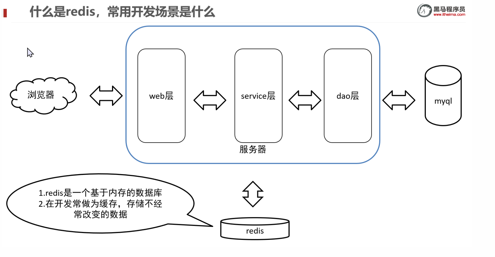
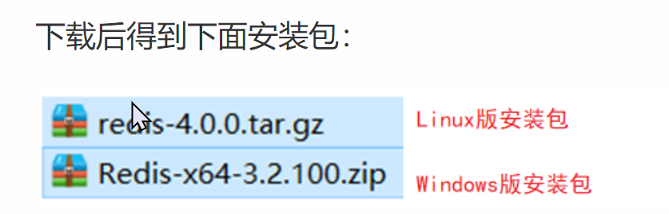

redis的基础理解

【1】redis属于非关系型数据库，存储的数据位于内存中，一般用来查询次数较多的数据，这样可与提高查询效率

【2】redis数据库存储的数据都是有key-value形式存储的

【3】实际开发中我们先到mysql数据库查询(经历磁盘IO),然后将查询的数据放到redis中，以后查询相同数据直接到redis即内存中查询，这样效率高



redis下载



redis在linux系统下安装

安装过程介绍

1. 安装编译环境并且编译

1. 安装redis

1. 设置成后台运行

1. 打开防火墙6379

1. 设置ip地址的bind

安装

1 查看

是否安装了gcc-c++

redis是C语言开发，安装redis需要先将官网下载的源码进行编译，编译依赖gcc环境。

```bash
rpm -q gcc-c++
```

如果没安装

```bash
yum -y install gcc-c++
```

2 把redis.tar.gz上传到soft目录中

3 解压

```bash
cd /usr/local/soft 
tar -zxvf redis-4.0.0.tar.gz
```

进入redis，redis的目录如下


这些都是redis的源码

4 进入redis之后，使用make命令对上述源码在c语言的环境下进行编译redis。make会调用gcc-c++变异redis源码，只有编译之后才可以进行安装

```bash
make
```


如下信息代表编译成功


5 在redis-4.0.0目录中，使用以下命令，将reids安装到/usr/local/soft/redis指定的目录下

```bash
make PREFIX=/usr/local/soft/redis install 
```


安装成功后在/usr/local/redis/bin目录下可以看到如下结构。


6 复制redis.conf配置文件到/usr/local/soft/redis/bin

说明：要从刚解压的目录中复制过来

```bash
cd /usr/local/soft/redis-4.0.0/

cp redis.conf /usr/local/soft/redis/bin
```


安装后重点说明：

```bash
/usr/local/soft/redis/bin/redis-server :Redis服务启动脚本
/usr/local/soft/redis/bin/redis-cli :Redis客户端脚本
/usr/local/soft/redis/bin/redis.conf  :Redis配置文件
```

redis的服务启动与停止（Linux；掌握）

redis启动服务器

启动redis有两种方式

1 前端模式启动（不使用这种模式）

直接运行bin/redis-server