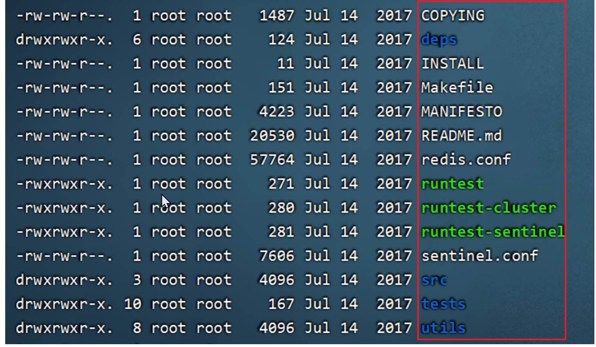
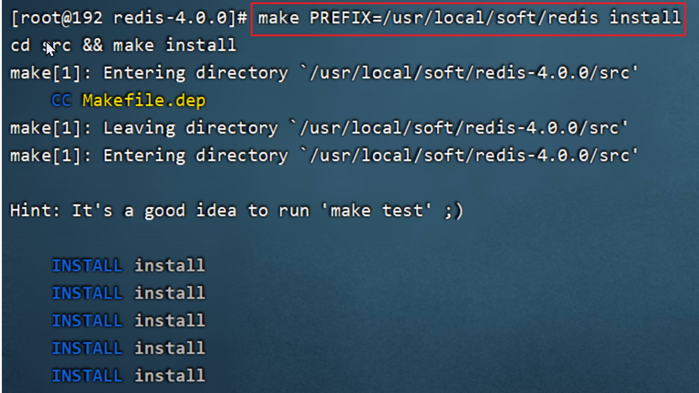
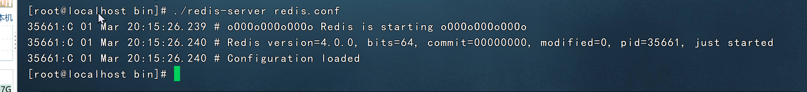
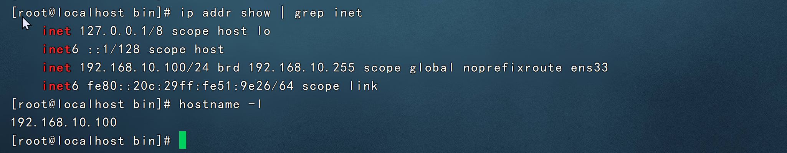
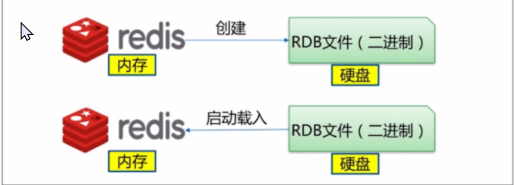
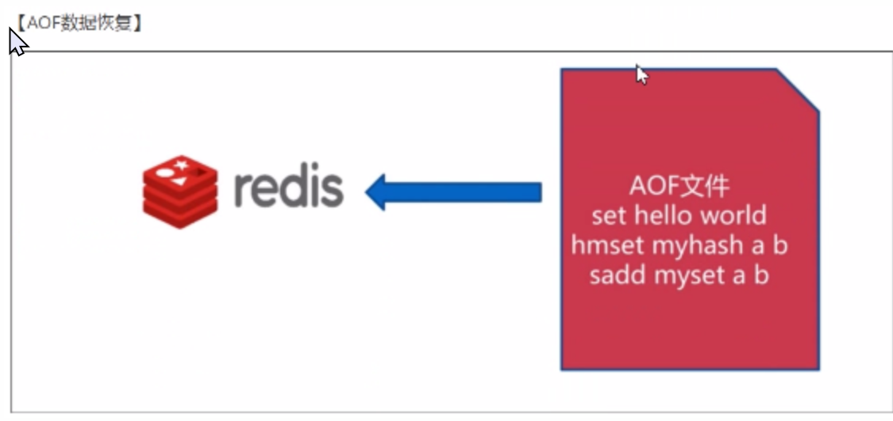

redis的基础理解

【1】redis属于非关系型数据库，存储的数据位于内存中，一般用来查询次数较多的数据，这样可与提高查询效率

【2】redis数据库存储的数据都是有key-value形式存储的

【3】实际开发中我们先到mysql数据库查询(经历磁盘IO),然后将查询的数据放到redis中，以后查询相同数据直接到redis即内存中查询，这样效率高


redis下载


redis在linux系统下安装

安装过程介绍

1. 安装编译环境并且编译

1. 安装redis

1. 设置成后台运行

1. 打开防火墙6379

1. 设置ip地址的bind

安装

1 查看

是否安装了gcc-c++

redis是C语言开发，安装redis需要先将官网下载的源码进行编译，编译依赖gcc环境。

```bash
rpm -q gcc-c++
```

如果没安装

```bash
yum -y install gcc-c++
```

2 把redis.tar.gz上传到soft目录中

3 解压

```bash
cd /usr/local/soft 
tar -zxvf redis-4.0.0.tar.gz
```

进入redis，redis的目录如下



这些都是redis的源码

4 进入redis之后，使用make命令对上述源码在c语言的环境下进行编译redis。make会调用gcc-c++变异redis源码，只有编译之后才可以进行安装

```bash
make
```


如下信息代表编译成功


5 在redis-4.0.0目录中，使用以下命令，将reids安装到/usr/local/soft/redis指定的目录下

```bash
make PREFIX=/usr/local/soft/redis install 
```



安装成功后在/usr/local/redis/bin目录下可以看到如下结构。


6 复制redis.conf配置文件到/usr/local/soft/redis/bin

说明：要从刚解压的目录中复制过来

```bash
cd /usr/local/soft/redis-4.0.0/

cp redis.conf /usr/local/soft/redis/bin
```


安装后重点说明：

```bash
/usr/local/soft/redis/bin/redis-server :Redis服务启动脚本
/usr/local/soft/redis/bin/redis-cli :Redis客户端脚本
/usr/local/soft/redis/bin/redis.conf  :Redis配置文件
```

redis的服务启动与停止（Linux；掌握）

redis启动服务器

启动redis有两种方式

1 前端模式启动（不使用这种模式）

直接运行bin/redis-server


  ctrl + c可停止

2 后端模式启动（推荐使用）

1 . 修改redis.conf配置文件，修改daemonize yes 以后端模式启动

daemonize：后台运行

```bash
vim redis.conf
```


保存并退出

2 启动时，指定配置文件

```bash
cd /usr/local/soft/redis/bin

 ./redis-server redis.conf
```



3 查看启动的后台进程

```bash
ps -aux | grep redis
```


redis启动客户端

1 进入redis/bin目录，启动“redis.cli”

```bash
./redis-cli
```


停止redis

在客户端向redis发送shutdown命令

方法：在redis客户端里面输入shutdown


使用远程操作linux的redis必须启动linux下的redis

```bash
 ./redis-server redis.conf
```

使用可视化工具连接redis服务器端

使用的是


需要开放6379的端口号

```bash
firewall-cmd --zone=public --add-port=6379/tcp --permanent

 firewall-cmd --reload
 
 #重启防火墙
systemctl restart firewalld
```

Windows下的客户端还是无法连接redis


5 修改配置允许其他机器访问

```bash
bind 127.0.0.1 192.168.18.128
或者直接插入：
bind 0.0.0.0  
# 使用0.0.0.0表示使用本地localhost 127  192.168.200.129都可以访问
```

先查看linux的ip（**注意是linux的ip，而不是为了链接的Windows的ip**）

```bash
ip addr show | grep inet
或
hostname -I
```



是192.168.10.100

所以我的redis.conf的设置为

```bash
bind 127.0.0.1 192.168.10.100
#或者直接插入：
bind 0.0.0.0  


#注意这个保护模式关掉
protected-mode no
```

关闭redis，再重新启动redis读取新的配置文件，才会起作用

```bash
./redis-cli shutdown
./redis-server redis.conf

```

具体的redis的各种操作知识（语法等）在3-1redis中已经有了

redis持久化机制

问：把服务端关闭了，再重新开启服务器，数据会不会丢失

```markdown
会部分丢失，因为默认redis服务器每隔一段时间写入一次内容中数据到硬盘上
```

什么是redis的持久化

redis的持久化就是原来写到内存上的数据写到磁盘上

redis持久化的两种方式

1. rdb：redis database默认的持久化方式，以二进制的方式将数据写入到文件中。每隔一段时间写入一次

1. aof：append only file以文本文件的方式记录用户的每次操作，数据还原的时候，读取aof文件，模拟用户操作，将数据还原

RDB持久化介绍

rdb是默认的持久化方式。这种方式就是将内存中数据以快照的方式写入到二进制文件中，默认的文件名为dump.db

注意：快照是内存中数据的状态



可以通过配置设置自动做快照持久化的方式。如下为配置的RDB方式数据持久化时机，必须两个条件都瞒住才能进行持久化操作

关键字-时间（s）-修改键数-解释

save	900		1		到了15分钟修改1个键，则发起快照保存

save	300		10		到了5分钟修改了10个键，则发起快照保存

save	60		10000	到了1分钟，修改了1万个键，则发起快照保存

在redis.conf中添加

```markdown
save 900 1
save 300 10
save 60  10000
```

缺点：

可能导致数据丢失。因为RDB是每隔一段时间写入数据，所以系统一旦定时持久化之前出现宕机现象，此前没有来得及写入磁盘的数据都将丢失

优点：

持久化效率高，持久化的事内存中的数据

数据库宕机后，数据恢复的效率更高

AOF的存储方式

由于快照方式是在一定间隔时间做一次，所以如果redis宕机，就丢失了最后一次快照后的所有修改。如果应用要求不能丢失任何修改的话，可以采用aof持久化方式

aof就是类似记录sql语句的所有语句一样

aof写入


aof恢复



aof包含了所有的修改操作。也可以通过该文件完成数据的重建。该机制可以带来更高的数据安全性，所有操作都是异步完成的

redis中提供了3种同步的策略	说明

每秒同步			每过一秒记录一次

每修改同步		每次修改（增删改）都会记录一次

不同步			由系统记录操作

aof的持久化配置

aof默认是关闭的，首先需要开启aof模式

参数配置-说明

appendonly	no/yes		默认是no，关闭。如果要打开，改成yes

aof持久化的实际

关键字-持久化时机-解释

appendfsync	everysec	每秒记录

appendfsync	always	每修改记录

appendfsync	no		完全依赖操作系统，性能最好，持久化无法保证

everysec：每秒钟写入磁盘一次，在性能和持久胡方面做了折中

always：收到写命令就立即写入磁盘，最慢，但是保证完全的持久化

no：完成依赖操作系统，性能最好，持久化无法保证

aof持久化配置

1 打开aof的配置文件redis.conf，设置appendonly yes

在命令行模式下输入以下，即可快速刷新当前的搜索关键词，按n是当前关键词跳转下一个

```markdown
/appendonly 
```