应用部署出现的问题

1 依赖关系复杂，容易出现兼容性问题

2 开发、测试、生产环境又差异

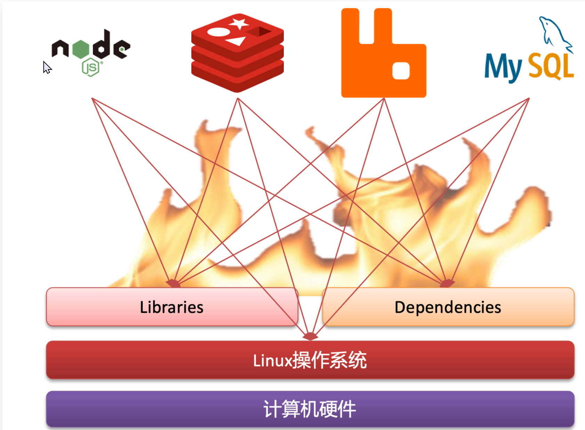

docker如何解决兼容性问题

将应用libs（函数库）、Deps（依赖）、配置与应用一起打包

将每个应用放到一个隔离**容器**去运行，避免相互干扰

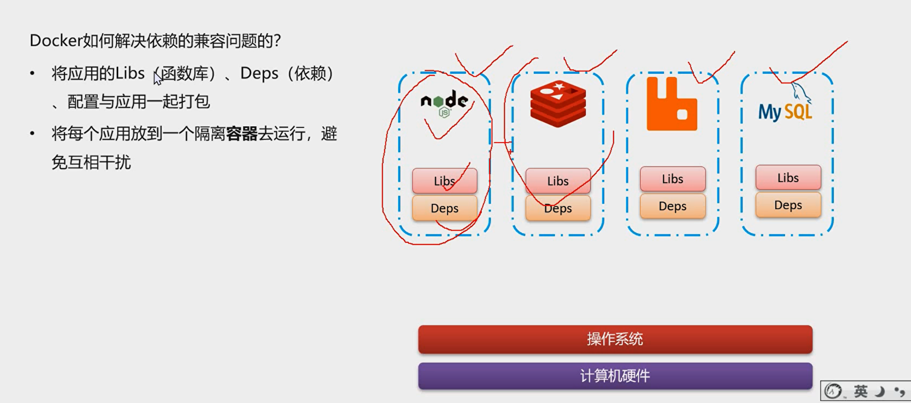

docker原理

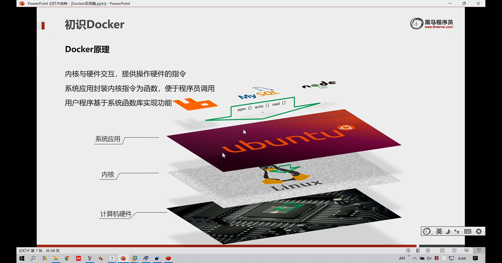

docker采用的是将不同的操作系统对应的函数库和接口进行打包，然后直接对接内核（因为不同操作系统的内核是一样的）

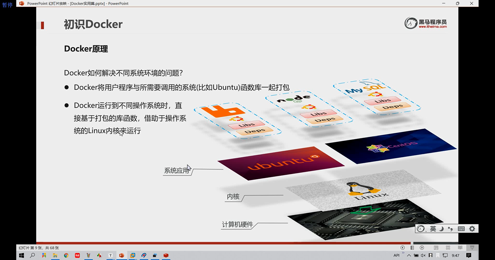

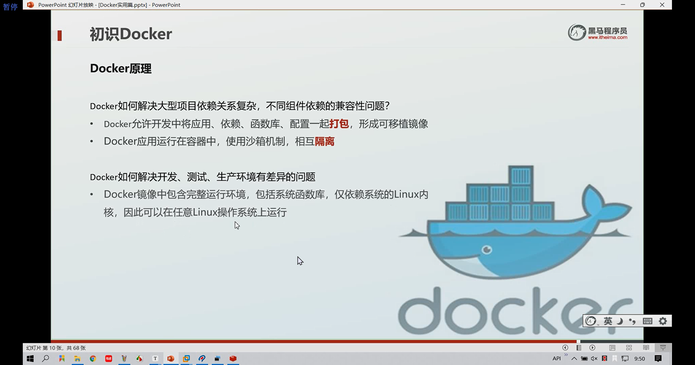

docker解决依赖兼容性问题的时候

docker应用运行在容器中指的是打包好的镜像运行会独占一个进程（一个进程就是一个容器）

docker解决开发、测试、生产环境又差异的问题的时候

docker镜像包含**完整运行环境**

总结

直接在linux发行版（centos）安装软件，弊端是安装和卸载麻烦，并且不同软件由于版本问题带来兼容问题，同时在不同发行版上移植的能力比较差

docker可以解决上述所有问题

1. docker将某个软件mysql软件的函数库依赖以及配置文件进行打包

1. docker还可以将当前软件所在的系统的函数库等进行打包

这样使用docker就可以实现不同linux发行版的系统上进行使用

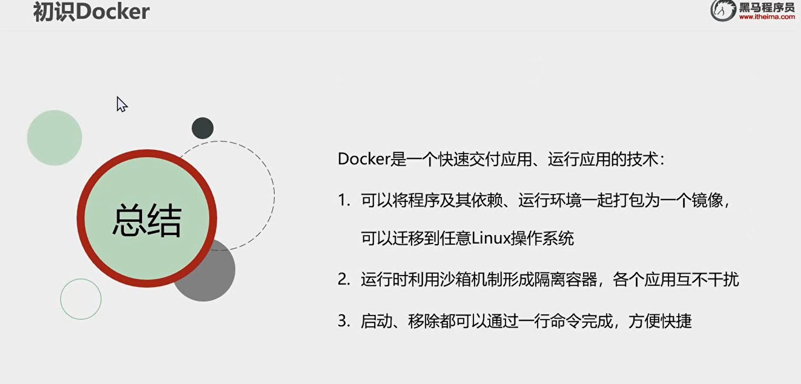

docker和虚拟机之间的差异

虚拟机是操作系统重模拟硬件设备，然后运行另一个操作系统，比如在windows系统里面运行ubuntu应用

```bash
传统的虚拟机需要模拟整台机器包括硬件，每台虚拟机都需要有自己的操作系统，虚拟机一旦被开启，预分配给他的资源将全部被占用。每一个虚拟机包括应用、必要的二进制和库，以及一个完整的用户操作系统。像平常用的VMware就属于虚拟机操作软件
```

docker仅仅是封装函数库，并没有模拟完整的操作系统

```bash
docker是一种容器技术
容器即使是和我们的宿主机共享硬件资源及操作系统可以实现资源的动态分配。容器包含应用和其所有的依赖包，但是与其他容器共享内核。容器在宿主机操作系统中，在用户空间以**分离的进程**运行

所有主流的Linux发行版都可以运行Docker
```

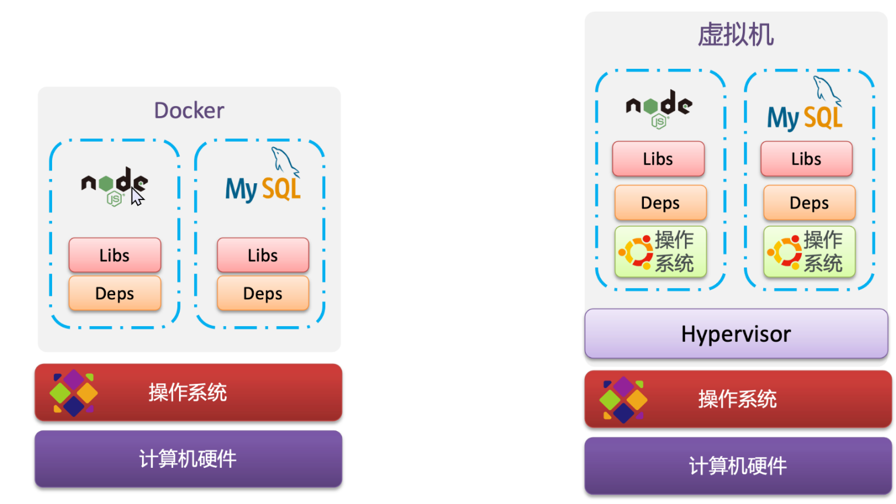

hypervisor的解释：

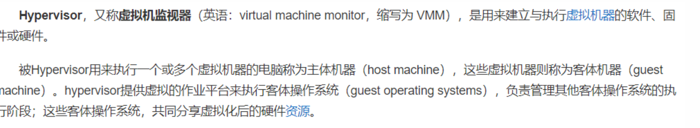

对比来看


总结：

Docker和虚拟机的差异

1. docker是一个系统进程；虚拟机是在操作系统中的操作系统

1. docker体积小、启动速度快、性能好。虚拟机体积大、启动速度慢、性能一般

镜像和容器

docker中重要的概念

镜像：docker将应用程序及所需的依赖、函数库、环境、配置等文件打包在一起，称为镜像

容器：镜像中的应用程序运行后形成的进程就是容器，只是docker会给容器进程做隔离，对外不可见

> ps：一切应用最终都是代码组层，都是硬盘中的一个个字节形成的文件。只有运行时，才会加载到内存，形成进程


镜像就是把一个应用在硬盘上的文件、及其运行环境、部分系统函数库文件一起打包形成的文件包。这个文件包是只读的

容器就是将这些文件中编写的程序、函数加载到内存中允许、形成进程，只不过要隔离起来。因此一个镜像可以启动多次，形成多个容器进程

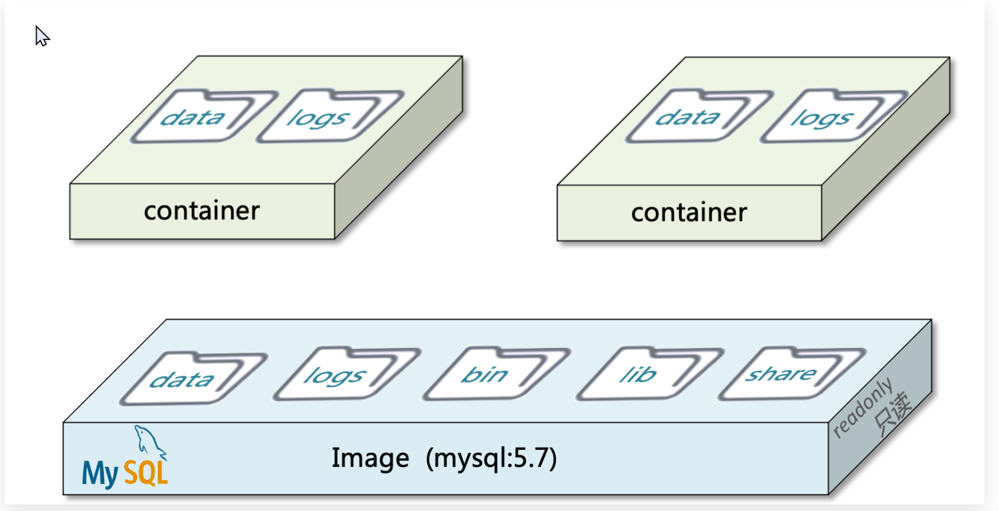

比如一个qq应用运行所需要的文件及其运行的操作系统依赖包，形成qq镜像（在硬盘里，就是上面的image），然后运行镜像（到内存里）称为容器进程（内存中），容器进程就是（container  qq1），可以开多个容器进程（qq1、qq2、qq3），开好几个qq。

dockerhub

开源应用程序太多，打包这些应用往往是重复劳动。为了避免这些重复劳动，人们就将自己打包的应用镜像，如Reids、MySQL镜像放到网络上，共享使用，就像**GitHub**的代码一样

DockerHub：DockerHub是一个官方的Docker镜像的托管平台、这样的平台称为**Docker Register**

国内也有类似**于DockerHub**的公开服务，比如网易云镜像服务、阿里云镜像库等

我们一方面可以将自己的镜像共享到DockerHub，另一方面也可以从DockerHub拉取镜像：

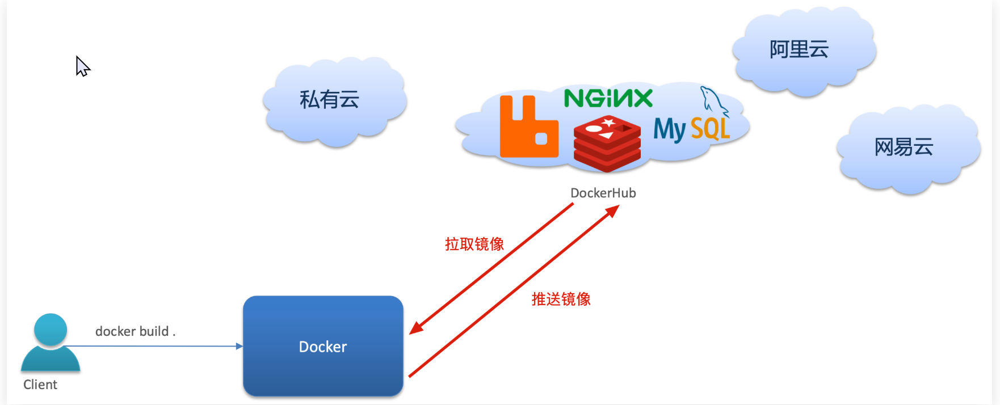

实际公司开发的时候使用的是自己的私有云

Docker的架构

Docker是一个CS架构的程序，由两部分组成：

服务端（server）：Docker守护进程，负责付出Docker指令，管理镜像、容器等

客户端（client）：通过命令或RestAPI向Docker服务端发送指令。可以在本地或远程向服务端发送指令

在Docker架构图中，docker daemon守护进程（通常简称为Docker Daemon）是Docker系统的核心组件，它复杂管理所有Docker对象（如镜像、容器、网络、卷等），并响应来自Docker Client（客户端）的命令

Docker daemon想象成一个“后台服务员”或“管家”，它一直运行在服务器上（Linux/windows/Mac）等待client通过docker命令（比如docker run，docker build）告诉它做什么。它接到指令后，就去创建容器、拉取镜像、构建镜像、管理网络等

架构图：

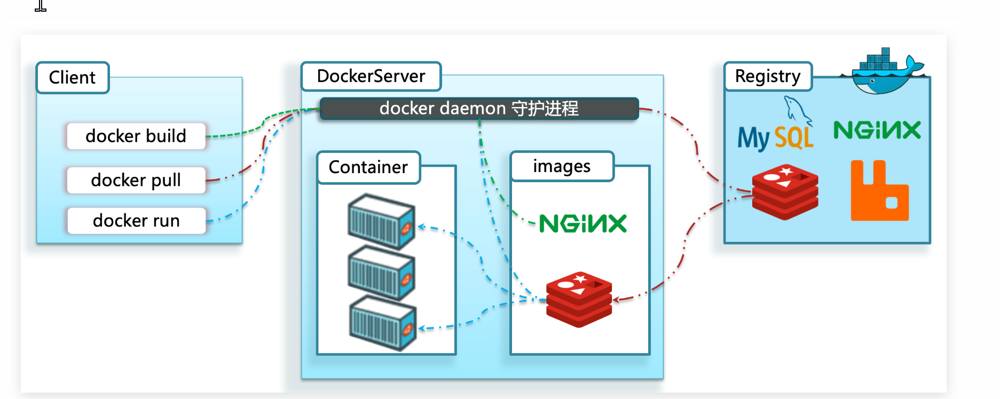

总结：

1. 镜像

1. 将应用程序及其依赖、环境、配置打包在一起

1. 容器

1. 镜像运行起来就是容器，一个镜像可以运行多个容器

1. Docker结构

1. 服务端：接受命令或远程请求，操作镜像或容器

1. 客户端：发送命令或请求到Docker服务端

1. DockerHub：

1. 一个镜像托管的服务器，类似的还有阿里云镜像服务器，统称为DockerRegistey

0 安装docker

> 官网：


Docker分为CE和EE两大版本。CE即社区版（免费，支持周期7个月），EE即企业版，强调安全，付费使用，支持周期24个月

DockerCE分为stable test和nightly三个更新频道

这里主要是Docker CE在CentOS上的安装

1 CentOS安装Docker

Docker CE支持64位版本CentOS 7，并且要求内核版本不低于3.10，CentOS满足最低内核的要求，所以在CentOS上安装Docker

1.1卸载（可选）

如果之前安装过旧版本的Docker，可以使用下面的命令卸载：

```bash
yum remove docker \
                  docker-client \
                  docker-client-latest \
                  docker-common \
                  docker-latest \
                  docker-latest-logrotate \
                  docker-logrotate \
                  docker-selinux \
                  docker-engine-selinux \
                  docker-engine \
                  docker-ce
```

其中\表示的是一行命令比较多看着不方便，可以使用\表示换行

1.2 安装docker

首先需要大家虚拟机联网，安装yum工具

```bash
yum install -y yum-utils \
           device-mapper-persistent-data \
           lvm2 --skip-broken
```

然后更新本地镜像源

```bash
# 设置docker镜像源
yum-config-manager \
    --add-repo \
    https://mirrors.aliyun.com/docker-ce/linux/centos/docker-ce.repo
# 添加docker镜像相关依赖    
sed -i 's/download.docker.com/mirrors.aliyun.com\/docker-ce/g' /etc/yum.repos.d/docker-ce.repo
# 刷新缓存
yum makecache fast


```

说明：yum源默认是从国外下载，上述命令表示更新yum源下载的镜像源为阿里云，这样下面安装docker的时候会快一些

然后输入命令开始安装docker

```bash
yum install -y docker-ce
```

docker-ce为免费社区版

在进行刷新缓存的时候

```bash
yum makecache fast
```

出现的问题

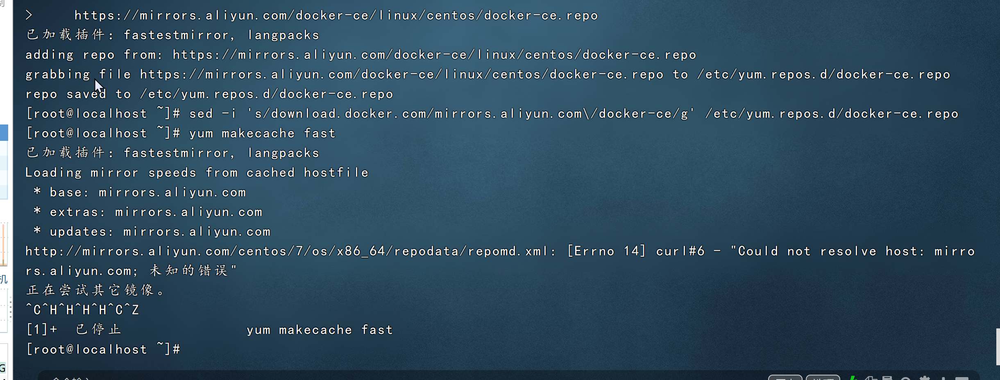

错误的cause是：无法解析阿里云

解决过程

检查并修复DNS的配置

```bash
vi /etc/resolv.conf
```

添加以下内容（推荐两个公共 DNS）

```bash
nameserver 8.8.8.8
nameserver 114.114.114.114
```

保存退出后，看看能否解析

```bash
ping mirrors.aliyun.com
或者
nslookup mirrors.aliyun.com
```

如果ping通了再执行

```bash
yum makecache fast
```

又出现的问题

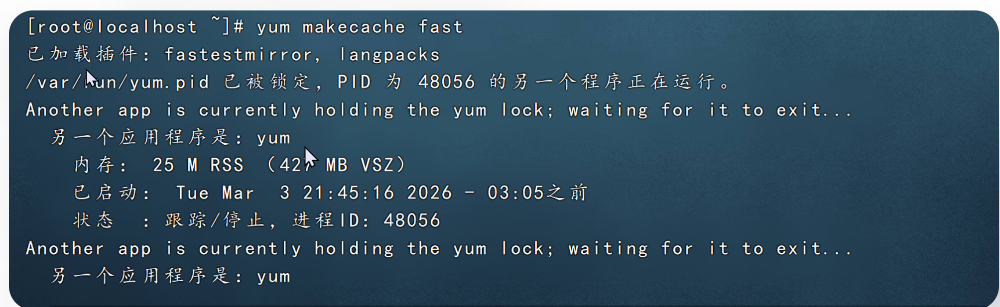

这是一个yum包管理器被锁住的错误

yum在同一时间只允许一个实例运行（防止多个进程同时修改软件包数据包导致冲突）

现在有一个yum进程（pid 48056）正在后台运行，占用了锁文件（/var/run/yum.pid），所以新命令yum makecache fast被阻塞等待

直接kill掉，然后重新更新

```bash
kill -9 48056
```

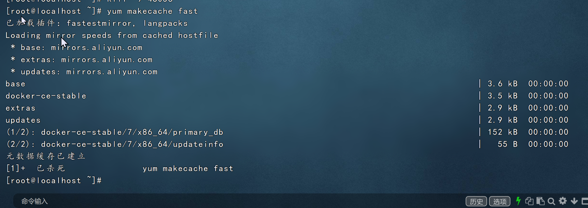

成功运行yum makecache fast

然后开始输入命令安装docker

```bash
yum install -y docker-ce
```

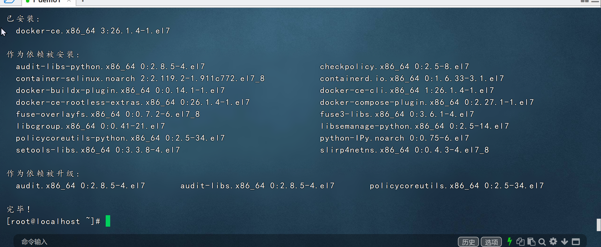

显示安装成功

手动安装的mysql怎么关掉

```bash
查找所有 mysqld 进程
ps aux | grep mysqld
强制杀死所有 mysqld 进程
kill -9 $(pgrep mysqld)
```

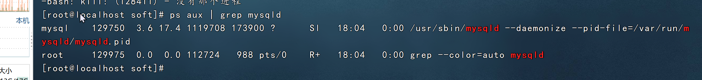

还是杀不死

```bash
#先确认服务名
systemctl list-units | grep -i mysql

#常见的服务名为mysqld.service、mysql.service、mariadb.service

#然后停止
systemctl stop mysqld
#或
systemctl stop mysql


#再检查
ps aux | grep mysqld

#可以发现就剩下了grep自己了
```

1.3启动docker

docker应用需要用到各种端口，逐一去修改防火墙设置。非麻烦，建议关闭防火墙

注意：启动docker之前，一定要关闭防火墙

关不防火墙

```bash
# 关闭
systemctl stop firewalld
# 禁止开机启动防火墙
systemctl disable firewalld
```

通过命令启动docker

```bash
systemctl start docker  #启动docker服务

systemctl stop docker #停止docker服务

systemctl restart docker  #重启docker服务

systemctl status docker  #检查docker状态

systemctl enable docker  #设置docker服务开机启动
```

输入命令，查看当前docker的版本

```bash
docker -v
```

1.4 配置镜像加速

docker官方镜像仓库网速比较差，需要设置国内镜像服务

参考阿里云的镜像加速文档：[https://cr.console.aliyun.com/cn-hangzhou/instances/mirrors](https://cr.console.aliyun.com/cn-hangzhou/instances/mirrors)

具体操作

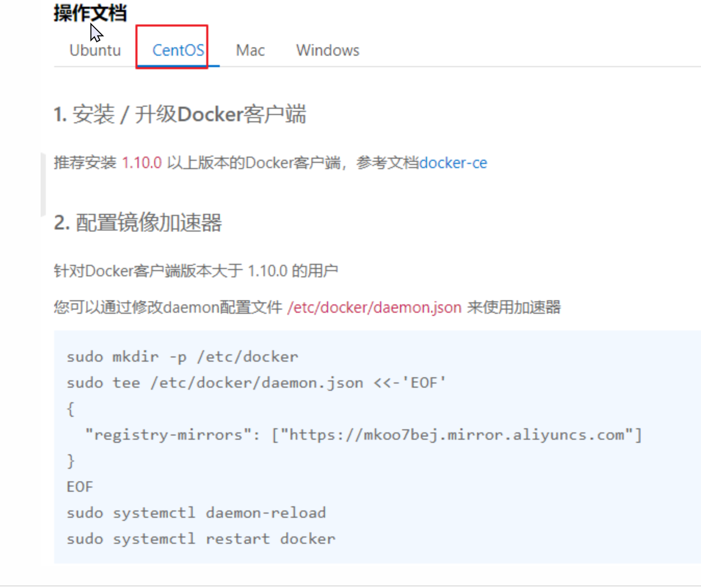

```bash
1. 安装／升级Docker客户端
推荐安装1.10.0以上版本的Docker客户端，参考文档docker-ce

2. 配置镜像加速器
针对Docker客户端版本大于 1.10.0 的用户

您可以通过修改daemon配置文件/etc/docker/daemon.json来使用加速器
# 1）执行第一条命令
# -p 创建多级目录
sudo mkdir -p /etc/docker

# 2）执行第二条命令

sudo tee /etc/docker/daemon.json <<-'EOF'
{
  "registry-mirrors": ["https://mkoo7bej.mirror.aliyuncs.com"]
}
EOF

# 3）执行第三条命令

sudo systemctl daemon-reload

# 4）执行第四条命令

sudo systemctl restart docker
```

如何验证是否执行成功？

使用docker info命令验证

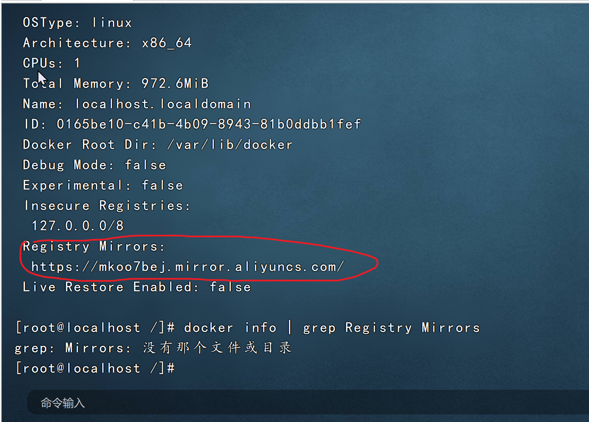

说明成功了。

centos安装dockercompose

下载

Linux下需要通过命令下载

```bash
# 安装
curl -L https://github.com/docker/compose/releases/download/1.23.1/docker-compose-`uname -s`-`uname -m` > /usr/local/bin/docker-compose
```

显示为

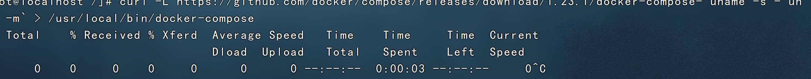

卡在了这里

走手动上传的模式（因为需要设置linux的代理，非常的麻烦）

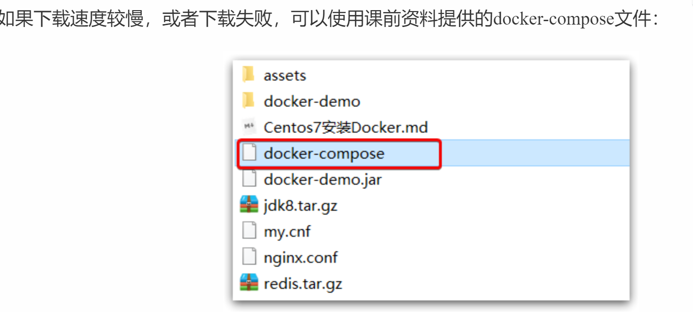

注意是/usr/local/bin目录下

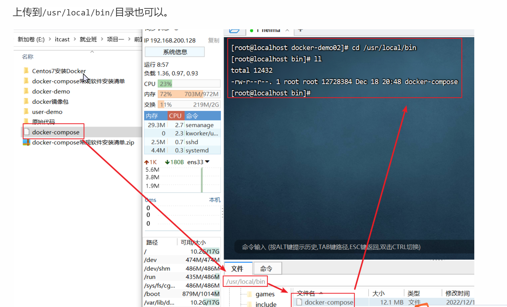

dockercompose是干什么的？

管理多个容器；如果没有它就要条命令一条命令的敲；有了它就可以通过docker-compose.yml命令一键启动和关闭

比如：

```bash
version: '3'
services:
db:
    image: mysql:5.7
    environment:
        MYSQL_ROOT_PASSWORD: 123
    volumes:
        - ./data/mysql:/var/lib/mysql
    networks:
        - my-net
redis:
    image: redis
    networks:
    - my-net
    
    
wp:
    image: wordpress
    ports:
        - "80:80"
    depends_on:  # 关键！确保 db 先启动
        - db
    networks:
        - my-net
    networks:
        my-net:
```

然后只需要执行一条命令：

```bash
docker-compose up -d
```

结果是：docker compose会自动创建网络、按顺序启动所有容器、配置好关联关系

2.2 修改文件权限

将文件变为执行权限

```bash
# 修改权限
chmod +x /usr/local/bin/docker-compose
```

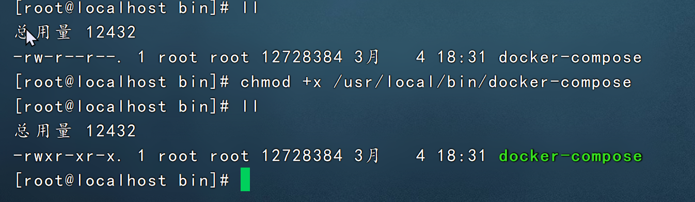

下面操作可选

2.3 Base自动补全命令（可选）

以下的命令可以自选执行，执行之后再docker-compose中会自动提示

1.需要修改自己的hosts文件：

```bash
echo "199.232.68.133 raw.githubusercontent.com" >> /etc/hosts
```

2 执行命令

```bash
# 补全命令
curl -L https://raw.githubusercontent.com/docker/compose/1.29.1/contrib/completion/bash/docker-compose > /etc/bash_completion.d/docker-compose
```

由于服务器连接不上**raw.githubusercontent.com****，**导致curl下载了一个空文件或错误页面，才导致没有生效

要让这个命令生效需要加一个国内加速器前缀

```bash
curl -L https://ghproxy.net/https://raw.githubusercontent.com/docker/compose/1.29.1/contrib/completion/bash/docker-compose > /etc/bash_completion.d/docker-compose && chmod +x /etc/bash_completion.d/docker-compose && source /etc/bash_completion.d/docker-compose
```

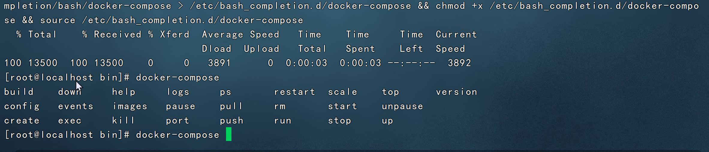

docker-compose加一个空格后按Tab键，出现很多命令，说明成功了

docker命令补全（注意不是docker-compose）

```bash
# 查看系统中是否已经包含命令补齐脚本
ls  /usr/share/bash-completion/completions/docker*
# 下载自动补齐工具
yum -y install bash-completion
# 让自动补齐功能生效
source /usr/share/bash-completion/completions/docker
source /usr/share/bash-completion/bash_completion
```

docker加空格然后两下Tab键生效

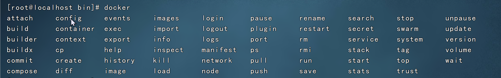

关于docker和docker-compose的提示无法同时生效的问题

可能是加载的时候或者什么顺序导致到覆盖或错乱

实验后发现一般会出现docker提示命令没问题，docker-compose提示命令出现问题的情况

只需要再次执行docker-compose的提示按照命令即可

```bash
curl -L https://ghproxy.net/https://raw.githubusercontent.com/docker/compose/1.29.1/contrib/completion/bash/docker-compose > /etc/bash_completion.d/docker-compose && chmod +x /etc/bash_completion.d/docker-compose && source /etc/bash_completion.d/docker-compose
```

执行之后，docker和docker-compose的提示都生效

但有时候又不会生效

实验后发现，只要配置了全局的代理（linux可以科学上网），那么重新执行提示命令相关之后，正常了

3 Docker镜像仓库

搭建镜像仓库可以基于Docker官方提供的DockerRegistry来实现

官网地址：[https://hub.docker.com/_/registry](https://hub.docker.com/_/registry)

Docker基本操作

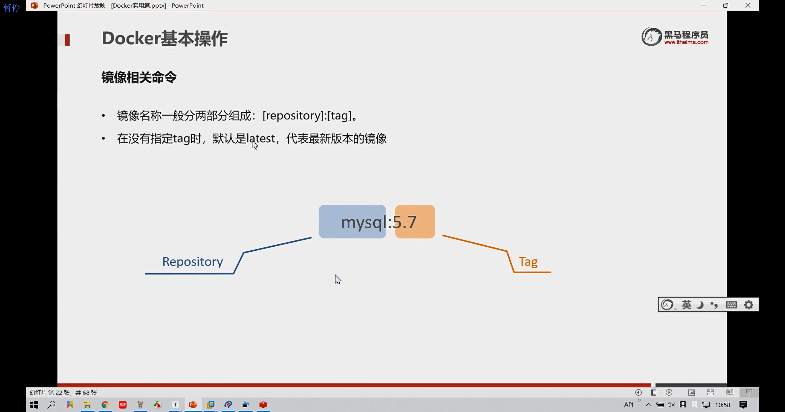

镜像操作命令

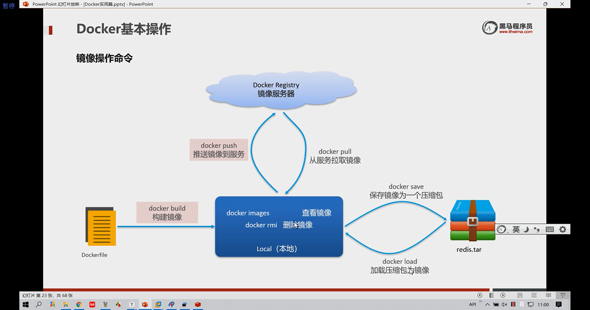

docker基本操作-镜像

案例：

从DockerHub中拉取一个nginx镜像并查看

分三步

1 首先去镜像仓库搜索nginx镜像，比如DockerHub（[https://hub.docker.com/_/nginx](https://hub.docker.com/_/nginx)）：

2 根据查看看到的镜像名称，拉取自己需要的镜像，通过命令：docker pull nginx

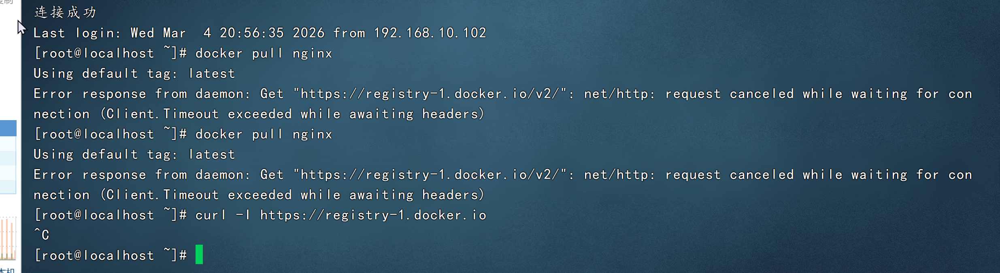

由于连接超时，有两种解决办法，一种是配置linux环境下的流量连接模式与宿主机对齐（相当麻烦），另一种是使用镜像

选择第二种使用镜像

```bash
1. 创建或覆盖 daemon.json 配置文件
这里使用了目前最稳定的几个国内源（阿里云、腾讯云、网易、中科大）
sudo tee /etc/docker/daemon.json <<-'EOF'
{
"registry-mirrors": [
"https://docker.m.daocloud.io",
"https://huecker.io",
"https://dockerhub.timeweb.cloud",
"https://noohub.ru"
],
"live-restore": true
}
EOF
2. 重载系统配置并重启 Docker
sudo systemctl daemon-reload
sudo systemctl restart docker
3. 验证是否生效
echo "✅ 当前配置的镜像加速器："
docker info | grep -A 10 "Registry Mirrors"

#由于近期国内 Docker 镜像源变动频繁，如果上述某个源失效，Docker 会自动尝试下一个。如果所有都慢，可能需要临时找一下最新的“可用镜像源列表”替换进去。

2. 测试拉取速度
docker pull nginx:latest


```

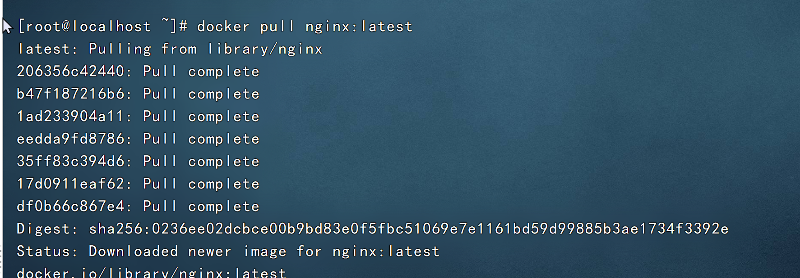

加载nginx镜像成功

3 通过命令：docker images查看拉取到的镜像

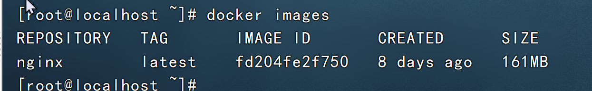

拉取成功

案例2：保存、导入镜像

需求：利用docker save将nginx镜像导出磁盘，然后再通过load加载回来

1) 利用docker xx --help命令查看docker save和docker load的语法

例如，查看save命令用法，可以输入命令

```bash
docker save --help
```

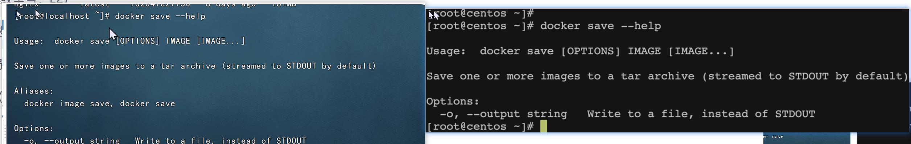

两者本质是一样的，只是版本不同而已

命令格式为	

```bash
docker save -o [保存的目标文件名称] [镜像名称]
```

2）使用docker save导出到磁盘

运行命令

```bash
docker save -o nginx.tar nginx:latest
```

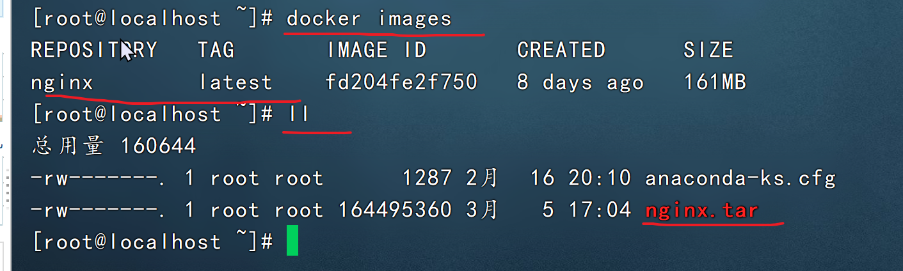

3) 使用docker load加载镜像

先删除本地的nginx镜像：

```bash
docker rmi nginx:latest
```

镜像删除成功

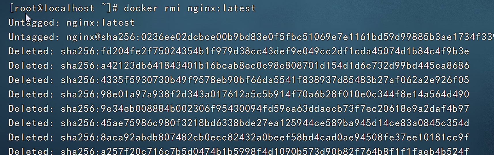

在加载本地nginx的镜像

```bash
docker load -i nginx.tar
```

结果：加载成功

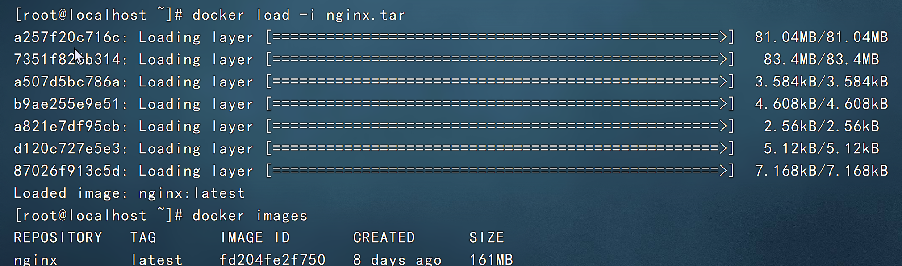

练习：

```bash
需求：去DockerHub搜索并拉取一个Redis镜像
目标：
1）去DockerHub搜索Redis镜像
   ** 访问：https://hub.docker.com**
2）查看Redis镜像的名称和版本
    
3）利用docker pull命令拉取镜像
说明：拉取指定版本的redis镜像 
    docker pull redis:latest
    
4）利用docker save命令将 redis:latest打包为一个redis.tar包
    docker save -o redis.tar redis:latest
5）利用docker rmi 删除本地的redis:latest
    docker rmi redis:latest
6）利用docker load 重新加载 redis.tar文件
    docker load -i redis.tar
```

**遇到的问题是：在docker pull redis:7.4 的时候走不了代理**

**下面是具体的解决流程和办法思路（已跑通）**

```bash
[VMware 桥接模式]
        ↓
[Linux 获得同网段 IP 192.168.10.100]    ens33配置
        ↓
[Windows 防火墙放行 ICMP + 53 + 7890 端口]    window放入规则设置（可命令和图形化界面操作）
        ↓
[Clash 监听 0.0.0.0:53 (DNS) + 0.0.0.0:7890 (HTTP)]  修改flash中的设置 
        ↓
[Linux 设置 nameserver 192.168.10.102 + 代理环境变量]
        ↓
[curl https://www.google.com → 200 OK!]
        ↓
[Docker / git / browser / apt / yum 全部科学上网！]
```

我都做了什么（**centos中的linux上的代理配置**）

第一部分 windows端。

1 放行端口53号端口

```bash
 放行 Clash HTTP 代理端口 (默认 7890)
New-NetFirewallRule -DisplayName "Clash HTTP Proxy" -Direction Inbound -Protocol TCP -LocalPort 7890 -Action Allow
放行 Clash SOCKS5 代理端口 (默认 7891)
New-NetFirewallRule -DisplayName "Clash SOCKS5 Proxy" -Direction Inbound -Protocol TCP -LocalPort 7891 -Action Allow
放行 DNS 服务端口 (UDP & TCP 53)
New-NetFirewallRule -DisplayName "Clash DNS UDP 53" -Direction Inbound -Protocol UDP -LocalPort 53 -Action Allow
New-NetFirewallRule -DisplayName "Clash DNS TCP 53" -Direction Inbound -Protocol TCP -LocalPort 53 -Action Allow
 
```

2 修改(windows代理的)fclash的配置

```bash
dns:
    listen: '0.0.0.0:53'
    enhanced-mode: redir-host
```

3 获取windows的地址

在 PowerShell 输入 ipconfig，找到连接 Linux 的那个网卡（通常是 vEthernet (WSL) 或 物理网卡），记下 IPv4 地址。

示例 IP: 192.168.10.102 (后续所有 Linux 配置都用这个 IP)

第二部分

目标：让linux系统、docker守护进程、以及所有docker容器自动走windows的代理

windows ip为：192.168.10.102

代理端口为7890

1 系统级代理（用户会话生效）

编辑 ~/.bashrc(或/etc/profile全局生效)，添加

```bash
#全局代理
export http_proxy="http://192.168.10.102:7890"
export https_proxy="http://192.168.10.102:7890"
export no_proxy="localhost,127.0.0.1,.local,.internal,192.168.10.0/24"
```

2 docker守护进程代理（拉取镜像生效）

```bash
sudo mkdir -p /etc/systemd/system/docker.service.d
sudo vi /etc/systemd/system/docker.service.d/http-proxy.conf
```

文件内容

```bash
[Service]
Environment="HTTP_PROXY=http://192.168.10.102:7890"
Environment="HTTPS_PROXY=http://192.168.10.102:7890"
Environment="NO_PROXY=localhost,127.0.0.1,.local,.internal"

```

重启并加载docker

```bash
sudo systemctl daemon-reload
sudo systemctl restart docker
```

3 容器内部自动代理

编辑 ~/.bashrc，在末尾添加智能 Shell 函数，让 docker run 自动注入环境变量：

```bash
--- Docker Auto Proxy Function Start ---
export DOCKER_PROXY_ARGS="-e http_proxy=http://192.168.10.102:7890 -e https_proxy=http://192.168.10.102:7890 -e no_proxy=localhost,127.0.0.1,.local"
docker() {
    if [ "$1" = "run" ]; then
        shift
        # 如果用户没手动指定 http_proxy，则自动注入
        if [[ " $@ " != " -e http_proxy " ]] && [[ " $@ " != " --env http_proxy " ]]; then
            command docker run $DOCKER_PROXY_ARGS "$@"
        else
            command docker run "$@"
        fi
    else
        command docker "$@"
    fi
}
--- Docker Auto Proxy Function End ---

```

第三部分 验证清单

1 验证Linux宿主机上网

```bash
curl -I https://www.google.com
预期：HTTP/2 200
```

2 验证Docker拉取镜像（测试被墙的网站）

```bash
sudo docker pull gcr.io/google-containers/busybox:latest
预期：Download complete
```

3 验证docker容器内上网（无需手动输入参数）

```bash
docker run --rm curlimages/curl -I https://www.google.com
预期：HTTP/2 200 (且能看到 Google 的 Header)
```

注意事项（维护部分）：

IP 变动问题：

如果 Windows 的 IP 地址变了（例如换了 WiFi），你需要更新 Linux 中的三处配置：

~/.bashrc (系统变量 + Docker 函数)

/etc/systemd/system/docker.service.d/http-proxy.conf

建议：在 Windows 网络设置中，将网卡设置为静态 IP，避免频繁变动。

Clash 规则模式：

确保 Clash 处于 Rule (规则) 或 Global (全局) 模式。如果是 Direct (直连) 模式，Google 依然无法访问。

DNS 污染：

如果在容器中遇到 Could not resolve host 错误，检查 Windows 防火墙是否放行了 UDP 53 端口，并确认 Clash 配置中 dns.listen 已开启。

容器操作相关命令

容器操作命令如图：

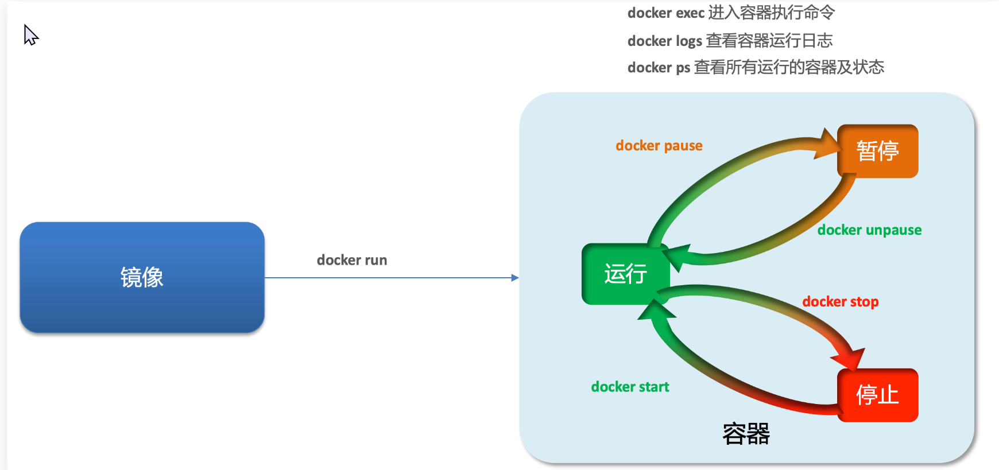

容器保护的三个状态

1. 运行：进程正常运行

1. 暂停：进程暂停，cpu不再运行，并不释放内存

1. 停止：进程终止，回收进程暂用内存、cpu等资源

其中：

1. docker run：创建并运行一个容器，处于运行状态

1. docker pause：让一个运行的容器暂停

1. docker unpause：让一个容器从暂停状态恢复运行

1. docker stop：停止一个运行的容器

1. docker start：让一个停止的容器再次运行

1. docker rm：删除一个容器

1. docker ps -a：查看所有容器

案例:

创建并运行nginx容器的命令

```bash
docker run --name containerName -p 80:80 -d nginx
```

命令解读：

1. docker run：创建并运行一个容器

1. --name：给容器起一个名字，比如叫做mn

1. -p：将宿主机端口与容器端口映射，冒号左侧是宿主机端口，右侧是容器端口

1. -d：后台运行容器

1. nginx：镜像名称，例如nginx

我通过网桥和centos中的linux连接，那么我在linux中使用docker命令，那么-p的宿主机是哪一个？

> 容器内部：Nginx 监听 80 端口。
> CentOS (宿主机)：Docker 会在 CentOS 的网络接口上监听 8080 端口。
> Windows (你)：你需要访问 CentOS 的 IP 地址 的 8080 端口。


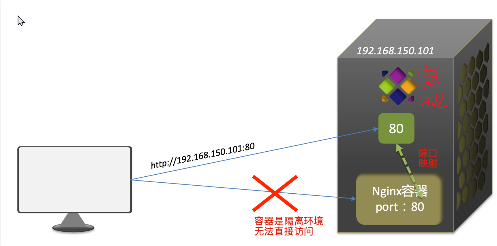

```bash
docker run --name nginxTest -p 80:80 -d nginx


#查看容器的状态
docker ps -a
#对齐查看容器状态
docker ps -a --format "table {{.Names}}\t{{.Status}}\t{{.Ports}}"

```

在windows端访问宿主机的80端口

案例2：

需求：进入nginx容器，修改html文件内容，添加“welcome 传智教育”

提示：进入容器要用到docker exec命令

步骤：

1) 进入容器。进入我们刚刚创建的nginx容器的命令

```bash
docker exec -it nginxTest bash
```

命令解读：

1. docker exec：进入容器内部，执行一个命令

1. -it：给当前进入的容器创建一个标准输入、输出终端，允许我们与容器交互

1. nginxTest：要进入的容器名称

1. bahs：进入容器后执行的命令，bash是一个linux终端交互命令

1. bash命令是shell脚本命令的超集，大多数shell脚本都可以在bash下运行，bash主要有如下这些功能cd rm mkdir...

2）进入nginx的HTML所在目录/usr/share/nginx/html

容器内部会模拟一个独立的Linux文件系统，看起来如同一个linux服务器一样：

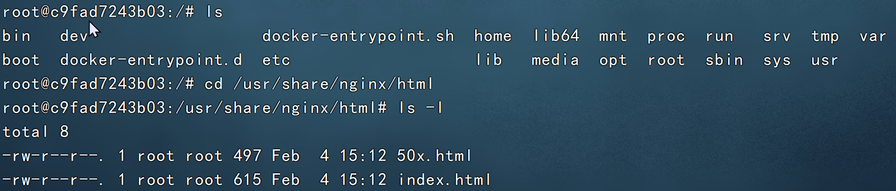

3）修改index.html的内容

容器内没有vim命令，无法直接修改，用下面的命令来修改

```bash
sed -i -e 's#Welcome to nginx#传智教育欢迎您#g' -e 's#<head>#<head><meta charset="utf-8">#g' index.html
```

说明：

1）-e：可以在同一行里执行多条命令

2）-i：就是对文本文件进行操作

在windows的浏览器访问即可看到结果

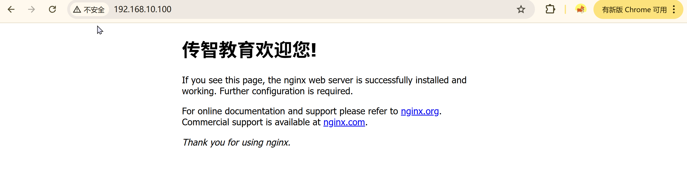

**Docker容器操作小结**

1 暂停容器

docker pause 容器名

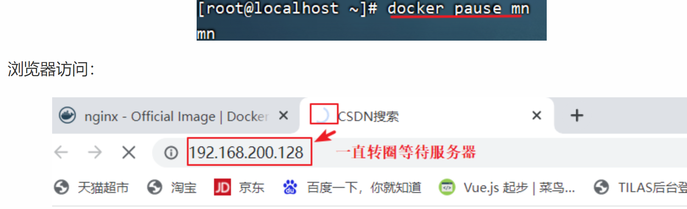

2 从暂停回到运行容器

docker unpause 容器名

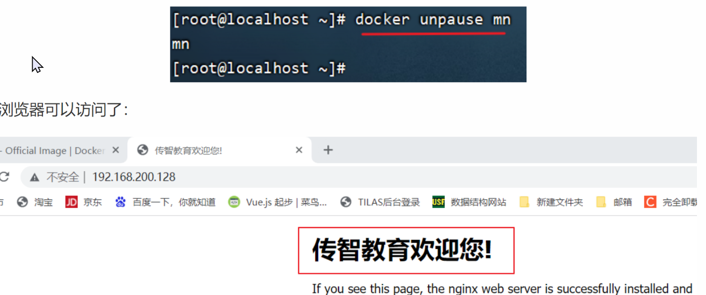

3 停止容器？

docker stop 容器名

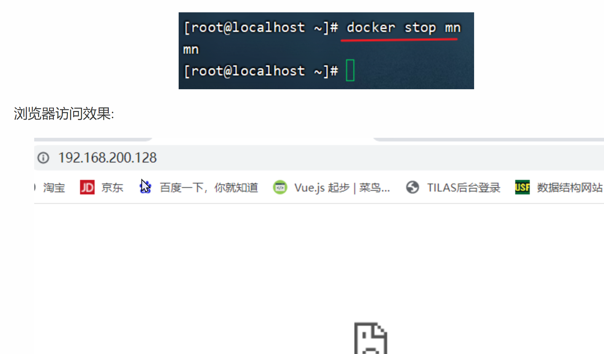

4 从停止到启动容器？

docker start 容器名

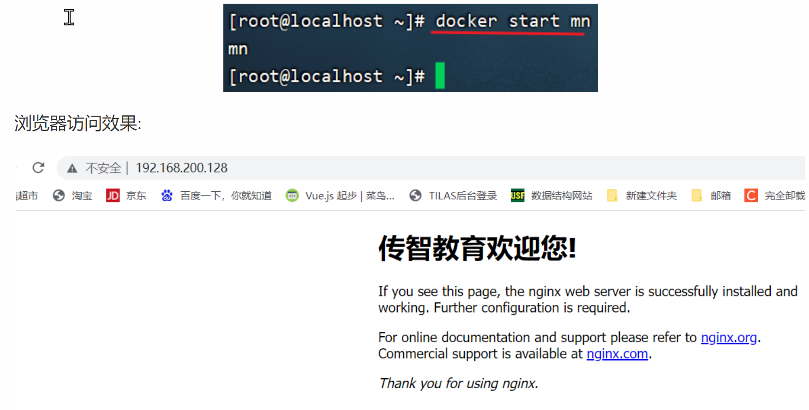

5 查看所有容器的状态docker ps、docker stop mn、docker ps -a

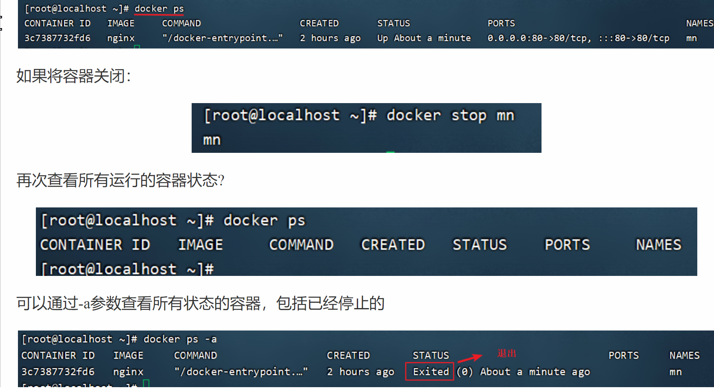

6 查看容器日志？

docker logs 容器名

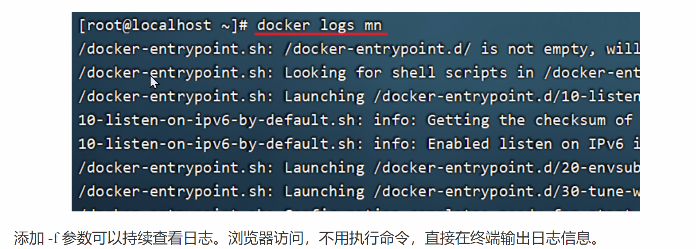

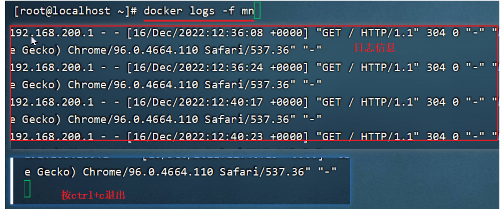

7 删除容器

docker mn 容器名

不能删除运行中的容器，除非添加-f 参数

docker rm -f 容器名

8 docker run 命令常见参数有哪些？

1. --name：指定容器名称

1. -p：指定端口映射

1. -d：让容器后台运行

```bash
docker -run --name containerName -p 80:80 -d nginx
```

案例：创建并运行一个redis容器，并支持数据持久化

实现步骤

1. 到DockerHub搜索Redis镜像

1. 查看Redis镜像文档中的帮助信息

1. 利用docker run命令运行一个Redis容器

步骤一：到DockerHub中搜索Redis镜像

步骤二：查看Reids镜像文档中的帮助信息

步骤三：利用docker run命令运行一个Redis容器

```bash
docker run --name redis -p 6379:6379 -d redis redis-server --appendonly yes

    --name：指定容器名称，redis为容器名
    -p: 指定端口映射。6379:6379 冒号左侧是宿主机端口，右侧是容器端口
    -d: 让容器后台运行
    redis：表示镜像名
    redis-server：表示redis服务
    --appendonly yes：开启aof持久化
```

步骤四：进入redis容器

```bash
docker exec -it redis bash
```

步骤五：执行redis-cli客户端命令

```bash
redis-cli
```

步骤六：设置数据num=666

```bash
set num 666
```