同步和异步

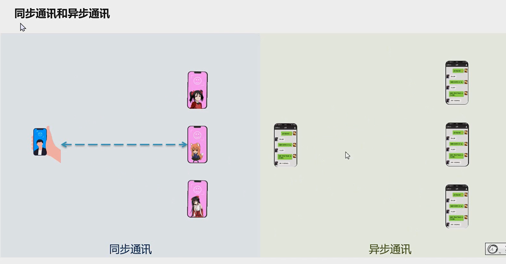

同步调用的问题是耦合度较高、性能下降、资源浪费、级联失败

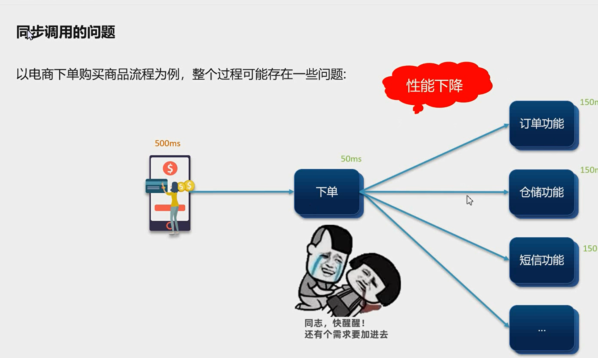

同步调用出现的问题

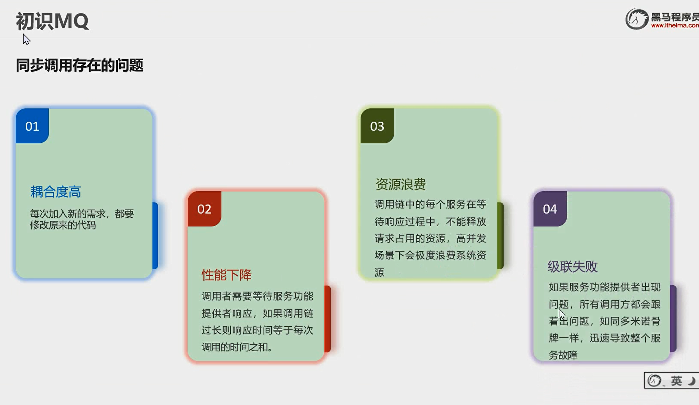

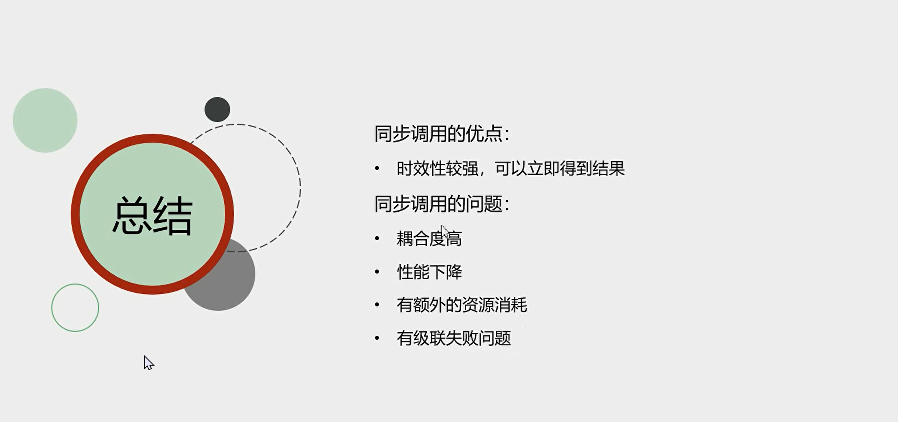

同步调用的优点：

时效性较强，可以立即得到结果

同步调用的问题：

耦合度高

性能下降

有额外的资源消耗

有级联失败的问题

异步调用方案

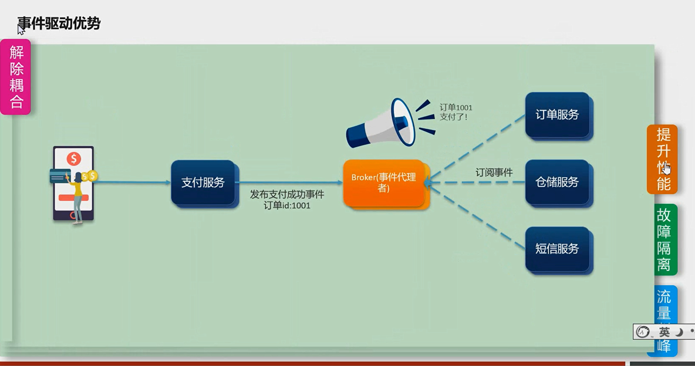

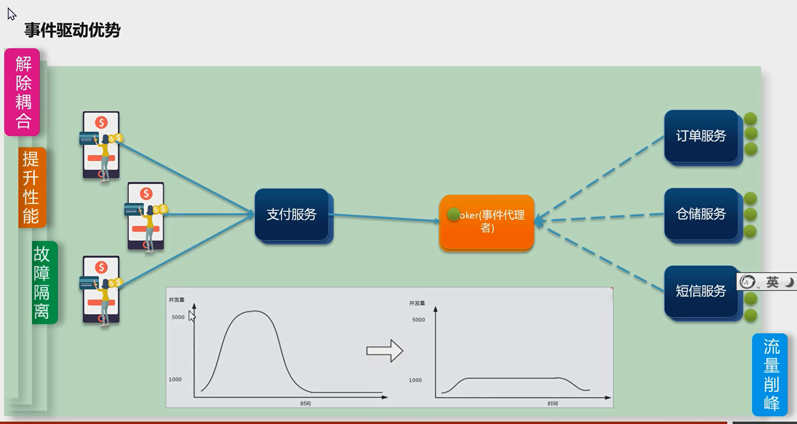

broker作为一个大坝，对流量进行分流和缓冲

总结

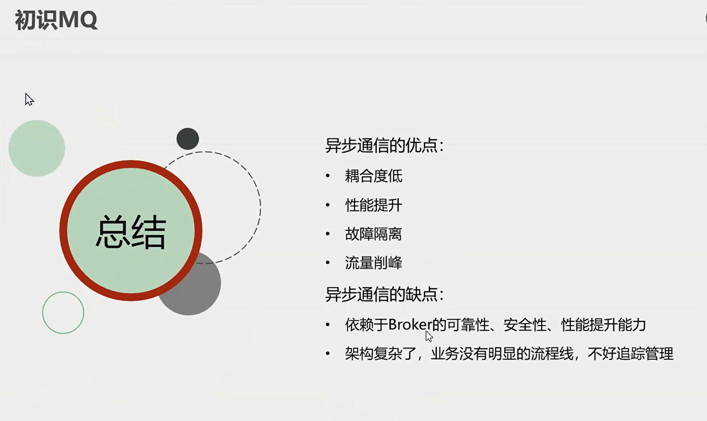

几种常见的mq

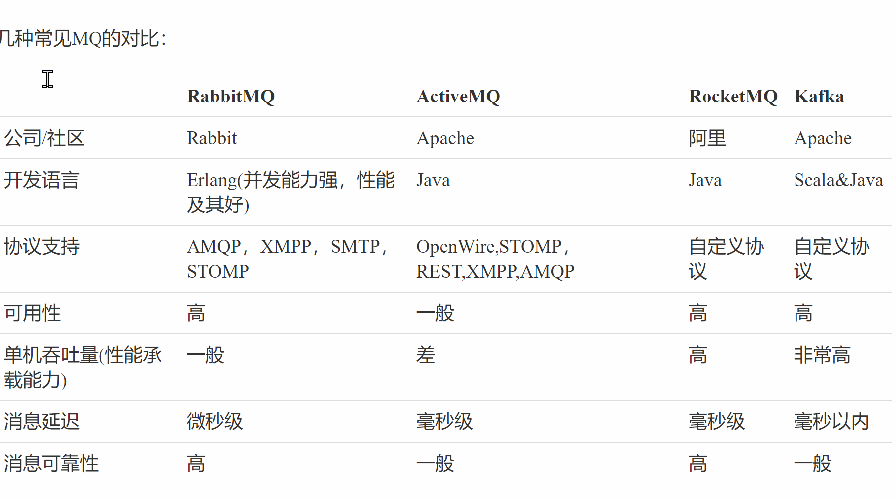

追求可用性（当需要处理数据时，资源处于可用状态）：Kafka、RockerMQ、RabbitMQ

追求可靠性：RabbitMQ、RocketMQ

追求吞吐能力（十万级别）：RocketMQ、Kafka

追求消息低延迟：RabbitMQ、Kafka

一些建议：

```bash
一般的业务系统要引入 MQ，最早大家都用 ActiveMQ，但是现在确实大家用的不多了，没经过大规模吞吐量场景的验证，社区也不是很活跃，所以不推荐用这个了；

后来大家开始用 RabbitMQ，由于是 erlang 语言阻止了大量的 Java 工程师去深入研究和掌控它，对公司而言，几乎处于不可控的状态，但是确实人家是开源的，比较稳定的支持，活跃度也高；

不过现在确实越来越多的公司会去用 RocketMQ，确实很不错，毕竟是阿里出品，但社区可能有突然黄掉的风险（目前 RocketMQ 已捐给 Apache，但 GitHub 上的活跃度其实不算高）对自己公司技术实力有绝对自信的，推荐用 RocketMQ，否则回去老老实实用 RabbitMQ 吧，人家有活跃的开源社区，绝对不会黄。

所以中小型公司，技术实力较为一般，技术挑战不是特别高，用 RabbitMQ 是不错的选择；大型公司，基础架构研发实力较强，用 RocketMQ 是很好的选择。

如果是大数据领域的实时计算、日志采集等场景，用 Kafka 是业内标准的，绝对没问题，社区活跃度很高，绝对不会黄，何况几乎是全世界这个领域的事实性规范。
```

总结：小公司RabbitMQ、大公司RockerMQ、大数据Kafka

RabbitMQ单机部署

方法一：在线拉取

```bash
docker pull rabbitmq:3.8-management
```

方法二是手动部署

上传到虚拟机后，切换到mq.tar文件的tmp目录

```bash
cd /tmp
```

切换目录后使用命令加载镜像

```bash
docker load -i mq.tar
```

查看按照是否成功？

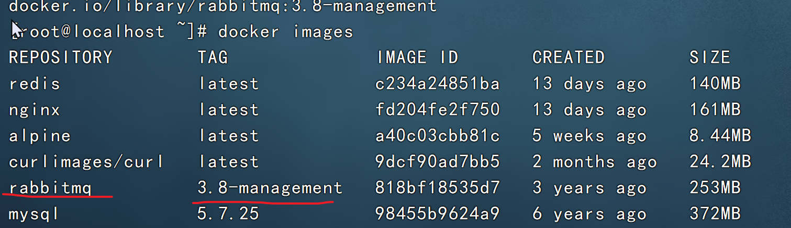

安装MQ

执行的命令的解析

```bash
docker run \
     # 设置环境变量  用户名是 itcast
     -e RABBITMQ_DEFAULT_USER=itcast \
     # 设置环境变量  密码是 123321
     -e RABBITMQ_DEFAULT_PASS=123321 \
     # 挂载数据卷，后面高级会用到下面的插件
     -v mq-plugins:/plugins \
     # mq的名字
     --name mq \
     # 主机名 这里不配置也可以，后期如果是集群必须配置
     --hostname mq \
     # web可视化终端监控端口；mq的ui界面管理平台端口
     -p 15672:15672 \
     # 程序与mq交互的访问端口；发消息和收消息的端口
     -p 5672:5672 \
     # 后端运行
     -d \
     # 镜像名称
     rabbitmq:3.8-management
```

实际执行

```bash
docker run \
     -e RABBITMQ_DEFAULT_USER=itcast \
     -e RABBITMQ_DEFAULT_PASS=123321 \
     -v mq-plugins:/plugins \
     --name mq \
     --hostname mq \
     -p 15672:15672 \
     -p 5672:5672 \
     -d \
     rabbitmq:3.8-management
```

其中

15672端口：web可视化终端监控端口；mq的ui界面管理平台端口

5672端口：程序与mq交互的访问端口；发消息和收消息的端口

注意要关闭防火墙

```bash
#临时关闭
systemctl stop firewalld

#永久关闭
systemctl disable firewalld
systemctl stop firewalld

#验证状态
systemctl status firewalld
# 应该显示 "inactive (dead)"
```

出现的问题，登录不上去

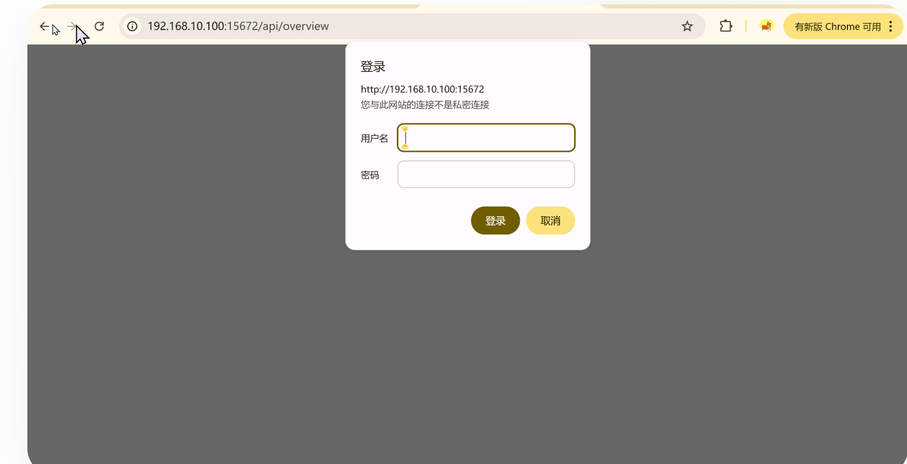

本地测试也无法登录

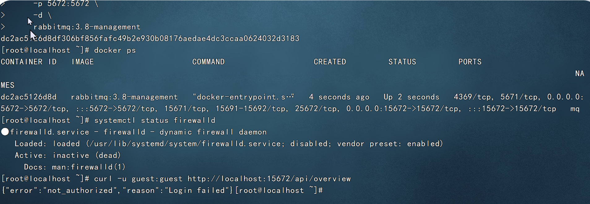

需要对创建用户并进行授权

```bash
#第一步、进入容器。id为图中的容器的id
docker exec -it dc2ac5126d8d bash

#第二步、在容器中添加新用户
# 添加用户 admin / password123
rabbitmqctl add_user admin admin
#看到的结果是Adding user "admin" ...Done. Don't forget to grant the user permissions to some virtual hosts! See 'rabbitmqctl help #set_permissions' to learn more.

# 设置为管理员
rabbitmqctl set_user_tags admin administrator

# 赋予所有权限（对默认虚拟主机 /）
rabbitmqctl set_permissions -p / admin ".*" ".*" ".*"

#执行成功后的结果
Setting permissions for user "admin" in vhost "/" ...

#最后退出容器
exit

```

访问http://192.168.10.100:15672，然后通过admin、admin登录即可

注意：访问阻塞，则尝试重启mq服务，或者重启docker服务

重启rabbitmq服务通过两个命令来实现：

rabbitmqctl stop ：停止rabbitmq

rabbitmq-server restart：重启rabbitmq

如何在rabbitmq中查询用户列表

```bash
docker exec -it <你的容器ID> bash
# 例如：docker exec -it dc2ac5126d8d bash

rabbitmqctl list_users


```

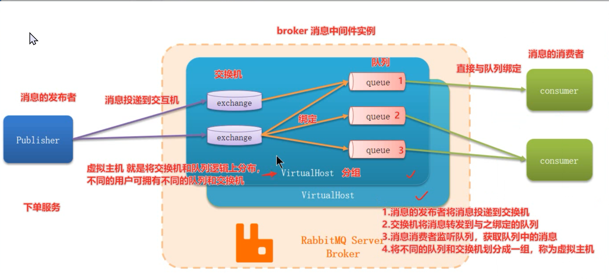

RabbitMQ中的一些角色

publisher：生产者（发布者）

consumer：消费者

exchange：交换机，负责消息路由（注意：交换机不是用来存储消息的，队列才是）

queue：队列，存储消息

virtualHost：虚拟主机，隔离不同租户的exchange、queue、消息的隔离

channel：表示通道，操作MQ的工具。是消息发布者和交换机之间的连接通道，也是消息消费者连接队列的通道

RabbitMQ基本结构的归纳

1 消息的发布者publisher将消息投递到交换机exchange

2 交换机exchange将消息转发到**绑定**的队列queue

3 消息消费者consumer监听队列queue，获取队列queue中的消息

4 将不同的队列queue和交换机exchange划分为一组，称为虚拟主机virtualHost

注意：消息的发布者publisher只知道对应的交换机exchange，不知道队列。反之，消息消费者consumer只知道队列queue，不知道交换机exchange

RabbitMQ的常见消息模型

1 基本消息队列

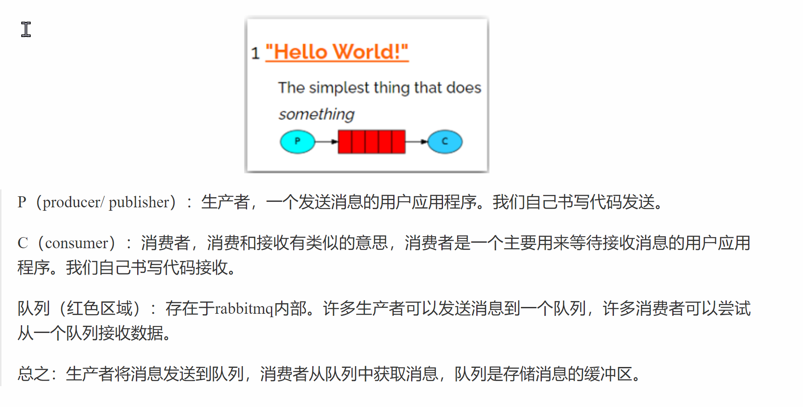

简而言之就是自己写消息的发送和消息的生产的程序，rabbitmq内部充当缓冲区

2 工作消息队列

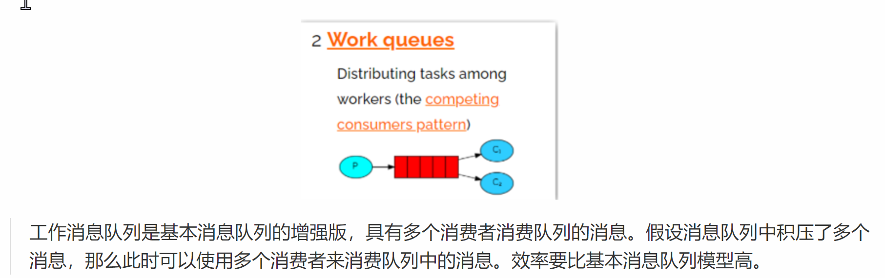

就是在1（基本消息队列）的基础之上，由多个消费者共同消费队列rabbitmq（缓冲区）中的消息

3 发布订阅模式

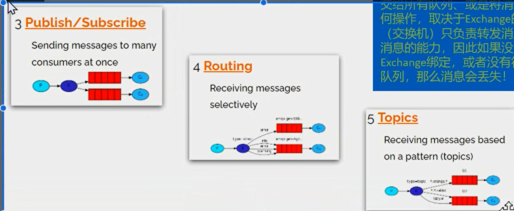

1、一个生产者，多个消费者

2、每一个消费者都有自己的一个队列

3、生产者没有将消息直接发送到队列，而是发送到了交换机

4、每个队列都要绑定到交换机

5、生产者发送的消息，经过交换机到达队列，实现一个消息被多个消费者获取的目的

X（exchange）：交换机一方面：接受生产者发送的消息。另一方面：知道如何处理消息，例如递交给某个特别的队列、递交给所有队列、或是将消息丢弃、到底如何操作，取决于Exchange的类型、Exchange（交换机）只负责转发消息，**不具备存储消息的能力**，因此如果没有任何独立额与Exchange绑定，或者没有符合路由规则的队列，那么消息会丢失！

fanout Exchange（广播）

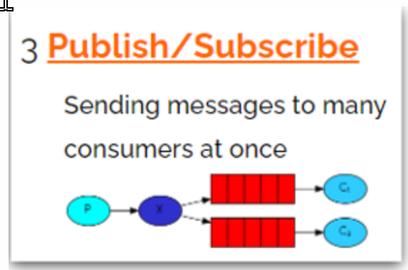

将消息交给所有绑定到交换机的队列，生产者发送消息，只能发送到交换机，交换机来决定要发给哪个队列，**生产者无法决定**。交换机把消息发送给绑定过的所有队列，队列的消费者都能拿到消息。实现一条消息被多个消费者消费

Direct Exchange

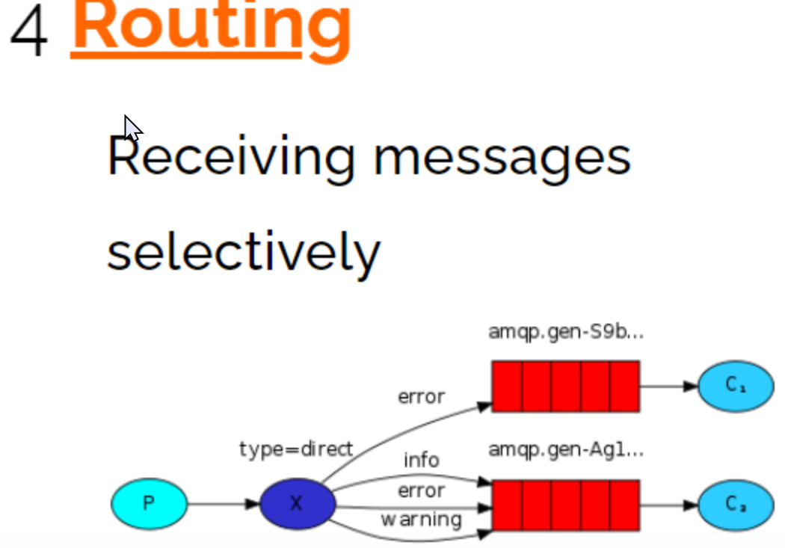

1、在广播模式下，生产者发布消息，所有消费者都可以获取所有消息

2、在某些场景下，我们希望不同的消息被不同的队列消费。这时就要用到Direct类型的Exchange。在Direct模型下，队列和交换机的绑定，不能是任意绑定了，而是要指定一个RoutingKey（路由key）。消息的发送方在Exchange发送消息时，也必须指定消息的routing key

3 P：生产者，向Exchange发送消息，发送消息，会指定一个routing key

4 X：Exchange（交换机），接受生产者的消息，然后把消息递交给routing key完成匹配的队列

Topic Exchange：主题

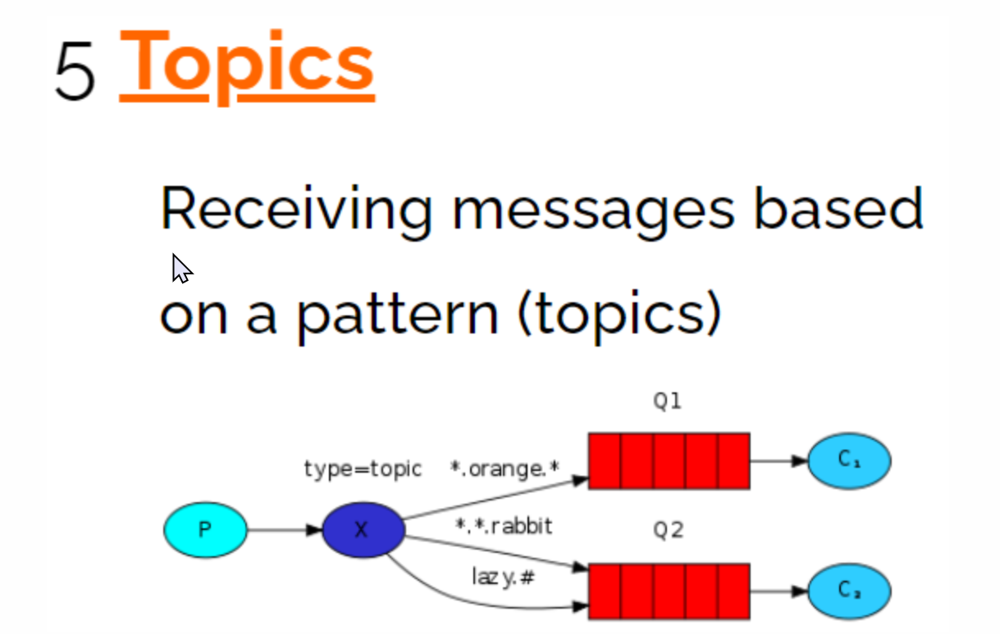

1 Topic类型的Exchange与Direct相比，都是可以根据RoutingKey把消息路由到不同的队列。只不过Topic类型Exchange可以让队列在绑定Routing key的时候使用通配符

2 Routingkey一般都是一个或多个单词组成，多个单纯之间以","分割，例如：item.insert

3 通配符规则

#：匹配一个或多个词

*：匹配恰好1个词

 代码实现

```bash
package cn.itcast.mq.helloworld;

import com.rabbitmq.client.Channel;
import com.rabbitmq.client.Connection;
import com.rabbitmq.client.ConnectionFactory;
import org.junit.Test;

import java.io.IOException;
import java.util.concurrent.TimeoutException;

public class PublisherTest {
    @Test
    public void testSendMessage() throws IOException, TimeoutException {
        // 1.建立连接
        ConnectionFactory factory = new ConnectionFactory();
        // 1.1.设置连接参数，分别是：主机名、端口号、vhost、用户名、密码
        factory.setHost("192.168.200.128");
        //发送和接收消息的端口号
        factory.setPort(5672);
        //虚拟主机的地址
        factory.setVirtualHost("/");
        factory.setUsername("itcast");
        factory.setPassword("123321");
        // 1.2.建立连接
        Connection connection = factory.newConnection();

        // 2.创建通道Channel
        Channel channel = connection.createChannel();

        // 3.创建队列
		/*
            声明队列
                参数1：队列的名称 queueName
                参数2：队列是否支持持久化 false：不持久化处理
                参数3：队列是否排它：是否允许其它的connection下的channel连接
                参数4：是否空闲时自动删除，当最后一个consumer(消费者)断开之后，队列将自动删除。
                参数5：参数是rabbitmq的一个扩展，功能非常强大，基本是AMPQ中没有的。这里我们先传递null
         */
        String queueName = "simple.queue";
        channel.queueDeclare(queueName, false, false, false, null);

        // 4.发送消息
        String message = "hello, rabbitmq!";
        /*
            发送消息：
                参数1：exchange 交换机 没有就设置为 "" 值就可以了
                参数2：routingKey 路由的key 现在没有设置key，直接使用队列的名字queueName
                参数3：发送数据到队列的时候，是否要带一些参数。直接赋值null即可
                参数4：body 向队列中发送的消息数据
         */
        channel.basicPublish("", queueName, null, message.getBytes());
        System.out.println("发送消息成功：【" + message + "】");

        // 5.关闭通道和连接
        channel.close();
        connection.close();

    }
}


package cn.itcast.mq.helloworld;

import com.rabbitmq.client.*;

import java.io.IOException;
import java.util.concurrent.TimeoutException;

public class ConsumerTest {

    public static void main(String[] args) throws IOException, TimeoutException {
        // 1.建立连接
        ConnectionFactory factory = new ConnectionFactory();
        // 1.1.设置连接参数，分别是：主机名、端口号、vhost、用户名、密码
        factory.setHost("192.168.200.128");
        factory.setPort(5672);
        factory.setVirtualHost("/");
        factory.setUsername("itcast");
        factory.setPassword("123321");
        // 1.2.建立连接
        Connection connection = factory.newConnection();

        // 2.创建通道Channel
        Channel channel = connection.createChannel();

        // 3.创建队列
        //TODO:如果MQ中有同名的队列就会使用该队列，没有就会创建队列
        String queueName = "simple.queue";
        channel.queueDeclare(queueName, false, false, false, null);

        // 4.订阅消息
		/*
            参数1：消费者消费的队列名称
            参数2：收到消息后自动应答，通知rabbitmq自动剔除已经被消费的消息
            参数3：接口消息的回调：一旦队列下有新的消息，则自动回调DefaultConsumer对象下的handleDelivery方法
            把消息以入参传入到该方法中
         */
        channel.basicConsume(queueName, true, new DefaultConsumer(channel){
            @Override
            public void handleDelivery(String consumerTag, Envelope envelope,
                                       AMQP.BasicProperties properties, byte[] body) throws IOException {
                // 5.处理消息
                //TODO:body就是消费端接收到的消息
                String message = new String(body);
                System.out.println("接收到消息：【" + message + "】");
            }
        });
        System.out.println("等待接收消息。。。。");
    }
}


```

Spring AMQP是基于RabbitMQ封装的一套模版，并且还利用了SpringBoot对其实现了自动装配，使用起来非常方便

> 官网：


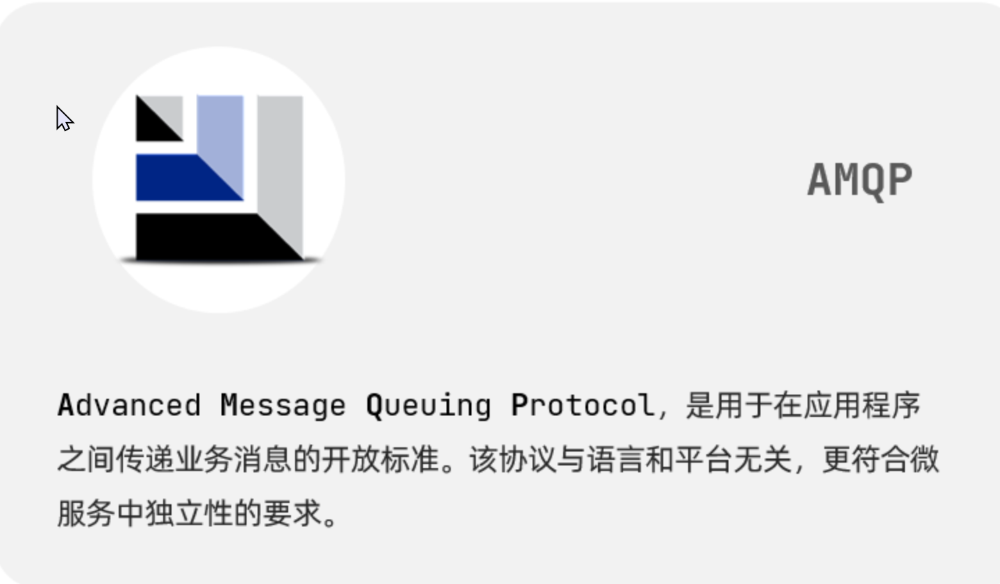

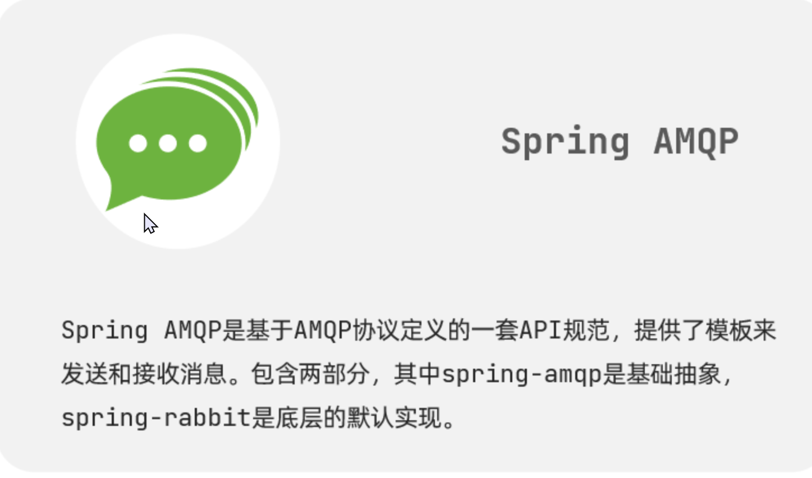

说明：

1 Spring AMQP是对Spring基于AMQP的消息收发解决方案，它是一个抽象层，不依赖于特定的AMQP Broker实现和客户端的抽象，所以可以很方便的替换。比如可以使用spring-rabbit来实现

2 spring-rabbit用于与RabbitMQ服务器交互的工具包

3 SpringAMQP提供了三个功能

自动声明队列、交换机及绑定关系

基于注解的监听器模式，异步接受消息

封装了RabbitTemplate工具，用于发送和接受消息

Spring AMQP发送和接受消息

Basic Queue简单队列模型

步骤如下：

1.在父工程中引入spring-amqp的依赖

2.在publisher服务中利用RabbitTemplate发送消息到simple.queue这个队列

3.在consumer服务中编写消费逻辑，绑定simple.queue这个队列

1 在父工程中引入依赖

```xml
<!--AMQP依赖，包含RabbitMQ-->
<dependency>
    <groupId>org.springframework.boot</groupId>
    <artifactId>spring-boot-starter-amqp</artifactId>
</dependency>
```

2 消息发送

整个过程中mq容器是启动的

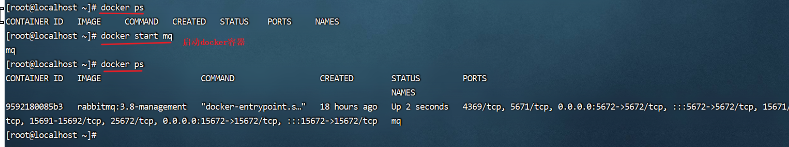

首先配备mq的地址，在publisher服务的application.yml中添加配置

```yaml
spring:
  rabbitmq:
    host: 192.168.10.100  # 主机名
    port: 5672 # 发送消息和接收消息的端口号
    virtual-host: / # 虚拟主机
    username: itcast # 用户名
    password: 123321 # 密码
    #预取 : 每次将队列中的消息发给消费者一个消息，当消费者消费完之后在给学消费者消息。那么这样做谁消费快谁就会消费更多的消息
    listener:
      simple:
        prefetch: 1
```

然后在publisher服务中编写测试类SpringAmqpTest，并利用RabbitTemplate实现消息发送：

1 定义变量保存队列名称

2 定义变量保存消息信息

3 发送消息

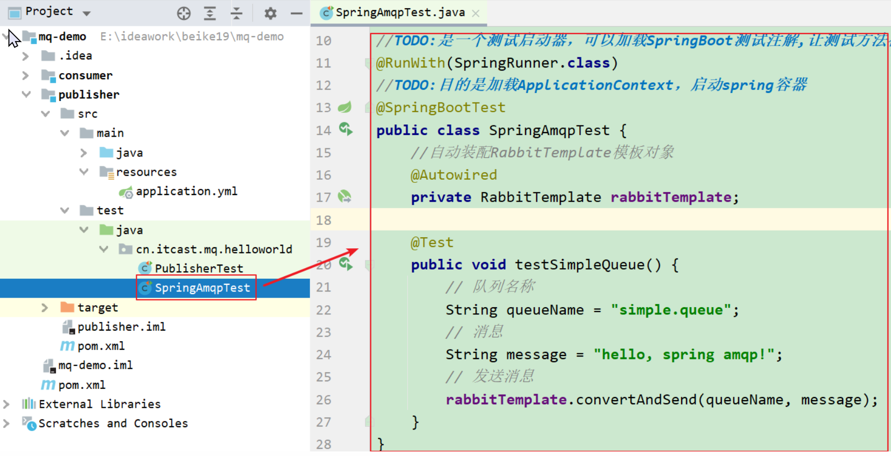

```java
package cn.itcast.mq.helloworld;

import org.junit.Test;
import org.junit.runner.RunWith;
import org.springframework.amqp.rabbit.core.RabbitTemplate;
import org.springframework.beans.factory.annotation.Autowired;
import org.springframework.boot.test.context.SpringBootTest;
import org.springframework.test.context.junit4.SpringRunner;

//TODO:是一个测试启动器，可以加载SpringBoot测试注解,让测试方法在Spring容器环境下执行
@RunWith(SpringRunner.class)
//TODO:目的是加载ApplicationContext，启动spring容器
@SpringBootTest
public class SpringAmqpTest {
    //自动装配RabbitTemplate模板对象
    @Autowired
    private RabbitTemplate rabbitTemplate;

    @Test
    public void testSimpleQueue() {
        // 队列名称
        String queueName = "simple.queue";
        // 消息
        String message = "hello, spring amqp!";
        // 发送消息
        rabbitTemplate.convertAndSend(queueName, message);
    }
}
```

消息接收

1 首先配置MQ地址，在consumer服务的application.yml中添加配置

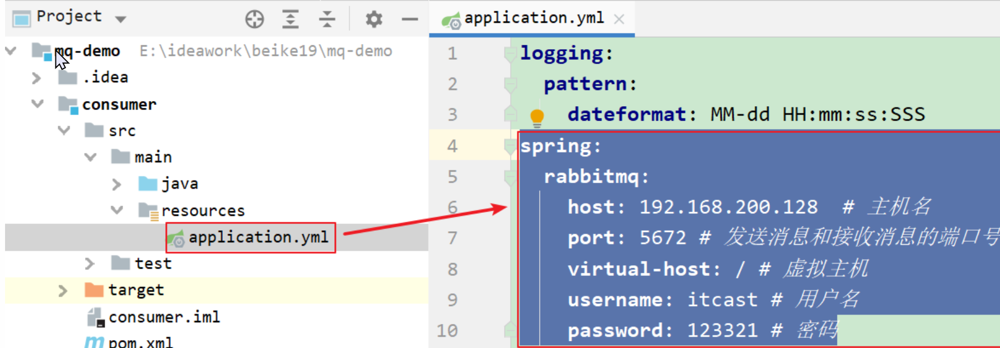

```yaml
spring:
  rabbitmq:
    host: 192.168.200.128  # 主机名
    port: 5672 # 发送消息和接收消息的端口号
    virtual-host: / # 虚拟主机
    username: itcast # 用户名
    password: 123321 # 密码
```

2 然后在consumer服务中的cn.itcast.mq.listener包中新建一个类SpringRabbitListener

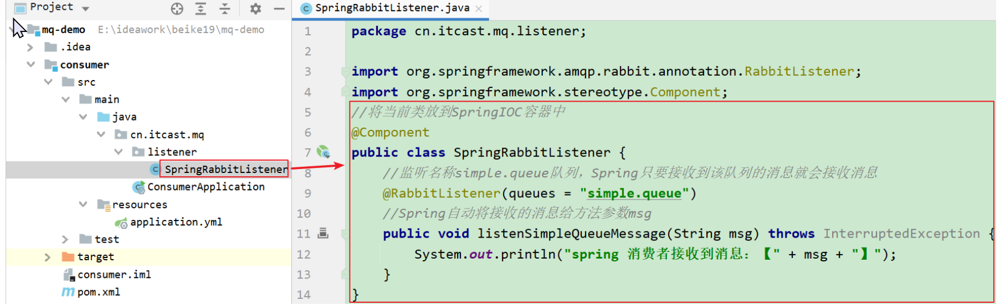

代码如下

```java
package cn.itcast.mq.listener;

import org.springframework.amqp.rabbit.annotation.RabbitListener;
import org.springframework.stereotype.Component;
//将当前类放到SpringIOC容器中
@Component
public class SpringRabbitListener {
    //监听名称simple.queue队列，Spring只要接收到该队列的消息就会接收消息
    @RabbitListener(queues = "simple.queue")
    //Spring自动将接收的消息给方法参数msg
    public void listenSimpleQueueMessage(String msg) throws InterruptedException {
        System.out.println("spring 消费者接收到消息：【" + msg + "】");
    }
}

```

测试即可

Work queue，也被称为（Task queues），任务模型。简单来说就是让多个消费者绑定到一个队列，共同消费队列中的消息

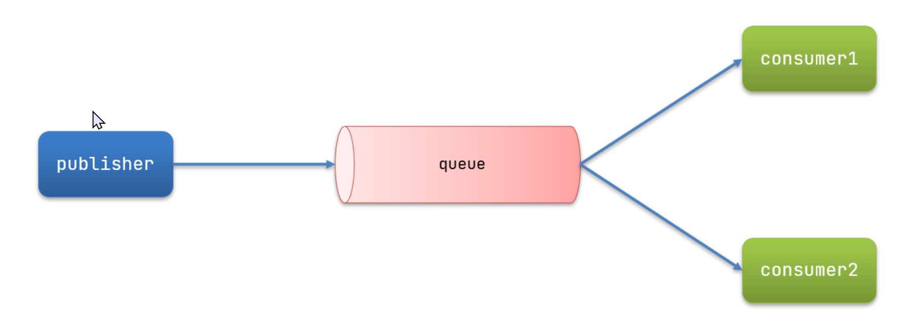

当消息处理比较耗时的时候，可能生产消息的速度会远远大于消息的消费速度。长此以往，消息就会堆积越来越多，无法及时处理

此时就可以使用work模型，多个消费者共同处理消息处理，速度就大大提高了

**注意：不一定是两个消费者**

代码实现思路

1 在publisher服务中定义测试方法，产生50条消息（每隔20ms发送一条），发送到simple.queue

2 在consumer服务中定义两个消息监听者，都监听simple.queue队列

3 消费者1处理50条消息（每隔20ms处理一条），消费者2处理50条消息（每隔100ms处理一条）

消息的发送

这次我们循环发送，模拟大量消息堆积的现象

在publisher服务中的SpringAmqpTest类中添加一个测试方法

```java
/**
     * workQueue
     * 向队列中不停发送消息，模拟消息堆积。
     */
@Test
public void testWorkQueue() throws InterruptedException {
    // 队列名称
    String queueName = "simple.queue";
    // 消息
    String message = "hello, message_";
    for (int i = 0; i < 50; i++) {
        // 发送消息
        rabbitTemplate.convertAndSend(queueName, message + i);
        Thread.sleep(20);
    }
}
```

消息的接受

要模拟多个消费者绑定一个队列，我们再consumer服务的SpringRabbitListener中添加2个新的方法：

```java
@RabbitListener(queues = "simple.queue")
    public void listenWorkQueue1(String msg) throws InterruptedException {
        System.out.println("消费者1接收到消息：【" + msg + "】" + new Date());
        Thread.sleep(20);
    }

    @RabbitListener(queues = "simple.queue")
    public void listenWorkQueue2(String msg) throws InterruptedException {
        System.err.println("消费者2........接收到消息：【" + msg + "】" + new Date());
        Thread.sleep(100);
    }
```

测试

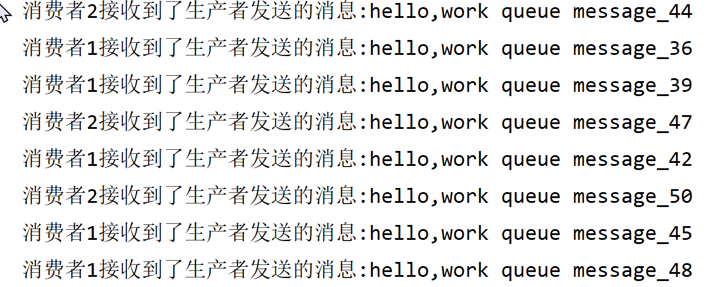

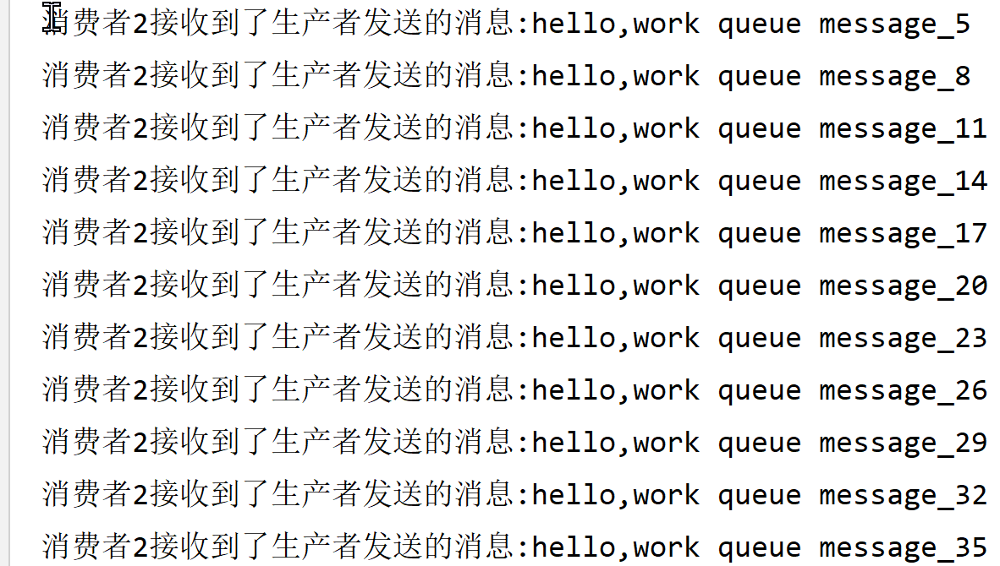

可以看到消费者1很快完成了自己的25条消息。消费者2缺在缓慢的处理自己的25条消息

也就是说消息时平均分配给每个消费者，并没有考虑到消费者的处理能力。这样显然有问题

说明：阐述上述原因是因为队列平均分配给每个消费者，即使当前消费者没有消费完，队列也将消息分配给消费者。然后消费者一个一个消费，即使消费很快的消费者，消费完毕，而消费很慢的消费者一直在消费。这样很不合理，应该能者多劳

在consumer中的yml中添加

```yaml
spring:
  rabbitmq:
    listener:
      simple:
        prefetch: 1 # 消费者每次最多只能预取一条消息，当消费完这条消息后，才能获取下一个消息，这样做的好处是消费能力强的消费者，处理的消息就会更多===》能者多劳
```

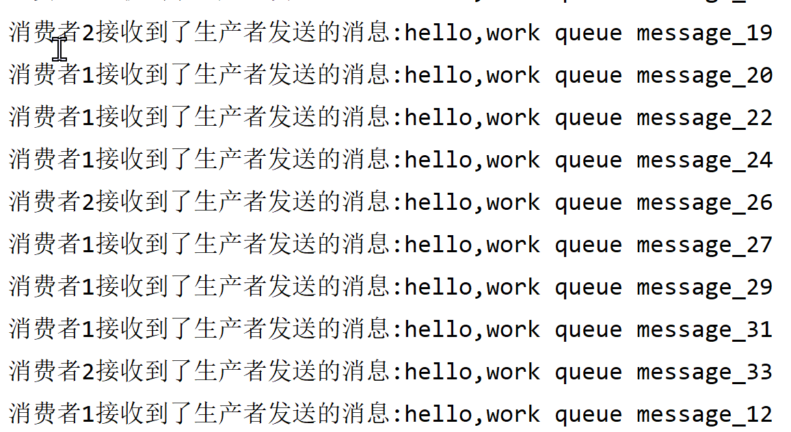

这样就解决了处理消息慢的消费者2堆积消息的情况

总结：

Work模型的使用：

多个消费者绑定到一个队列，同一条消息只会被一个消费者处理

通过设置prefetch来控制消费者预取得消息数量

发布订阅

发布订阅模型

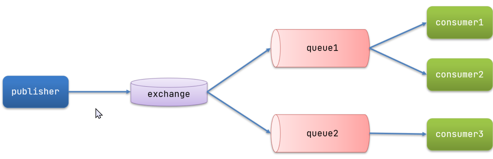

可以看到，在订阅模型中，对了exchange角色，而且过程略有变化

Publiser：生产者，也就说要发送消息的程序，但是不再发生到队列中，而是发给X（交换机）

Exchange：交换机，图中的X。一方面，接受生产者发送的消息。另一方面，知道如何处理消息，例如递交给某个特别的队列、递交给所有队列、或是将消息丢弃。最后如何操作，取决于Exchange的类型。Exchange有以下3种类型

Fanout：广播，将消息交给所有绑定到交换机的队列

Direct：定向，把消息交给符合指定routing key的队列

Topic：通配符，把消息交给符合routing pattern（路由模式）的队列

Consumer：消费者，与以前一样，订阅队列，没有变化

Queue：消息队列也与以前一样，接受消息、缓存消息

**Exchange（交换机）只负责转发消息，不具备存储消息的能力**，因此如果没有任何队列与Exchange绑定，或者没有符合路由规则的队列，那么消息会丢失

Fanout（扇出），中文翻译为广播

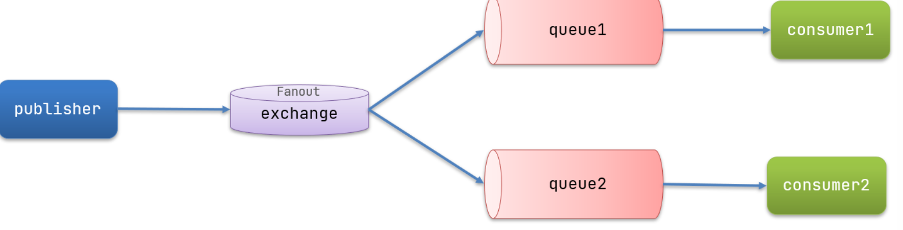

在广播模式下，消息发送的流程是这样的

1 可以有多个队列

2 每个队列都要绑定到Exchange（交换机）

3 生产者发送的消息，只能发送到交换机，交换机来决定要发给哪个队列，生产者无法决定

4 交换机把消息发送给绑定过的所有队列

5 订阅队列的消费者都能拿到消息

我们的计划是

1 创建一个交换机itcast.fanout，类型是Fanout

2 创建两个队列fanout.queue1 和fanout.queue2，绑定到交换机itcast.fanout

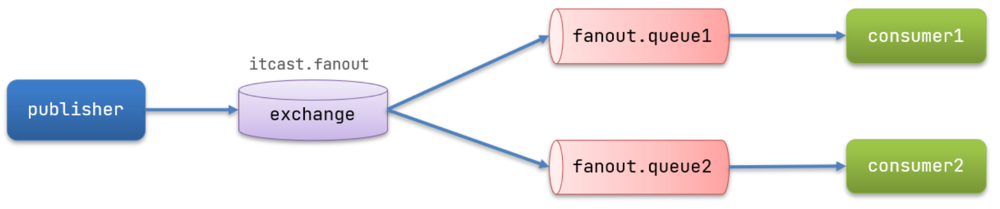

声明队列和交换机

Spring提供了一个接口Exchange，来表示所有不同类型的交换机

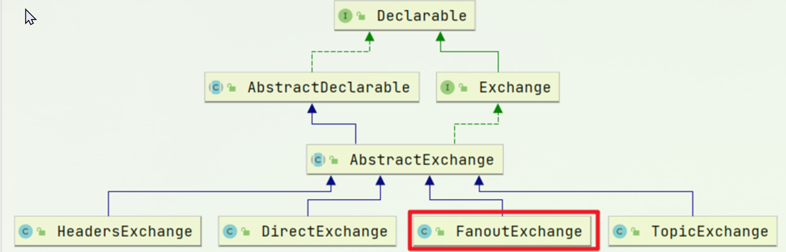

在consumer中创建一个配置类，声明队列和交换机

```java
package cn.itcast.mq.config;


import org.springframework.amqp.core.Binding;
import org.springframework.amqp.core.BindingBuilder;
import org.springframework.amqp.core.FanoutExchange;
import org.springframework.amqp.core.Queue;
import org.springframework.amqp.support.converter.Jackson2JsonMessageConverter;
import org.springframework.amqp.support.converter.MessageConverter;
import org.springframework.context.annotation.Bean;
import org.springframework.context.annotation.Configuration;

/**
 * @Configuration 将修饰的类FanoutConfig对象放到SpringIOC容器中
 */
@Configuration
public class FanoutConfig {

    //1.定义方法声明交换机，将交换机对象放到SpringIOC容器中
    //@Bean修饰的方法返回值对象作为SpringIOC容器中的value，方法名作为key
    @Bean
    public FanoutExchange fanoutExchange(){
        //itcast.fanout表示交换机的名字
        return new FanoutExchange("itcast.fanout");
    }

    //2.定义方法声明队列1
    @Bean
    public Queue fanoutQueue1(){
        //fanout.queue1 表示队列名
        return new Queue("fanout.queue1");
    }

    //3.定义方法将队列1绑定到交换机itcast.fanout上
    //下面方法的形参FanoutExchange fanoutExchange的名字和上述 public FanoutExchange fanoutExchange(){}方法名一致
    @Bean
    public Binding bindingQueue1ToExchange(FanoutExchange fanoutExchange,Queue fanoutQueue1){
        /*
            public Binding to(FanoutExchange exchange){}
         */
        return BindingBuilder.bind(fanoutQueue1).to(fanoutExchange);
    }

    //4.定义方法声明队列2
    @Bean
    public Queue fanoutQueue2(){
        //fanout.queue2 表示队列名
        return new Queue("fanout.queue2");
    }

    //5.定义方法将队列2绑定到交换机上
    @Bean
    public Binding bindingQueue2ToExchange(FanoutExchange fanoutExchange,Queue fanoutQueue2){
        /*
            public Binding to(FanoutExchange exchange){}
         */
        return BindingBuilder.bind(fanoutQueue2).to(fanoutExchange);
    }

    //声明队列
    @Bean
    public Queue objectMessageQueue(){

        return new Queue("object.queue");
    }

    //将json的消息转换器对象放到IOC中
    @Bean
    public MessageConverter jsonMessageConverter(){
        return new Jackson2JsonMessageConverter();
    }
}

```

消息的接受

在consumer服务中添加SpringRabbitListener中添加两个方法，作为消费者

```java
 @RabbitListener(queues = "fanout.queue1")
    public void listenFanoutQueue1(String msg) {
        System.out.println("消费者1接收到Fanout消息：【" + msg + "】");
    }

    @RabbitListener(queues = "fanout.queue2")
    public void listenFanoutQueue2(String msg) {
        System.out.println("消费者2接收到Fanout消息：【" + msg + "】");
    }
```

消息的发送

```java
 @Test
    public void testFanoutExchange() {
        // 交换机名称
        String exchangeName = "itcast.fanout";
        // 消息
        String message = "hello, everyone!";
        rabbitTemplate.convertAndSend(exchangeName, "", message);
    }
```

总结：

接受publisher发送的消息

将消息按照规则路由到与之绑定的队列

不能缓存消息，路由失败，消息丢失

FanoutExchange的会将消息路由到没个bind的队列

声明队列、交换机、绑定关系的Bean是什么？

Queue

FanoutExchange

Binding

发布订阅DirectExchange模式

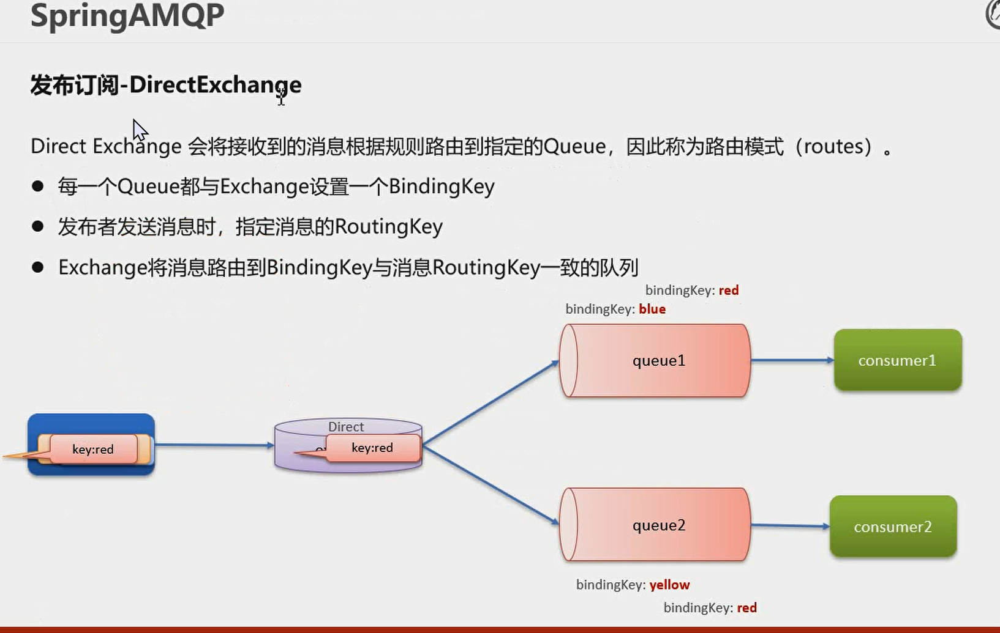

在Fanout模式中，一条消息，会被所有订阅的队列都消费。但是，在某些场景下，我们希望不同的消息被不同的队列消费。这时就要用到Direct类型中的Exchange

在Direct模型下：

队列与交换机的绑定，不能是任意绑定，而是要指定一个RoutingKey（路由key）

消息的发送方在向Exchange发送消息是时，也必须指定消息的RoutingKey

Exchange不再把消息交给每一个绑定的队列，而是根据消息的Routing key进行判断，只有队列的Routingkey与消息的Routing key完全一致，才会收到消息

案例：

1 利用@RabbitListener声明Exchange、Queue、RoutingKey

2 在consumer服务中，编写两个消费者方法，分别监听direct.queue1和direct.queue2

3 在publisher中编写测试方法，向itcast.direct发送消息

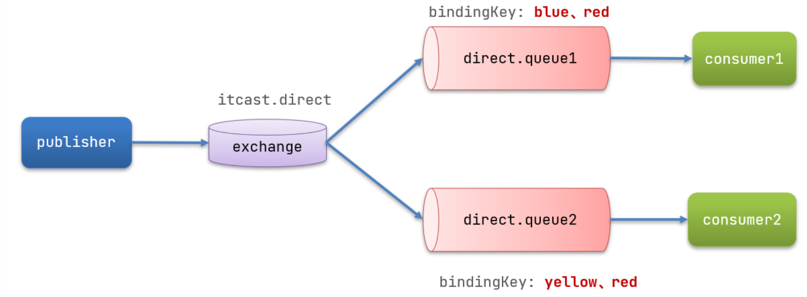

由于基于@Bean的交换机声明很麻烦。所以还有基于注解方式声明队列和交换机

在consumer中的SpringRabbitListener中添加两个消费者

```java
  /*
        定义方法接收队列1的消息
            1.@RabbitListener 注解的属性： QueueBinding[] bindings() default {};
                说明：QueueBinding也是一个注解，表示队列绑定，当前队列和哪个交换机绑定
            2.@QueueBinding注解中常见属性：
                1）Queue value(); 属于Queue，Queue是一个注解，在Queue注解中有一个属性name，name属性值表示书写的队列名
                         value=@Queue(name="direct.queue1") ===>direct.queue1 表示队列名
                2）Exchange exchange(); 属于Exchange类型，是一个注解，在Exchange注解中有属性：
                    I:String name() default ""; 表示交换机的名字 name="itcast.direct"==》itcast.direct就是交换机名
                    II:String type() default "direct" 表示交换机类型===》ExchangeTypes.DIRECT就是"direct"
                3)String[] key() default {}; 表示绑定的routing key===》 key={"blue","red"}
     */
 
 /*
        TODO:
            1. value = @Queue(name = "direct.queue1") 表示绑定的第一个队列
            2.exchange = @Exchange(name = "itcast.direct", type = ExchangeTypes.DIRECT) 表示交换机名和类型
            3.key = {"red", "blue"} 表示路由key
     */
    @RabbitListener(bindings = @QueueBinding(
            value = @Queue(name = "direct.queue1"),
            exchange = @Exchange(name = "itcast.direct", type = ExchangeTypes.DIRECT),
            key = {"red", "blue"}
    ))
    public void listenDirectQueue1(String msg){
        System.out.println("消费者接收到direct.queue1的消息：【" + msg + "】");
    }

    @RabbitListener(bindings = @QueueBinding(
            value = @Queue(name = "direct.queue2"),
            exchange = @Exchange(name = "itcast.direct", type = ExchangeTypes.DIRECT),
            key = {"red", "yellow"}
    ))
    public void listenDirectQueue2(String msg){
        System.out.println("消费者接收到direct.queue2的消息：【" + msg + "】");
    }
```

消息的发送

在publisher服务的SpringAmqpTest类中加入测试方法

```java
@Test
public void testSendDirectExchange() {
    // 交换机名称
    String exchangeName = "itcast.direct";
    // 消息
    String message = "红色警报！日本乱排核废水，导致海洋生物变异，惊现哥斯拉！";
    // 发送消息
    rabbitTemplate.convertAndSend(exchangeName, "red", message);
}
```

总结：

描述下Direct交换机与Fanout交换机的差异？

Fanout交换机将消息路由给每一个与之绑定的队列

Direct交换机根据RoutingKey判断路由给哪个队列

如果多个队列具有相同的RoutingKey，则与Fanout功能类似

基于@RabbitListener注解声明队列和交换机有哪些常见的注解？

@Queue

@Exchange

Topic

Topic类型和Exchange与Direct相比，都是可以根据RoutingKey把消息路由到不同的队列。只不过Topic类型的Exchange可以让队列在绑定Routing key的时候使用通配符

Routingkey一般都是由一个或多个单词组成，多个单词之间以"，"分割，例如：item.insert

通配符规则：

#：匹配一个或多个词

*：匹配不多不少恰好1个词

举例：

item.#：能够匹配item.spu.insert或者item.spu

item.*：只能匹配item.spu

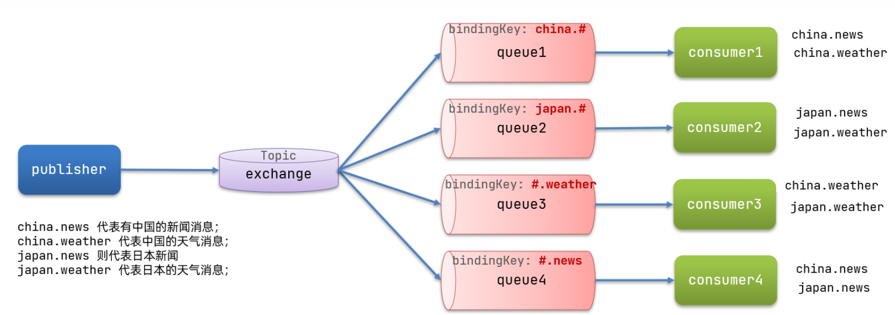

解释：

Queue1：绑定的是china.#，因此凡是以china.开头的routing key都会被匹配到。包括china.newshe和china.weather

Queue2：绑定的事#.news，因此凡是以.news结尾的routing key都会被匹配。包括china.news和japan.news

案例：

1. 并利用@RabbitListener声明Exchange、Queue、RoutingKey

1. 在consumer服务中，编写两个消费者方法，分别监听topic.queue1和topic.queue2

1. 在publisher中编写测试方法，向itcast. topic发送消息

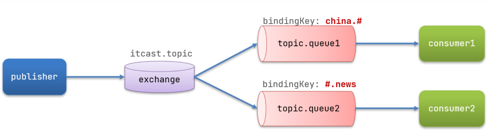

在consumer服务的SpringRabbitListener中添加方法：

```java
/*
        TODO:
            1.value = @Queue(name = "topic.queue1") 表示绑定的第一个队列
            2.exchange = @Exchange(name = "itcast.topic", type = ExchangeTypes.TOPIC) 表示交换机名和类型
            3. key = "china.#" 表示路由key只要以china开始都会接收
     */
    @RabbitListener(bindings = @QueueBinding(
            value = @Queue(name = "topic.queue1"),
            exchange = @Exchange(name = "itcast.topic", type = ExchangeTypes.TOPIC),
            key = "china.#"
    ))
    public void listenTopicQueue1(String msg) {
        System.out.println("消费者接收到topic.queue1的消息：【" + msg + "】");
    }

    @RabbitListener(bindings = @QueueBinding(
            value = @Queue(name = "topic.queue2"),
            exchange = @Exchange(name = "itcast.topic", type = ExchangeTypes.TOPIC),
            key = "#.news"
    ))
    public void listenTopicQueue2(String msg) {
        System.out.println("消费者接收到topic.queue2的消息：【" + msg + "】");
    }
```

消息发送

在publisher服务的SpringAmqpTest类中添加测试方法：

```java
/**
     * topicExchange
     */
    @Test
    public void testSendTopicExchange() {
        // 交换机名称
        String exchangeName = "itcast.topic";
        // 消息
        String message = "喜报！孙悟空大战哥斯拉，胜!";
        // 发送消息
        rabbitTemplate.convertAndSend(exchangeName, "china.news", message);
    }
```

总结：

描述下Direct交换机与Topic交换机的差异？

Topic交换机接收到消息RoutingKey必须是单词，以.分割

Topic交换机与队列绑定时bindingKey可以指定通配符

#：代表0个或多个词

*：代表1个词

消息转化器

我们在consumer中利用@Bean声明一个队列：

```java

@Bean
public Queue objectMessageQueue(){
    return new Queue("object.queue");
}
```

生产者

我们修改消息发送的对象，发送一个Map对象

```java
@Test
    public void testSendMap() throws InterruptedException {
        // 准备消息
        Map<String,Object> msg = new HashMap<>();
        msg.put("name", "Jack");
        msg.put("age", 21);
        // 发送消息
        rabbitTemplate.convertAndSend("simple.queue", msg);
    }
```

停止consumer服务，发送消息后查看控制台

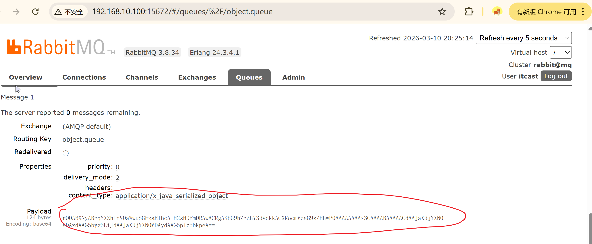

之前说过，Spring会把你发送的消息序列化为字节发送给MQ，接受消息的时候，还会把字节反序列化为Java对象

只不过，默认情况下Spring采用的序列化方式是JDK序列化。JDK序列化存在下列问题

数据体积过大

有安全漏洞

可读性差

配置JSON转化器

我们希望体积更小、可读性更高，因此可以使用JSON来方式来做序列化和反序列化

1 在publisher和consumer两个服务中都引入依赖

```xml
<dependency>
    <groupId>com.fasterxml.jackson.dataformat</groupId>
    <artifactId>jackson-dataformat-xml</artifactId>
    <version>2.9.10</version>
</dependency>
```

2 在生产者中配置转化器

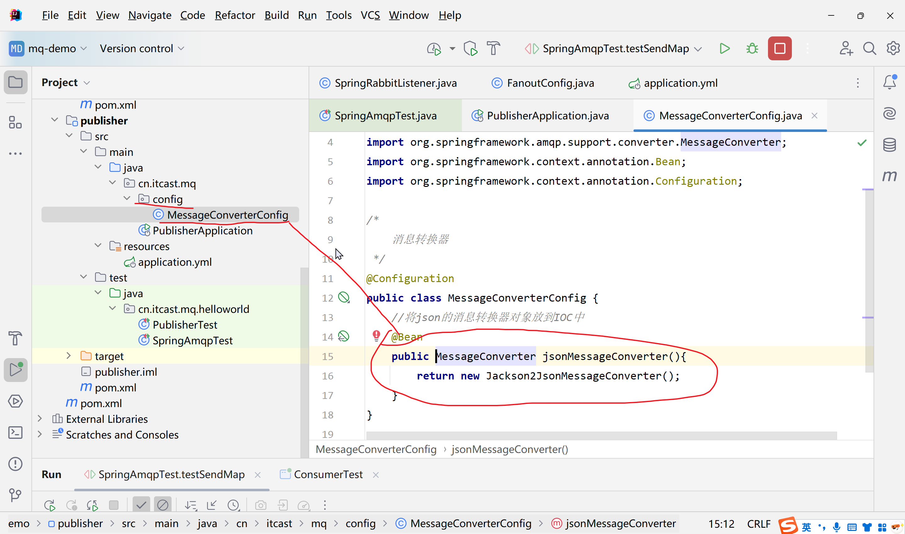

```java
@Bean
public MessageConverter jsonMessageConverter(){
    return new Jackson2JsonMessageConverter();
}
```

在消费者中配置JSON转化器

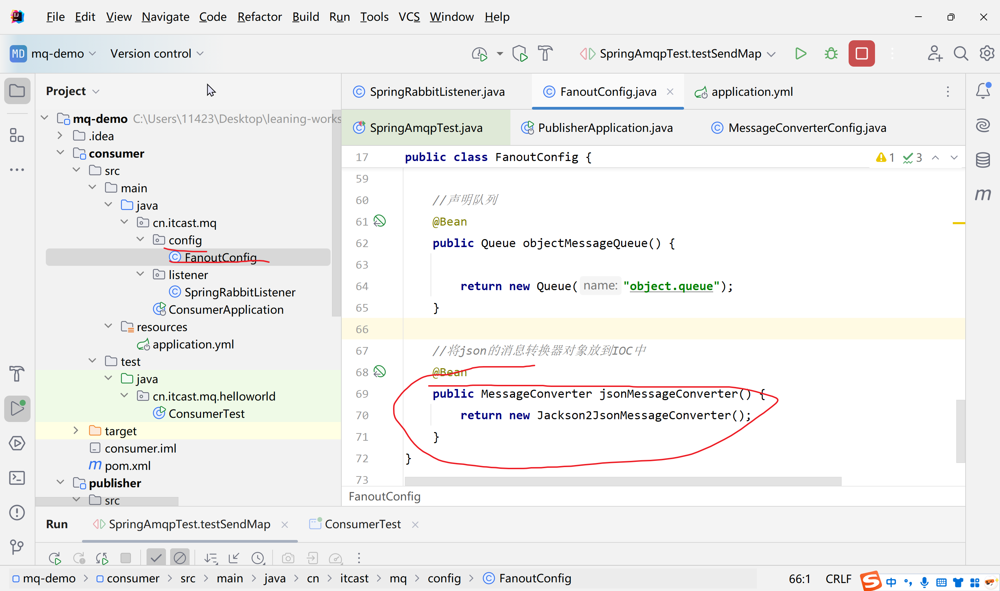

```java
@RabbitListener(queues = "object.queue")
    public void listenObjectQueue(Map<String, Object> msg) {
        System.out.println("收到消息：【" + msg + "】");
    }
```

测试后显示如下

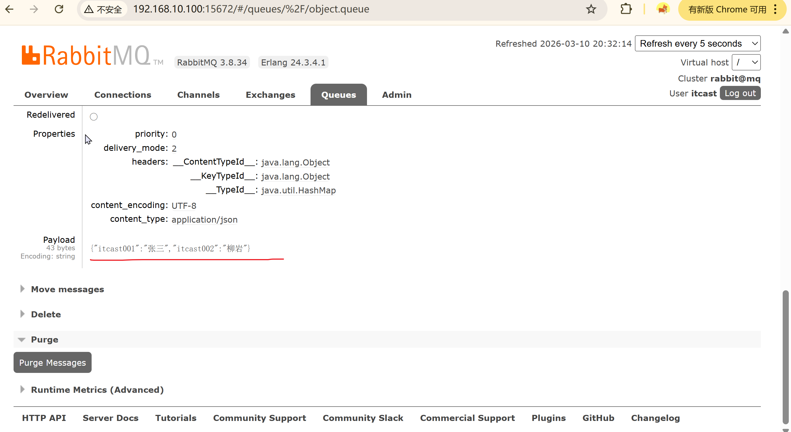