#  Linux-Day02


~~~markdown
掌握Linux的文件目录操作命令
	1.创建文件 ：touch 文件
	2.创建文件夹:mkdir 文件夹名
	3.更改目录：cd 更改目录
	4.查看文件：
		1）cat 文件名 查看整个文件
		2）more 文件名 ：从头开始分屏查看  空格 向下一屏 
		3）tail 文件名  ：从后往前查看，默认查看后10行  tail -行 文件名  
	5.删除文件和目录： rm -rf 删除的内容
掌握Linux的拷贝移动命令
	1.拷贝：复制  cp 源文件 目的地
	2.剪切和重命名；
		mv 源文件  目的地
			剪切：目的地存在
			重命名：目的地不存在
掌握Linux的文本编辑vim命令
	1）进入命令行模式： vim 文件名。都是整行操作。yy 复制 p 粘贴 dd 删除  u撤销 /搜索的内容
	2)从命令行模式进入到编辑模式：i 光标前插入  a  光标后插入  o 换行插入
	3）从编辑模式到命令模式按esc,然后在英文输入法按:进入到底行模式。:wq 保存退出   :q!不保存退出
掌握Linux的查找命令
	1）find 搜索目录 -name '要搜索的字符串'  表示在指定目录查询指定文件或者目录
	2）grep -nvi 搜索的字符串 文件名  ： 在指定文件中查找要搜索的内容
~~~


## 课程内容

- 软件安装

- 项目部署


## 1. 软件安装

### 1.1 软件安装方式

在Linux系统中，安装软件的方式主要有四种，这四种安装方式的特点如下：

| 安装方式                        | 特点                                                         |
| ------------------------------- | ------------------------------------------------------------ |
| 二进制发布包安装                | 软件已经针对具体平台编译打包发布，只要解压，修改配置即可。例如tomcat |
| rpm(redhat package manager)安装 | 软件已经按照redhat的包管理规范进行打包，使用rpm命令进行安装，==但是包之间有可能具有依赖关系，因此不能自行解决库依赖问题，比较麻烦。== |
| yum安装                         | 一种在线软件安装方式，本质上还是rpm安装，自动下载安装包并安装，安装过程中自动解决库依赖问题(安装过程需要联网) |
| 源码编译安装                    | 软件以源码工程的形式发布，需要自己编译打包。类似.java文件需要编译成.class文件安装方式。第一个二进制发布包安装相当于直接拿到.class文件直接安装。 |

### 1.2 安装JDK

在linux系统中我们一般将软件安装到根目录下的/usr/local 目录下，我们在这个目录下可以创建一个自定义的目录，然后将jdk tomcat等软件放到这个目录下。

~~~markdown
操作步骤：
1、在/usr/local目录下创建自定义soft目录
2、使用FinalShell自带的上传工具将jdk的二进制发布包上传到Linux
3、切换到soft目录下
4、解压安装包，命令为tar -zxvf jdk-8u171-linux-x64.tar.gz
5、配置环境变量，使用vim命令修改/etc/profile文件，在文件末尾加入如下配置 按字母G跳转到文件尾部
    # 注意：/usr/local/soft/jdk1.8.0_171 路径不固定，是你的jdk路径位置，复制下面的路径到配置文件/etc/profile
	JAVA_HOME=/usr/local/soft/jdk1.8.0_171
    CLASSPATH=.:$JAVA_HOME/lib
    PATH=$JAVA_HOME/bin:$PATH
    export JAVA_HOME CLASSPATH PATH
6、重新加载profile文件，使更改的配置立即生效，命令为source /etc/profile
7、检查安装是否成功，命令为java -version

~~~


​	1.进入到根目录下的/usr/local目录，并创建目录soft

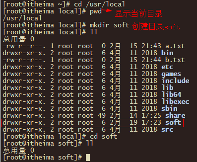

​	2.将windows系统的jdk软件传递到linux下的soft目录下，并查看soft目录。

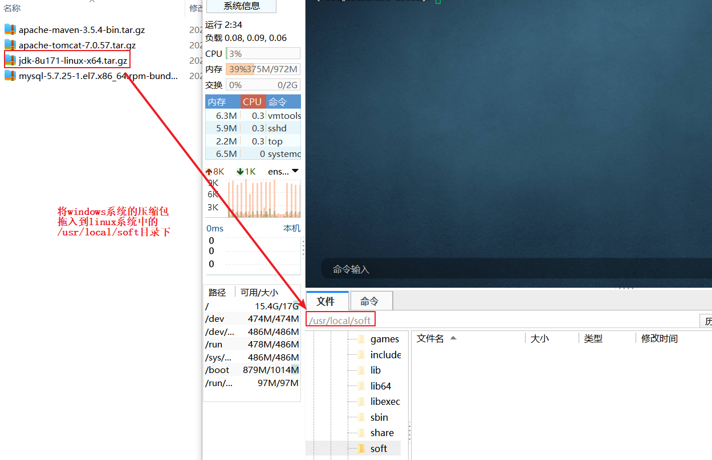


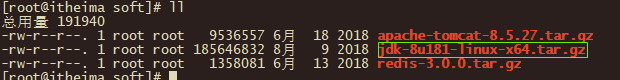


​	3.**进入“/soft”目录，解压jdk到该目录下**

```
 tar -zxvf jdk-8u181-linux-x64.tar.gz 
```


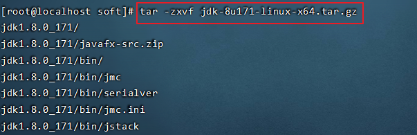

**查看解压后的目录,目录中有jdk1.8.0_181为jdk解压的目录**

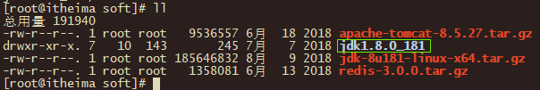

​	4.到目录jdk1.8.0_181下查看jdk的安装目录结构

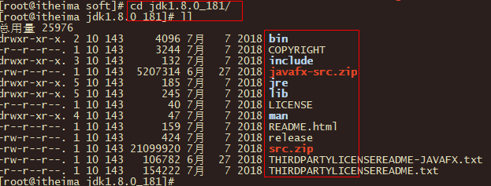

说明：目录结构和在windows系统上安装的目录结构差不多，但是我们发现输入java或者javac命令报错：

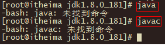

报上述错误的原因是没有配置环境变量，接下来我们需要配置环境变量path.类似于windows系统中配置环境变量一样。

​	5.**配置jdk环境变量，打开/etc/profile配置文件，将下面配置拷贝进去。export命令用于将shell变量输出为环境变量**

```
#set java environment
# /usr/local/soft/jdk1.8.0_181  文件夹soft是上面你自己创建的文件夹
JAVA_HOME=/usr/local/soft/jdk1.8.0_171
CLASSPATH=.:$JAVA_HOME/lib
PATH=$JAVA_HOME/bin:$PATH
export JAVA_HOME CLASSPATH PATH
```

说明：

​	1）#表示注释的意思

​	2）JAVA_HOME后面的值是bin目录的上一级目录

​	3）$表示引用的意思。类似于windows系统中的%JAVA_HOME%

​	4）profile是系统的配置文件

**具体操作如下：**

 **命令1：vim /etc/profile**

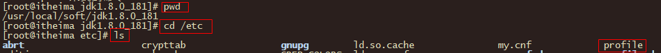


 **命令2：输入G跳转到文件末尾处，输入o(表示在光标下插入新行)，复制上面的环境变量配置粘贴如图位置，并写入保存**

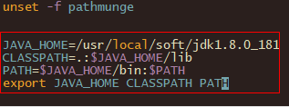

****

​	6.**重新加载/etc/profile配置文件，并测试**

```
source /etc/profile
```

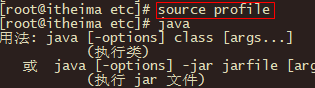

****

​	7.**判断JDK是否安装成功**

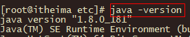


**JDK安装小结**

1. **解压到压缩包到：/usr/local/soft(自己创建的)**
2. **配置环境变量：/etc/profile**

~~~java
#set java environment
# /usr/local/soft/jdk1.8.0_181  文件夹soft是上面你自己创建的文件夹
JAVA_HOME=/usr/local/soft/jdk1.8.0_171
CLASSPATH=.:$JAVA_HOME/lib
PATH=$JAVA_HOME/bin:$PATH
export JAVA_HOME CLASSPATH PATH
~~~

3.**重新加载配置: source  /etc/profile** 


4.检查是否已安装jdk： 

~~~shell
# 查看安装jdk的软件
[root@192 local]# rpm -qa | grep openjdk
	java-1.8.0-openjdk-headless-1.8.0.312.b07-1.el7_9.x86_64
	java-1.8.0-openjdk-1.8.0.312.b07-1.el7_9.x86_64
# 卸载默认已经安装的openjdk	
[root@192 local]# rpm -qa | grep openjdk |xargs rpm -e --nodeps
~~~

 

### 1.3 安装Tomcat

#### 1.3.1 Tomcat安装

Tomcat的安装和上述JDK的安装采用相同的方式，都是使用二进制发布包的形式进行安装，在我们的资料目录下，也已经准备了Tomcat的安装包： 


具体安装步骤如下： 

**1). 上传安装包**

使用FinalShell自带的上传工具将Tomcat的二进制发布包上传到Linux(与前面上传JDK安装包步骤一致)。

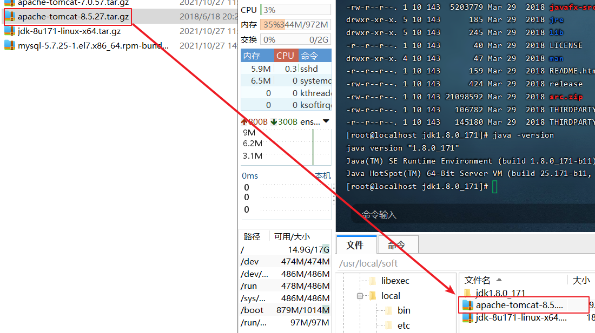


**2)  进入soft文件夹，解压Tomcat到soft目录下**

```
#切换到soft目录下
cd /usr/local/soft
查看目录内容
ll
解压tomcat到soft目录下
tar -zxvf apache-tomcat-8.5.27.tar.gz
```

解压好之后将之前的压缩文件删除即可。

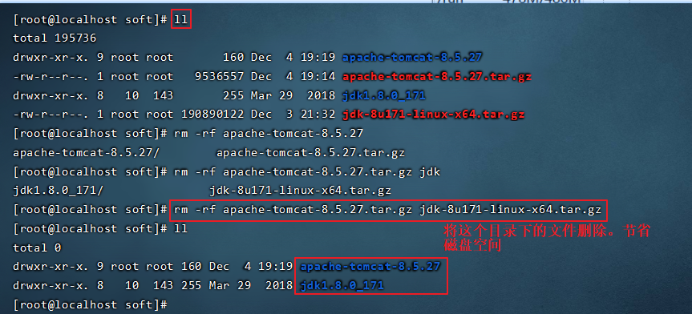

查看tomcat的安装目录，几乎和windows版本一样的。

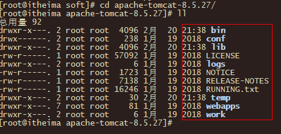


**3). 启动Tomcat**

进入Tomcat的bin目录启动服务。执行命令为: 

```
cd /usr/local/apache-tomcat-8.5.27/

cd bin

./startup.sh
```

 

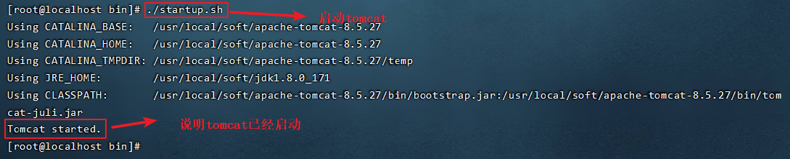 


#### 1.3.2 Tomcat进程查看

上述我们将Tomcat启动完成之后，并不能知道Tomcat是否正常运行，那么我们验证Tomcat启动是否成功，有多种方式，我们这里主要介绍常见的两种方式： 

**1). 查询系统进程**

我们也可以通过Linux系统的查看系统进程的指令，来判定Tomcat进程是否存在，从而判定Tomcat是否启动。执行如下指令： 

```
ps -aux | grep tomcat 
```


**说明:** 

- ps命令是linux下非常强大的进程查看命令，通过ps -aux可以查看当前运行的所有进程的详细信息

- "|" 在Linux中称为管道符，可以将前一个命令的结果输出给后一个命令作为输入

- 使用ps命令查看进程时，经常配合管道符和查找命令 grep 一起使用，来查看特定进程


#### 1.3.3 防火墙操作

前面我们已经验证了Tomcat服务已经正常启动，接下来我们就可以尝试访问一下。访问地址：http://192.168.138.130:8080，我们发现是访问不到的。

 

那为什么tomcat启动成功了，但就是访问不到呢？原因就在于Linux系统的防火墙，系统安装完毕后，系统启动时，防火墙自动启动，防火墙拦截了所有端口的访问。

防火墙类似于一个关卡检查人员，当你访问其他人的电脑，或者其他人访问你的电脑，都要进行拦截并进行处理，有的阻止，有的放行。默认情况下防火墙在开机以后就自动启动了。例如下面就是windows的防火墙：

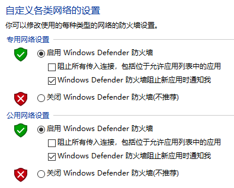

防火墙引发的问题

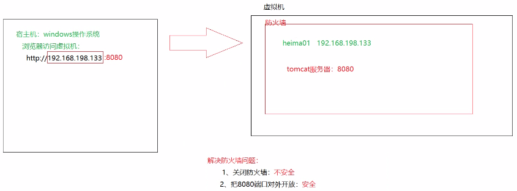


接下来我们就需要学习一下，如何操作防火墙，具体指令如下： 

| 操作                         | 指令                                                         | 备注                 |
| ---------------------------- | ------------------------------------------------------------ | -------------------- |
| 查看防火墙状态               | ==systemctl status firewalld== / firewall-cmd --state        |                      |
| 关闭防火墙                   | systemctl stop firewalld                                     |                      |
| 永久关闭防火墙(禁用开机自启) | systemctl disable firewalld                                  | ==下次启动,才生效==  |
| 暂时开启防火墙               | systemctl start firewalld                                    |                      |
| 永久开启防火墙(启用开机自启) | systemctl enable firewalld                                   | ==下次启动,才生效==  |
| 重启防火墙                   | systemctl restart firewalld                                  |                      |
| 开放指定端口                 | firewall-cmd --zone=public --add-port=8080/tcp --permanent   | ==需要重新加载生效== |
| 关闭指定端口                 | firewall-cmd --zone=public --remove-port=8080/tcp --permanent | ==需要重新加载生效== |
| 立即生效(重新加载)           | firewall-cmd --reload                                        |                      |
| 查看开放端口                 | firewall-cmd --zone=public --list-ports                      |                      |

> 注意：
>
> ​	A. systemctl是管理Linux中服务的命令，可以对服务进行启动、停止、重启、查看状态等操作
>
> ​	B. firewall-cmd是Linux中专门用于控制防火墙的命令
>
> ​	C. 为了保证系统安全，服务器的防火墙不建议关闭


那么我们要想访问到Tomcat，就可以采取两种类型的操作：

**A. 关闭防火墙**

执行指令 : 

```
systemctl stop firewalld
```

关闭之后，再次访问Tomcat，就可以访问到了。

 

注意: 上面我们也提到了，直接关闭系统的防火墙，是不建议的，因为这样会造成系统不安全。


**B. 开放Tomcat的端口号8080**

执行指令: 

```
①. 先开启系统防火墙
systemctl start firewalld

②. 再开放8080端口号
firewall-cmd --zone=public --add-port=8080/tcp --permanent

③. 重新加载防火墙
firewall-cmd --reload
```

| **firewall-cmd**        | 向防火墙中添加或删除指定端口号                               |
| ----------------------- | ------------------------------------------------------------ |
| **--zone=public**       | 将端口号添加到防火墙中哪个区域 public: 公共区域，默认值。可以让互联网上所有的机器访问这个端口号 internal: 内部区域，让局域网中，内部中机器来访问这个端口号 是public的一个子集 |
| **--add-port=端口/tcp** | 添加指定的端口号，使用TCP协议                                |
| --remove-port=端口/tcp  | 删除指定的端口号，使用TCP协议                                |
| **--permanent**         | 永久的添加，主机重启了也是起作用的                           |
| --list-all              | 显示所有已经添加的端口号                                     |
| **--reload**            | 重启加载端口的规则，让新的端口号起作用                       |


执行上述的操作之后，就开放了当前系统中的8080端口号，再次访问Tomcat。


#### 1.3.4 停止Tomcat

在Linux系统中，停止Tomcat服务的方式主要有两种： 

**1). 运行Tomcat提供的脚本文件**

在Tomcat安装目录下有一个bin目录，这个目录中存放的是tomcat的运行脚本文件，其中有一个脚本就是用于停止tomcat服务的。

 

我们可以切换到bin目录，并执行如下指令，来停止Tomcat服务：

```
./shutdown.sh
```


**2). 结束Tomcat进程**

我们可以先通过 `ps -ef|grep tomcat` 指令查看tomcat进程的信息，从进程信息中获取tomcat服务的进程号。然后通过kill -9 的形式，来杀死系统进程。

 

通过上述的指令，我们可以获取到tomcat的进程号为 79947。接下来，我们就可以通过指令 ，来杀死tomcat的进程 ：

```
kill -9 79947 
```

执行完上述指令之后，我们再访问Linux系统中的Tomcat，就访问不到了。

> 注意：
>
> ​	kill命令是Linux提供的用于结束进程的命令，-9表示强制结束


> 注意 ： 
>
> ​	虽然上述讲解的两种方式，都可以停止Tomcat服务，但是推荐使用第一种方式(./shutdown.sh)执行脚本来关闭tomcat服务，如果通过第一种方式停止不了tomcat了，这个时候，我们可以考虑使用第二种方式，强制杀死进程。


### 1.4 安装MySQL

#### 1.4.1 MySQL安装

对于MySQL数据库的安装，我们将要使用前面讲解的第二种安装方式rpm进行安装。那么首先我们先了解一下什么是rpm？

> **RPM：**全称为 Red-Hat Package Manager，RPM软件包管理器，是红帽Linux用于管理和安装软件的工具。


我们要通过rpm，进行MySQL数据库的安装，主要的步骤如下：

**1). 检测当前系统是否安装过MySQL相关数据库**

需要通过rpm相关指令，来查询当前系统中是否存在已安装的mysql软件包，执行指令如下：

```
rpm -qa							查询当前系统中安装的所有软件
rpm -qa | grep mysql			查询当前系统中安装的名称带mysql的软件
rpm -qa | grep mariadb			查询当前系统中安装的名称带mariadb的软件
```

通过rpm -qa 查询到系统通过rpm安装的所有软件，太多了，不方便查看，所以我们可以通过管道符 | 配合着grep进行过滤查询。

 

通过查询，我们发现在当前系统中存在mariadb数据库，是CentOS7中自带的，而这个数据库和MySQL数据库是冲突的，所以要想保证MySQL成功安装，需要卸载mariadb数据库。


**2). 卸载现有的MySQL数据库**

在rpm中，卸载软件的语法为： 

```
rpm -e --nodeps  软件名称
```

那么，我们就可以通过指令，卸载 mariadb，具体指令为： 

```
rpm -e --nodeps  mariadb-libs-5.5.60-1.el7_5.x86_64
```

 

我们看到执行完毕之后， 再次查询 mariadb，就查不到了，因为已经被成功卸载了。


**3). 将资料中提供的MySQL安装包上传到Linux并解压**

A. 上传MySQL安装包

在课程资料中，提供的有MySQL的安装包 ，我们需要将该安装包上传到Linux系统中。

 

 


B. 解压到/usr/local/soft/mysql

执行如下指令: 

```
mkdir /usr/local/soft/mysql
tar -zxvf mysql-5.7.25-1.el7.x86_64.rpm-bundle.tar.gz -C /usr/local/soft/mysql
```

 


**4). 按照顺序安装rpm安装包**

进入到上述解压的路径下：


执行如下命令：

```shell
rpm -ivh mysql-community-common-5.7.25-1.el7.x86_64.rpm
rpm -ivh mysql-community-libs-5.7.25-1.el7.x86_64.rpm
rpm -ivh mysql-community-devel-5.7.25-1.el7.x86_64.rpm
rpm -ivh mysql-community-libs-compat-5.7.25-1.el7.x86_64.rpm
rpm -ivh mysql-community-client-5.7.25-1.el7.x86_64.rpm
yum install net-tools
rpm -ivh mysql-community-server-5.7.25-1.el7.x86_64.rpm
```


> 说明: 
>
> - 因为rpm安装方式，是不会自动处理依赖关系的，需要我们自己处理，所以对于上面的rpm包的安装顺序不能随意修改。
> - 安装过程中提示缺少net-tools依赖，使用yum安装(yum是一种在线安装方式，需要保证联网)
> - 可以通过指令(yum update)升级现有软件及系统内核

 


#### 1.4.2 MySQL启动

MySQL安装完成之后，会自动注册为系统的服务，服务名为mysqld。那么，我们就可以通过systemctl指令来查看mysql的状态、启动mysql、停止mysql。

```
systemctl status mysqld		查看mysql服务状态  
systemctl start mysqld		启动mysql服务
systemctl stop mysqld		停止mysql服务
```

说明：

​	1.mysqld其实是SQL后台程序(也就是MySQL服务器)，它是关于服务器端的一个程序，mysqld意思是mysql daemon，在后台运行，监听3306端口，如果你想要使用客户端程序，这个程序必须运行，因为客户端是通过连接服务器来访问数据库的。你只有启动了mysqld.exe，你的mysql数据库才能工作。

​	2.mysql是一个客户端软件，可以对任何主机的mysql服务（即后台运行的mysqld）发起连接，mysql自带的客户端程序一般都在cmd或者终端下进行操作


> 说明： 这里不建议，后期学习docker有可能会导致端口号冲突。
>
> ​	可以设置开机时启动mysql服务，避免每次开机启动mysql。执行如下指令： 
>
> ​	systemctl enable mysqld


我们可以通过如下两种方式，来判定mysql是否启动：

```
netstat -tunlp					查看已经启动的服务
netstat -tunlp | grep mysql		查看mysql的服务信息
ps -aux | grep mysql				查看mysql进程
```

 

> <font color='red'>备注: </font>
>
> ​	<font color='red'>A. netstat命令用来打印Linux中网络系统的状态信息，可让你得知整个Linux系统的网络情况。</font>
>
> ​		参数说明: 
>
> ​		-l或--listening：显示监控中的服务器的Socket；
> ​		-n或--numeric：直接使用ip地址，而不通过域名服务器；
> ​		-p或--programs：显示正在使用Socket的程序识别码和程序名称；
> ​		-t或--tcp：显示TCP传输协议的连线状况；
> ​		-u或--udp：显示UDP传输协议的连线状况；
>
> ​	<font color='red'>B. ps命令用于查看Linux中的进程数据。</font>


#### 1.4.3 MySQL登录

##### 1.4.3.1 查阅临时密码

MySQL启动起来之后，我们就可以测试一下登录操作，但是我们要想登录MySQL，需要一个访问密码，而刚才在安装MySQL的过程中，并没有看到让我们设置访问密码，那这个访问密码是多少呢? 那实际上，对于rpm安装的mysql，在mysql第一次启动时，会自动帮我们生成root用户的访问密码，并且输出在mysql的日志文件 /var/log/mysqld.log中，我们可以查看这份日志文件，从而获取到访问密码。


可以执行如下指令：

1). cat /var/log/mysqld.log

 

这种方式，可以看到所有的日志数据，文件比较大时，很不方便查看数据。我们可以通过管道符 | 配合grep来对数据进行过滤。


2). cat /var/log/mysqld.log | grep password

我们可以通过上述指令，查询日志文件内容中包含password的行信息。

 

注意：==临时的密码要加单上引号，否则可能登录失败！==

##### 1.4.3.2 登录MySQL

获取到root用户的临时密码之后，我们就可以登录mysql数据库，修改root的密码，为root设置一个新的密码。并且我们还需要开启root用户远程访问该数据库的权限，这样的话，我们就可以在windows上来访问这台MySQL数据库。

执行如下指令： 

```
①. 登录mysql（复制日志中的临时密码登录）
	mysql -uroot -p								

②. 修改密码 必须一步一步执行
    set global validate_password_length=4;			设置密码长度最低位数
    set global validate_password_policy=LOW;		设置密码安全等级低，便于密码可以修改成root
    set password = password('1234');				设置密码为1234
    
③. 开启访问权限
    -- 给root指定所有的权限，在任何电脑上可以远程登录 注意我的数据库密码是1234，这里要改成你的数据库密码
    grant all on *.* to 'root'@'%' identified by '1234';
    -- 从mysql数据库中的授权表重新载入权限
    flush privileges;
```

操作完上述的指令之后，数据库root用户的密码以及远程访问我们就配置好了，接下来，可以执行exit退出mysql，再次通过新的密码进行登录。

 


==注意： 要想在windows上能够访问MySQL，还需要开放防火墙的3306端口，执行如下指令：==

```
#开放的端口永久保存到防火墙
firewall-cmd --zone=public --add-port=3306/tcp --permanent;
firewall-cmd --reload;
```

 

当然我们也可以使用安装在windows系统中的可视化工具datagrip来远程连接linux上的MySQL。

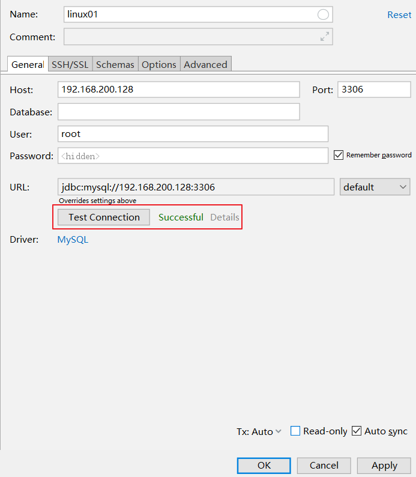


##### 1.4.3.3 修改MySQL默认编码

```java
vim /etc/my.cnf
# 修改 /etc/my.cnf 文件
[mysqld]
init_connect = 'SET NAMES utf8'
character-set-server = utf8
collation-server =utf8_general_ci
```


### 1.5 安装lrzsz(主要是练习是Yum安装软件)

lrzsz 是用于在Linux系统中文件上传下载的软件。大家可能会存在疑问，我们用finalShell图形化界面就可以很方便的完成上传下载，为什么还要使用这个软件来完成上传下载呢？实际上是这样的，Linux的远程连接工具有很多，而finalShell只是其中的一种，而还有很多的远程连接工具并没有上传下载的功能，这个时候就需要依赖于lrzsz这个软件了。**最主要的是我们这里想通过Yum方式来安装lrzsz。让大家熟悉使用Yum如何安装软件。**

对于lrzsz的安装，我们需要通过第三种软件安装方式yum来进行安装。这里，我们先对yum做一个简单介绍。

> yum（全称为 Yellow dog Updater, Modified）能够从指定的服务器自动下载包并且安装，可以自动处理依赖关系，一次安装所有依赖的软件包，无须繁琐地一次次下载、安装。
>
> | **yum [参数] [命令] <安装包>** | **说明**                          |
> | ------------------------------ | --------------------------------- |
> | **参数：-y**                   | 在软件安装过程中所有的提示回答yes |
> | **命令：install**              | 安装指定的软件                    |
> | **命令：remove**               | 删除指定的安装包                  |
> | **命令：list**                 | 搜索指定的安装包                  |


安装lrzsz的步骤如下: 

**1). 搜索lrzsz安装包**

```
yum list lrzsz
```

 


**2). 在线安装lrzsz**

```
yum install lrzsz.x86_64
```

 


**3). 测试**

在命令行中输入 rz , 就会自动打开一个文件选择的窗口，然后选择要上传的文件。

 

将linux的文件下载到window系统中(默认下载到windows桌面上)的命令是：sz

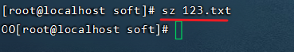


> **yum拓展知识:**
>
> ​	 1). 如果在不更改软件来源的情况下，是需要联网才能使用yum的，那么我们安装的软件是从哪儿下载的呢，这里就涉及到一个概念： yum源。
>
> ​		
>
> ​	 2). 我们可以通过一个指令，来检查当前的yum源
>
> 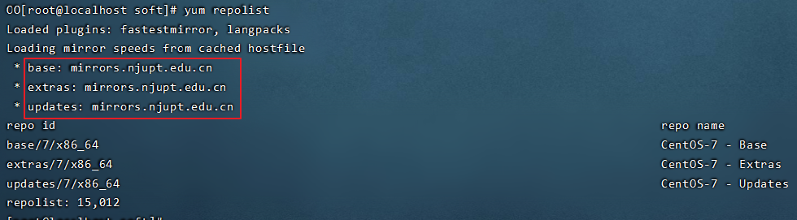
>
> ​	从图中，我们可以看到我们安装的 CentOS7 采用的是南京邮电大学的yum源。
>
> ​		
>
> ​	  3). 网络 yum 源配置文件位于 /etc/yum.repos.d/ 目录下，文件扩展名为"*.repo"
>
> ​		 
>
> ​		可以看到，该目录下有 7 个 yum 配置文件，通常情况下 CentOS-Base.repo 文件生效。
>
> ​		
>
> ​	  4). 添加阿里云yum源
>
> ​		A. 先通过 `yum install wget` ,安装wget命令
>
> ​			说明：wget表示上网下载。安装之前先去下载。
>
> ​		B. 备份默认的的yum源，执行指令 ：
>
> ​			切换目录: cd /etc/yum.repos.d/
>
> ​			创建备份目录: mkdir bak
>
> ​			移动现有的yum源文件到bak: mv *.repo bak/
>
> ​		C. 下载阿里云的yum源
>
> ​			wget -O /etc/yum.repos.d/CentOS-Base.repo http://mirrors.aliyun.com/repo/Centos-7.repo
>
> ​				说明：这里的-O表示将阿里云的资源下载到/etc/yum.repos.d/CentOS-Base.repo文件中即表示下载的指定文件。
>
> ​		D. 执行命令，重新生成cache			
>
> ​			yum clean all
>
> ​				说明：清除YUM缓存
>
> ​			yum makecache
>
> ​				说明：是将服务器上的软件包信息存放到本地缓存,以提高 搜索 安装软件的速度
>
> ​		E. 再次查看yum源
>
> ​			 
>
> ​			之后，我们通过yum指令安装软件，就是从阿里云下载的。


## 2. 项目部署

之前我们讲解Linux操作系统时，就提到，我们服务端开发工程师学习Linux系统的目的就是将来我们开发的项目绝大部分情况下都需要部署在Linux系统中。那么在本章节，我们将通过两种方式，来演示项目部署，分别是：手动部署项目 和 基于shell脚本自动部署。

### 2.1 手动部署项目

**1). 在IDEA中开发SpringBoot项目并打成jar包**

项目是一个很简单的springboot项目(可以自己开发一个，也可以直接导入资料中提供的)，结构如下： 

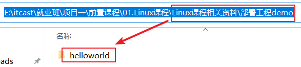


 

可以在本地的idea中先启动当前的demo工程，然后访问一下，看看工程是否正常访问。

 


执行package指令，进行打包操作，将当前的springboot项目，打成一个jar包。 

 


**2). 将jar包上传到Linux服务器**

通过 rz 指令，将打好的jar包上传至Linux服务器的 /usr/local/app 目录下。 先执行指令创建app目录。

```
A. 在/usr/local下创建目录app
mkdir /usr/local/app

B. 切换到app目录下
cd /usr/local/app

C. 执行指令,进行jar包上传
rz
```

 

此时这个jar包就上传到 /usr/local/app 目录了。

 

**3). 检查防火墙，确保8080端口对外开放，访问SpringBoot项目**

```
firewall-cmd --zone=public --list-ports
```

 

如果防火墙没有放开8080端口，还需要放开对应的端口号，执行如下指令：

```
firewall-cmd --zone=public --add-port=8080/tcp --permanent
```


**4）查看当前linux系统的ip地址**

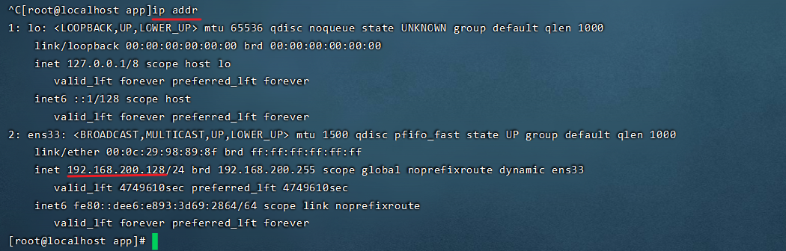

**5). 启动SpringBoot程序**

由于我们的项目已经打成jar包上传上来到Linux服务器，我们只需要运行这个jar包项目就启动起来了，所以只需要执行如下指令即可： 

```
java -jar helloworld-1.0-SNAPSHOT.jar
```

 


==注意： 由于前面安装的Tomcat在启动时，会占用端口号8080，而当前springboot项目我们没有配置端口号，默认也是8080，所以我们要想启动springboot项目，需要把之前运行的Tomcat停止掉。==

**6). 访问测试**

http://192.168.200.128:8080/hello

 


**6). 后台运行项目**

当前这个demo工程我们已经部署成功了，并且我们也可以访问项目了。但是这个工程目前是存在问题的，就是当前我们项目启动的这个窗口被霸屏占用了，如果我们把这个窗口关闭掉(或ctrl+c)，当前服务也就访问不到了，我们可以试一下。


 


**目前程序运行的问题：**

A. 线上程序不会采用控制台霸屏的形式运行程序，而是将程序在后台运行

B. 线上程序不会将日志输出到控制台，而是输出到日志文件，方便运维查阅信息


**后台运行程序:**

要想让我们部署的项目进行后台运行，这个时候我们需要使用到linux中的一个命令 nohup ，接下来，就来介绍一下nohup命令。

> **nohup命令：**英文全称 no hang up（不挂起），用于不挂断地运行指定命令，退出终端不会影响程序的运行
>
> **语法格式：** nohup Command [ Arg … ][&]
>
> **参数说明：**
>
> ​	Command：要执行的命令
>
> ​	Arg：一些参数，可以指定输出文件
>
> ​	&：让命令在后台运行
>
> **举例：**
>
> ​	nohup java -jar boot工程.jar &> hello.log &
>
> ​	上述指令的含义为： 后台运行 java -jar 命令，并将日志输出到hello.log文件


那么经过上面的介绍，我们可以推测中，我们要想让当前部署的项目后台运行，就可以使用下面的指令： 

```
nohup java -jar helloworld-1.0-SNAPSHOT.jar &> hello.log &
```

说明：

> 1.上述命令的 “&” ，表示在当窗口关闭时，程序才会中止运行。&代表让该命令在后台执行。
>
> 2.上述命令的 \> hello.log ” 该命令就是指定日志输出的文件。

 

这样的话，我们的项目就已经启动成功了，我们可以通过ps指令，查看到系统的进程。

 

接下来，我们再次访问我们的项目，来看看服务是否可用。

 


**7). 停止SpringBoot项目**

 


### 2.2 基于Shell脚本自动部署(掌握，开发使用，环境安装是运维完成)

#### 2.2.1 介绍

前面介绍的项目部署是手动部署，也就是部署过程中的每一步操作都需要我们手动操作。接下来，我们需要再讲解一下项目的自动部署，从而来简化项目部署的操作，那么我们先来整体上了解一下项目自动部署的流程及操作步骤。

 

操作步骤如下： 

1). 在Gitee/gitlab上创建远程仓库，并将本地的项目代码推送到远程仓库中

2). 在Linux中安装Git,克隆代码

3). 在Linux中安装maven

4). 编写Shell脚本（拉取代码、编译、打包、启动）

5). 为用户授予执行Shell脚本的权限

6). 执行Shell脚本


#### 2.2.2 推送代码到远程仓库

这部分操作，大家只需要参考之前讲解的Git，来完成helloworld工程代码推送即可。

##### A. 创建远程仓库 

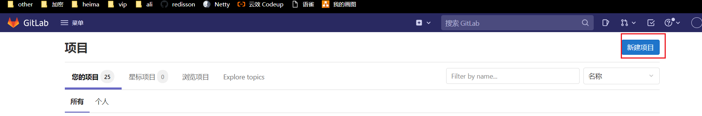

注意事项：新建仓库时，选择空的仓库即可！

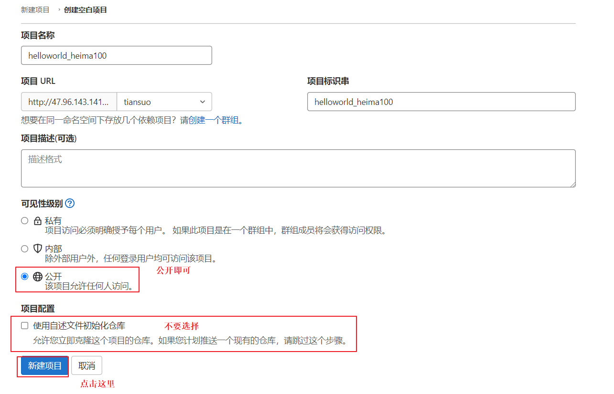


##### B.使用ssh安全协议访问git远程仓库免密登录

1.在本地确认已经==安装好git软件==后，使用指令生成ssh公钥：

~~~shell
  C:\Users\46035>ssh-keygen -t rsa
# ssh-keygen -t rsa ： 实现免密登录，这条命令目的是为了本地机器ssh登录远程服务器无需输入密码
# ssh 是secure shell的简写，表示建立在应用层基础上的安全协议。ssh是目前比较可靠，专门为远程登录会话和其他网络服务提供的安全性
# ssh提供两种级别的安全验证:
# 第一种级别(基于口令的安全验证)：只要知道自己的账号和口令就可以登录到远程主机。但是不能保证你正在连接的服务器就是你想连接的服务器
# 第二种级别(基于秘钥的安全验证)ssh-keygen:需要依靠秘钥，你必须为自己创建一对秘钥，并把公用秘钥放到需要访问的服务器上。如果你要连接到SSH服务器上，客户端软件就会向服务器发出请求，请求用你的秘钥进行安全验证。服务器收到请求之后，先在该服务器上你的主目录下寻找你的公用秘钥，然后把它和你发送过来的公用秘钥进行比较，如果两个秘钥一致，服务器就用公用秘钥加密“质询”并把它发送给客户端软件。客户端收到之后就可以用你的私人秘钥解密。
# -t 即指定秘钥的类型，秘钥的类型由两种： 1）RSA  2)DSA
# 一直回车，直到生成完毕，然后会看到ssh密码生成的位置
~~~

在用户的文件夹中就会生成.ssh的文件件，内部包含了公钥信息：

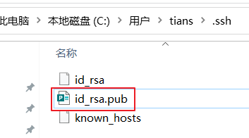

然后将公钥信息配置到gitlab下：

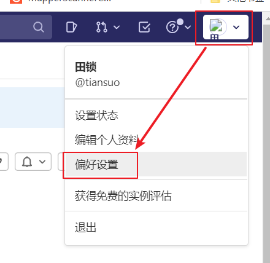

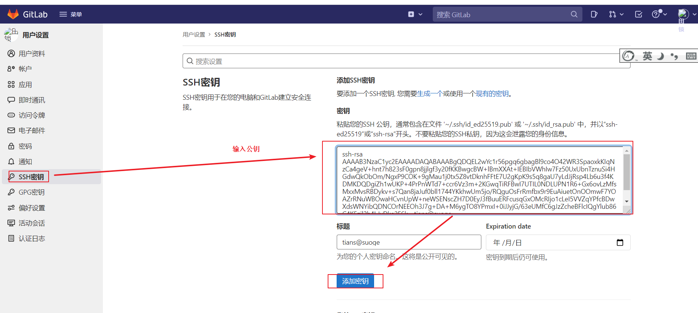

**然后进行代码push操作时是无需反复的输入账户和密码的，做到免密登录！**

##### C.将代码推送到gitlab远程

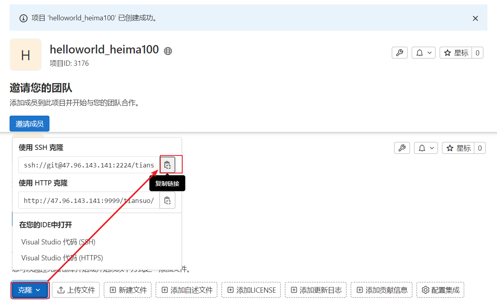


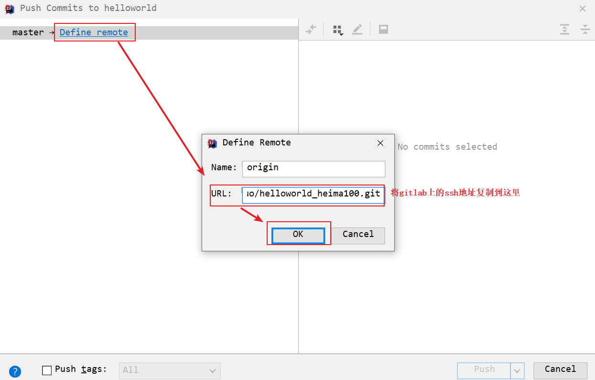

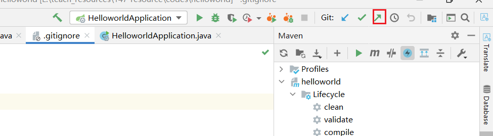

上传后的效果：

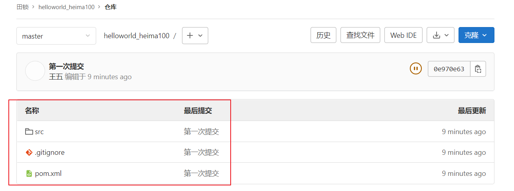

#### 2.2.3 Git操作

1). Git软件安装

通过yum命令在线安装git，执行如下指令： 

```
yum list git			列出git安装包
yum install git			在线安装git
```

通过上述指令，安装好git之后，我们就可以通过 git --version去验证git的环境。

   

如何配置公钥？与window环境的配置一致：

~~~java
ssh-keygen -t rsa
~~~


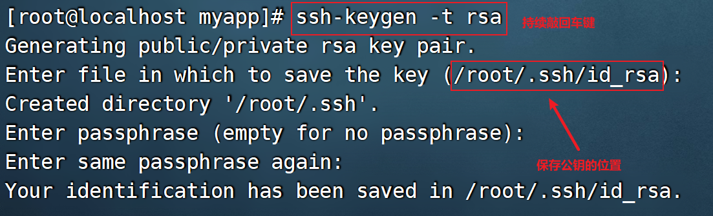

获取/root/.ssh/id_rsa.pub公钥信息，并配置到gitlab下：

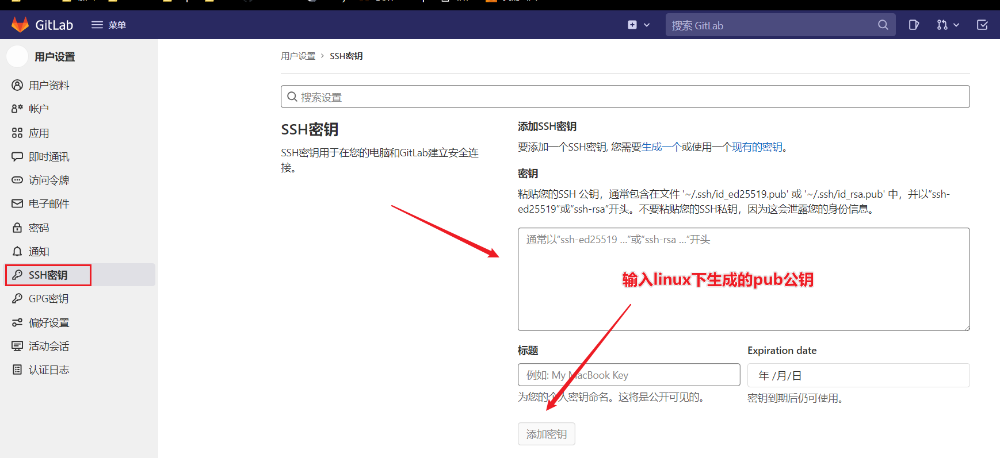

下载代码：

```tex
 git clone ssh://git@47.96.143.141:2224/tiansuo/helloworld_heima100.git
 # 整个过程无需输入账户和密码，非常方便
```


2). Git克隆代码

```
# 切换存放项目的目录
cd /usr/local/soft
# 克隆
# 初次拉去代码使用git clone
git clone ssh://git@47.96.143.141:2224/tiansuo/helloworld_heima100.git

```

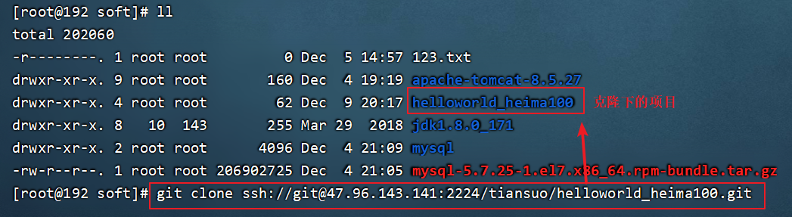 


#### 2.2.4 Maven安装

由于我们的工程是maven工程，我们要想进行项目的编译打包，需要用到maven的指令，所以需要安装maven。具体操作步骤如下：

##### **1). 上传资料中提供的maven的安装包**


 

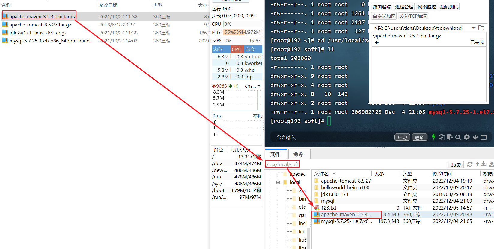

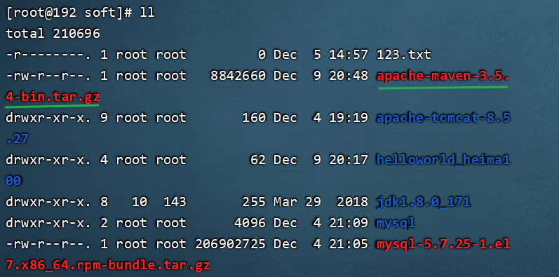  


##### **2). 解压maven安装包到/usr/local/soft目录**

```
tar -zxvf apache-maven-3.5.4-bin.tar.gz
```

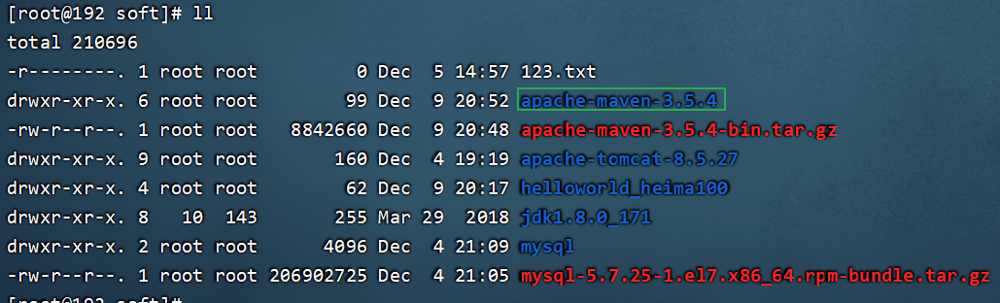 

删除不需要的压缩包

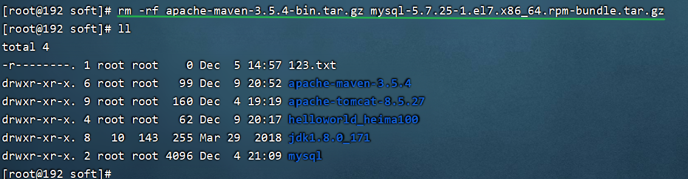

##### **3). 在/etc/profile配置文件中配置环境变量**

```
vim /etc/profile

修改配置文件，进入到命令模式，按G切换到最后一行，按a/i/o进入插入模式，然后在最后加入如下内容 :
MAVEN_HOME=/usr/local/soft/apache-maven-3.5.4
PATH=$JAVA_HOME/bin:$MAVEN_HOME/bin:$PATH

然后按ESC进入到命令模式，输入 :wq 保存并退出
```

 


要想让配置的环境变量生效,还需要执行如下指令:

```
source /etc/profile
```

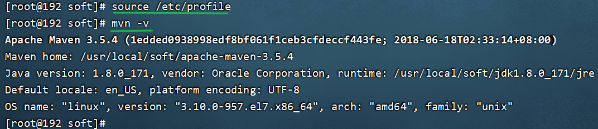 


##### **4). 修改maven的settings.xml配置文件,配置本地仓库地址**

A. 切换目录

```
cd /usr/local/soft/apache-maven-3.5.4/conf
```


B. 编辑settings.xml配置文件

```
vim settings.xml
```

在其中增加如下配置,配置本地仓库地址:

```
<localRepository>/usr/local/soft/repo</localRepository>
```

 


并在settings.xml中的<mirrors>标签中,配置阿里云的私服(==选做==):

```xml
<mirror> 
    <id>alimaven</id> 
    <mirrorOf>central</mirrorOf> 
    <name>aliyun maven</name> 
    <url>http://maven.aliyun.com/nexus/content/groups/public/</url>
</mirror> 
```

 


C.创建本地仓库/usr/local/soft/repo

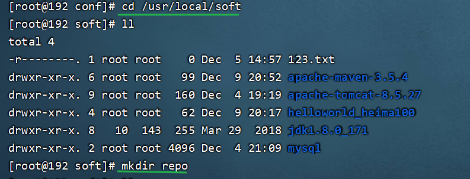


#### 2.2.5 Shell脚本准备

> Shell脚本（shell script），是一种Linux系统中的脚本程序。使用Shell脚本编程跟 JavaScript、Java编程一样，只要有一个能编写代码的文本编辑器和一个能解释执行的脚本解释器就可以了。 
>
> 对于Shell脚本编写不作为本课程重点内容，直接使用课程资料中提供的脚本文件bootStart.sh即可。


在/usr/local/soft 目录下创建一个目录 sh(mkdir sh)，并将shell脚本上传到该目录下。或者直接在sh目录下创建一个脚本bootStart.sh，然后将资料中的bootStart.sh文件打开,内容拷贝过来即可。

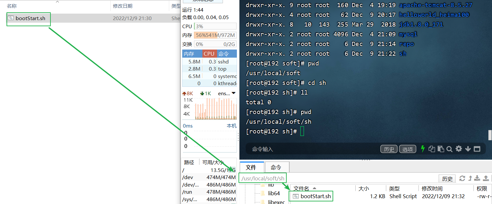


**脚本解读:** 

~~~markdown
#!/bin/sh
#记事本打开，修改编码格式为utf8，可解决上传centos后中文乱码问题
echo =================================
echo  自动化部署脚本启动
echo =================================

echo 停止原来运行中的工程
APP_NAME=helloworld
# 查询系统中正在运行的helloworld的进程，并停止进程
tpid=`ps -aux|grep $APP_NAME|grep -v grep|grep -v kill|awk '{print $2}'`
if [ ${tpid} ]; then
    echo 'Stop Process...'
    kill -15 $tpid
fi
sleep 2
tpid=`ps -aux|grep $APP_NAME|grep -v grep|grep -v kill|awk '{print $2}'`
# 停止后再次查询，如果还存在，则通过kill -9 强制杀死
if [ ${tpid} ]; then
    echo 'Kill Process!'
    kill -9 $tpid
else
    echo 'Stop Success!'
fi

echo 准备从Git仓库拉取最新代码
cd /usr/local/soft/helloword_heima100

echo 开始从Git仓库拉取最新代码
# 拉取最新代码
git pull
echo 代码拉取完成

echo 开始打包
# 执行打包，跳过单元测试
output=`mvn clean package -Dmaven.test.skip=true`
# 切换到当前工程的target目录下
cd target

echo 启动项目
# 后台启动该项目
nohup java -jar helloworld.jar &> helloworld.log &
echo 项目启动完成

~~~

 

#### 2.2.6 Linux权限

前面我们已经把Shell脚本准备好了，但是Shell脚本要想正常的执行，还需要给Shell脚本分配执行权限。 由于linux系统是一个多用户的操作系统，并且针对每一个用户，Linux会严格的控制操作权限。接下来，我们就需要介绍一下Linux系统的权限控制。

> 1). ==chmod==（英文全拼：change mode）命令是控制用户对文件的权限的命令
>
> 2). Linux中的权限分为三种 ：读(r)、写(w)、执行(x)
>
> 3). Linux文件权限从左到右分为三级 : 文件所有者（Owner）、用户组（Group）、其它用户（Other Users）
>
> 4). 只有文件的所有者和超级用户可以修改文件或目录的权限
>
> 5). 要执行Shell脚本需要有对此脚本文件的执行权限(x)，如果没有则不能执行


Linux系统中权限描述如下: 

 


解析当前脚本的权限情况: 

 


chmod命令可以使用八进制数来指定权限(0 - 代表无 , 1 - 执行x , 2 - 写w , 4 - 读r):

| 值   | 权限           | rwx  |
| ---- | -------------- | ---- |
| 7    | 读 + 写 + 执行 | rwx  |
| 6    | 读 + 写        | rw-  |
| 5    | 读 + 执行      | r-x  |
| 4    | 只读           | r--  |
| 3    | 写 + 执行      | -wx  |
| 2    | 只写           | -w-  |
| 1    | 只执行         | --x  |
| 0    | 无             | ---  |


**举例:**

```
chmod 777 bootStart.sh   为所有用户授予读、写、执行权限
chmod 755 bootStart.sh   为文件拥有者授予读、写、执行权限，同组用户和其他用户授予读、执行权限
chmod 210 bootStart.sh   为文件拥有者授予写权限，同组用户授予执行权限，其他用户没有任何权限

```


==注意:==

三个数字分别代表不同用户的权限

- 第1位表示文件拥有者的权限
- 第2位表示同组用户的权限
- 第3位表示其他用户的权限


#### 2.2.7 授权并执行脚本

在测试阶段，我们可以给所有的人都赋予执行该shell脚本的权限。所以可以执行如下指令：

```
chmod 777 bootStart.sh
```

 

权限解读: 

A. 第一个7，代表当前文件所有者root用户，对该文件具有读写执行权限；

B. 第二个7，代表当前文件所有者所属组的用户，对该文件具有读写执行权限；

B. 第三个7，代表其他用户，对该文件具有读写执行权限；

执行该shell脚本:

 

==注意： 在执行maven指令进行打包时，第一次执行可能会耗时比较长，因为在进行maven工程的打包时，需要到中央仓库下载工程依赖的jar包和插件(可以在settings.xml中配置阿里云私服加速下载)。==

启动完成之后, 我们可以查看java进程：

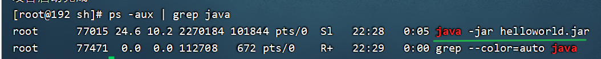 


访问项目：

 


注意：

假设公司开发小组成员在代码上新增功能，将代码提交到gitlab上：

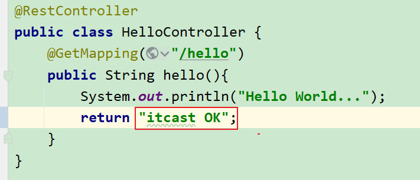

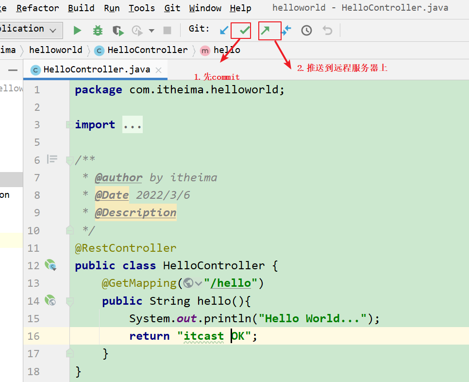


你的公司运维，就会在linux上更新gitlab上的项目：

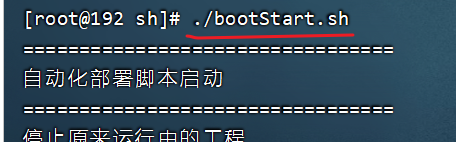

浏览器访问：

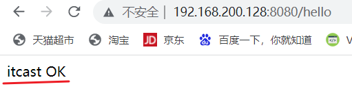

## 3.设置静态IP

我们目前安装的Linux操作系统，安装完毕之后并没有配置IP地址，默认IP地址是动态获取的，那如果我们使用该Linux服务器部署项目，IP动态获取的话，也就意味着，IP地址可能会发生变动，那我们访问项目的话就会非常繁琐，所以作为服务器，我们一般还需要把IP地址设置为静态的。 

1). 设置静态IP

设置静态ip，我们就需要修改 /etc/sysconfig/network-scripts/ifcfg-ens33 配置文件，内容如下： 

```properties
TYPE=Ethernet
PROXY_METHOD=none
BROWSER_ONLY=no
BOOTPROTO=static
IPADDR="192.168.200.128"        # 设置的静态IP地址
NETMASK="255.255.255.0"         # 子网掩码
GATEWAY="192.168.200.2"         # 网关地址
DNS1="192.168.200.2"            # DNS服务器
DNS2="8.8.8.8"
DEFROUTE=yes
IPV4_FAILURE_FATAL=no
IPV6INIT=yes
IPV6_AUTOCONF=yes
IPV6_DEFROUTE=yes
IPV6_FAILURE_FATAL=no
IPV6_ADDR_GEN_MODE=stable-privacy
NAME=ens33
UUID=afd0baa3-8bf4-4e26-8d20-5bc426b75fd6
DEVICE=ens33
ONBOOT=yes
ZONE=public
```

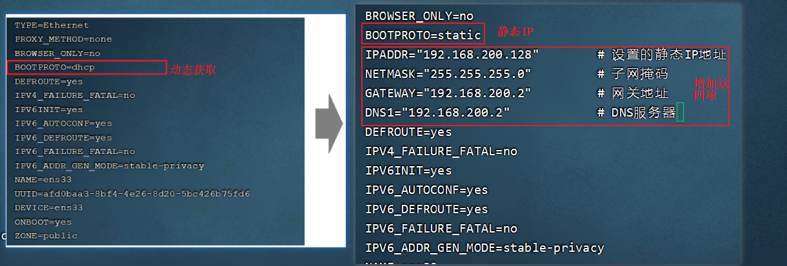 

~~~markdown
BOOTPROTO=static
IPADDR="192.168.200.128"        # 设置的静态IP地址
NETMASK="255.255.255.0"         # 子网掩码
GATEWAY="192.168.200.2"         # 网关地址
DNS1="192.168.200.2"            # DNS服务器

BOOTPROTO=static
IPADDR="192.168.200.128"        
NETMASK="255.255.255.0"         
GATEWAY="192.168.200.2"         
DNS1="192.168.200.2"           
~~~


上述我们所设置的网段为200，并不是随意指定的，需要和我们虚拟机中的虚拟网络编辑器中的NAT模式配置的网关保持一致。

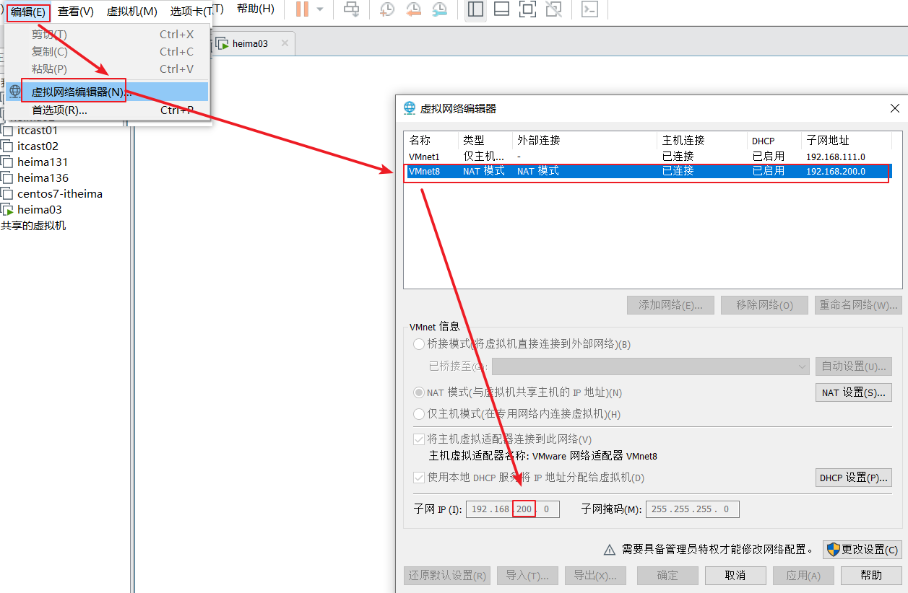

 

2). 重启网络服务

ip地址修改完毕之后，需要重启网络服务，执行如下指令： 

```
systemctl restart network
或者service network restart
```

 

==注意：重启完网络服务后ip地址已经发生了改变，此时FinalShell已经连接不上Linux系统，需要创建一个新连接才能连接到Linux。==


再次连接上Linux之后，我们再次查看IP地址，就可以看到我们所设置的静态IP：

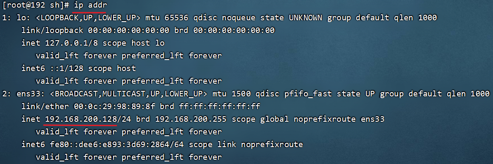 


