# 	Redis基础

## 课程内容

- Redis入门
- Redis数据类型
- Redis常用命令
- Redis使用场景
- 在Java中操作Redis


## 1. Redis入门

### 1.1 Redis简介

#### 【1】为什么学习Redis

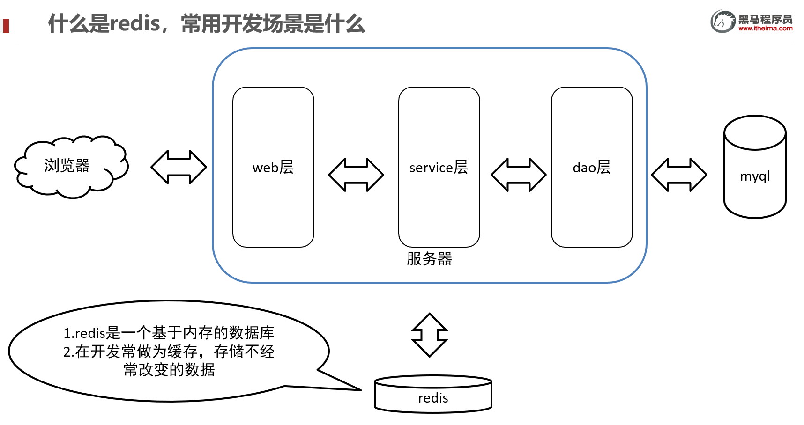

Redis是一个基于**内存**的key-value结构数据库。它是「**Re**mote **Di**ctionary **S**ervice」的首字母缩写，也就是「远程字典服务-remote dictionary server」。

- [ ] 基于内存存储，读写性能高


- [ ] 适合存储热点数据（热点商品、资讯、新闻）


- [ ] 企业应用广泛


#### 【2】Redis介绍

Redis is an open source (BSD licensed), in-memory data structure store, used as a database, cache, and message broker. 翻译为：Redis是一个开源的内存中的数据结构存储系统，它可以用作：数据库、缓存等。

官网：[https://redis.io](https://redis.io/)  

中文网   https://www.redis.net.cn/

Redis是用C语言开发的一个开源的高性能键值对(key-value)数据库，官方提供的数据是可以达到10万+的QPS（Queries-per-second每秒内查询次数）。它存储的value类型比较丰富，也被称为结构化的NoSql数据库。

NoSql（Not Only SQL），不仅仅是SQL，泛指**非关系型数据库(数据之间没有关系)**。NoSql数据库并不是要取代关系型数据库，而是关系型数据库的补充。

关系型数据库(RDBMS)：

- Mysql
- Oracle
- DB2
- SQLServer

非关系型数据库(NoSql)：

- Redis
- Mongo db
- MemCached

https://db-engines.com/ (数据库排行榜)


### 1.2 使用Redis能做什么

- 数据缓存 ★

- 消息队列

  .........

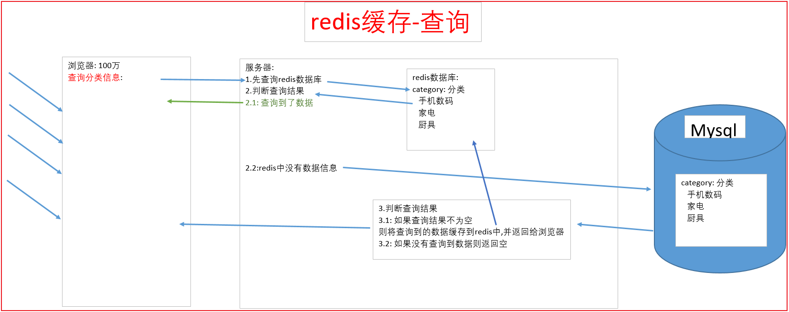


### 1.3 Redis下载与安装

#### 1.3.1 Redis下载

Redis安装包分为windows版和Linux版：

- Windows版下载地址：https://github.com/microsoftarchive/redis/releases
- Linux版下载地址： https://download.redis.io/releases/ 

下载后得到下面安装包：


说明:

> Redis官网只提供了linux版本，没有windows版本。windows版本由微软公司开发，不稳定，实际开发中我们一般都是使用linux版本。

#### 1.3.2 Redis安装

##### **1）在Linux中安装Redis**

###### 安装过程介绍

1. 安装编译环境并且编译
2. 安装redis
3. 设置成后台运行
4. 打开防火墙6379端口号
5. 设置IP地址的bind(知道即可，今天课程不做过多要求，后续会使用)

###### redis安装

**1.先查看下是否安装了gcc-c++**

redis是C语言开发，安装redis需要先将官网下载的源码进行编译，编译依赖gcc环境。如果没有gcc环境，需要安装gcc。

~~~
rpm -q gcc-c++
~~~


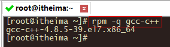

如果出现如上所示说明已经安装了。**如果没有安装则执行下面命令进行安装即可。**

```
yum -y install gcc-c++
```

​	安装过程信息如下，大约需要下载39M。

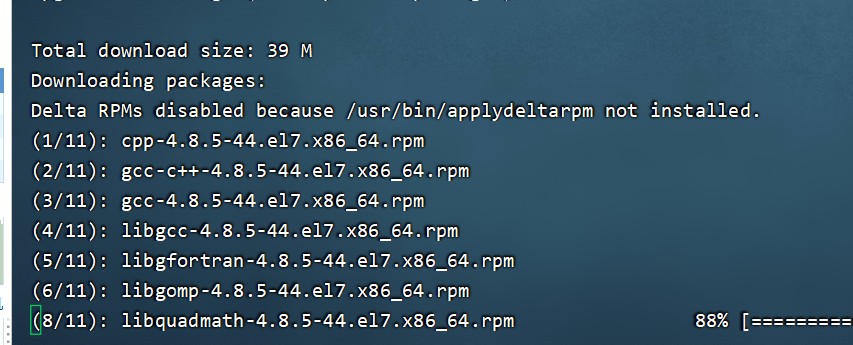 


**2.上传"redis"到Linux系统/soft目录下**

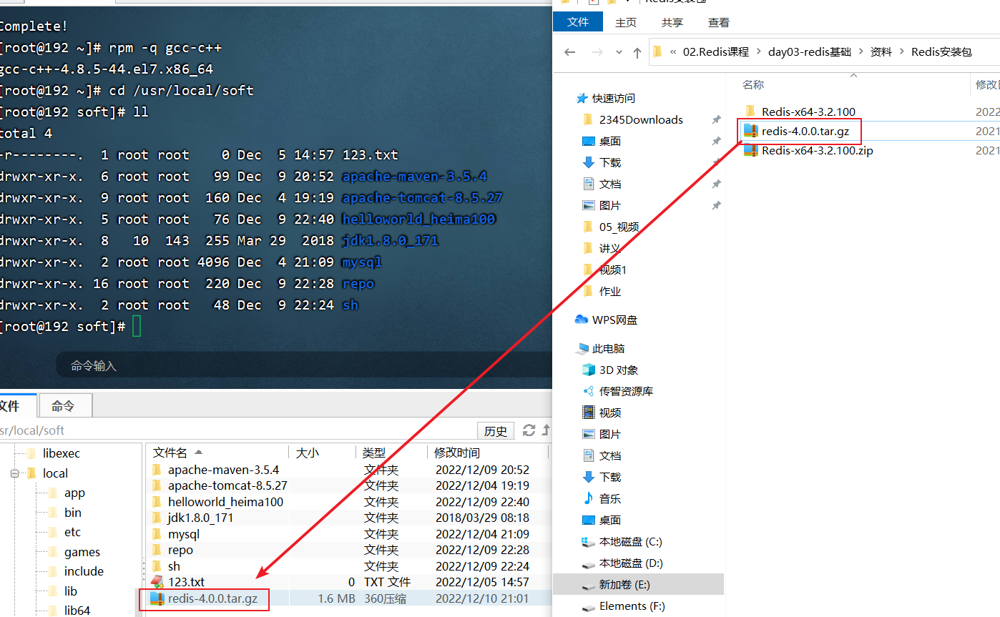

**3.进入soft目录,将"redis-4.0.0.tar.gz"解压到当前目录**

```
cd /usr/local/soft 
tar -zxvf redis-4.0.0.tar.gz
```

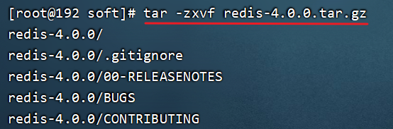

解压好之后会出现redis-4.0.0目录


切换到redis-4.0.0目录下查看内容，下面内容是redis的源码。

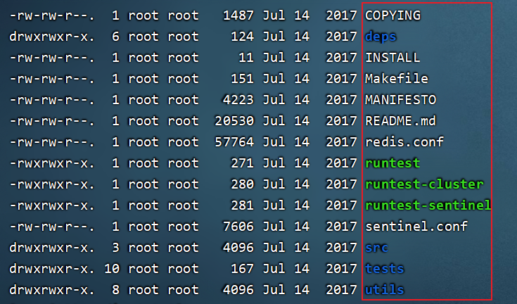


**4.进入redis-4.0.0目录，使用make命令对上述源码在c语言的环境下进行编译redis 。make会调用gcc-c++编译redis源码，只有编译之后才可以进行安装。**

~~~html
make
~~~


如下信息代表编译成功

  

**5.在redis-4.0.0目录中，使用以下命令，将redis安装到/usr/local/soft/redis指定的目录下**

```
make PREFIX=/usr/local/soft/redis install 
```

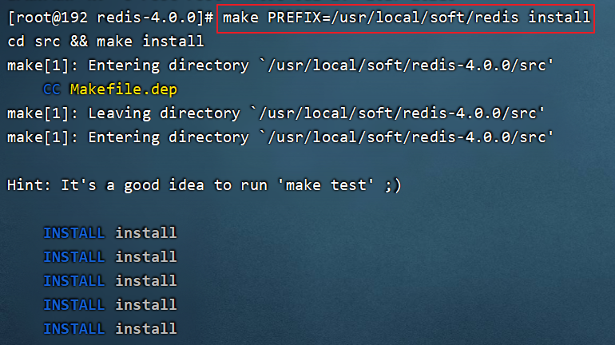

​    

​	安装成功后在/usr/local/redis/bin目录下可以看到如下结构。

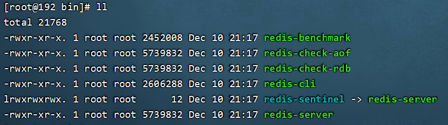

**6.复制redis.conf配置文件到/usr/local/soft/redis/bin**

 说明：要从刚解压的目录下复制过来。

~~~java
cd /usr/local/soft/redis-4.0.0/
~~~


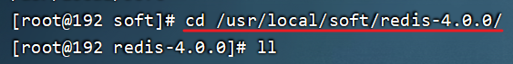

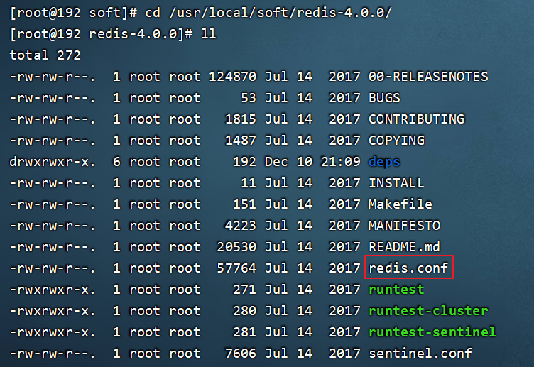

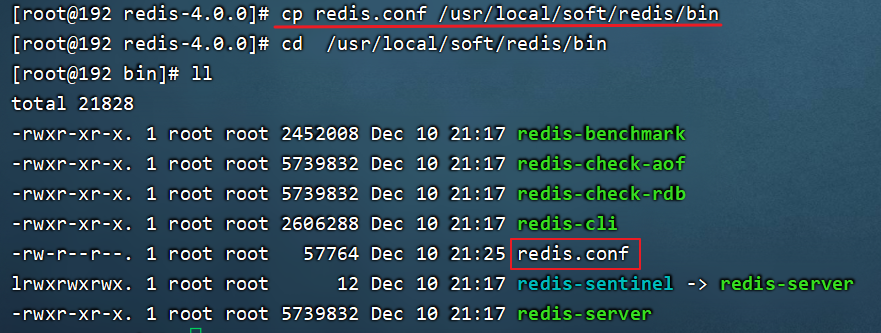

安装后重点文件说明：

> /usr/local/soft/redis/bin/redis-server：Redis服务启动脚本
>
> /usr/local/soft/redis/bin/redis-cli：Redis客户端脚本
>
> /usr/local/soft/redis/bin/redis.conf：Redis配置文件


##### **2）在Windows中安装Redis**

Redis的Windows版属于绿色软件，直接解压即可使用，解压后目录结构如下：


### 1.4 Redis服务启动与停止

#### **1）Linux系统中启动和停止Redis** 掌握

##### redis启动服务器

启动redis有两种方式：

【1】前端模式启动(不使用这种模式)

​	直接运行bin/redis-server以前端模式启动，前端模式启动的缺点是启动完成后，不能再进行其他操作，如果要操作必须使用ctrl+c，同时redis-server程序结束，不推荐使用此方法。

```
./redis-server
```

 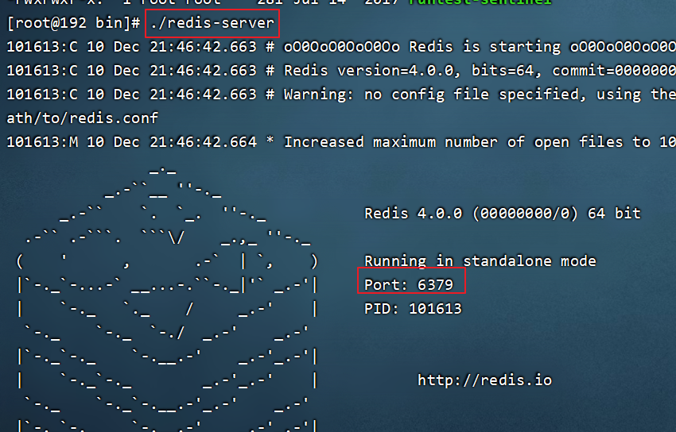  

使用CTRL+ C 停止前端模式


【2】后端模式启动(推荐使用)

1.修改redis.conf配置文件，修改daemonize yes 以后端模式启动。

daemonize：后台运行

```
vim redis.conf
```

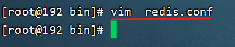

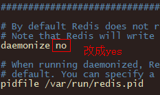

 

 保存并退出。

2.启动时，指定配置文件

```
cd /usr/local/soft/redis/bin
 ./redis-server redis.conf
```

 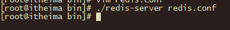

3.查看启动的后台进程

```
ps -aux | grep redis
```

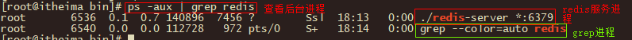

   

 

##### redis启动客户端

1. 进入redis/bin目录,启动"redis-cli"

```
./redis-cli
```

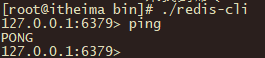    

 


##### 停止redis

**在客户端向Redis发送shutdown命令**

方法：在Redis客户端里面输入shutdown

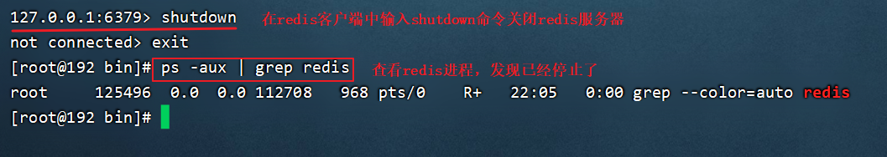  

**注意：上述已经将redis服务关闭了，如果希望演示下面的远程访问redis必须先启动redis服务。**

~~~
./redis-server redis.conf
~~~

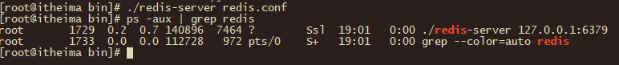


#### **2）Windows系统中启动和停止Redis** 了解

Windows系统中启动Redis，直接双击redis-server.exe即可启动Redis服务，redis服务默认端口号为6379


如果双击无法启动redis,那么就打开dos窗口输入如下命令启动:

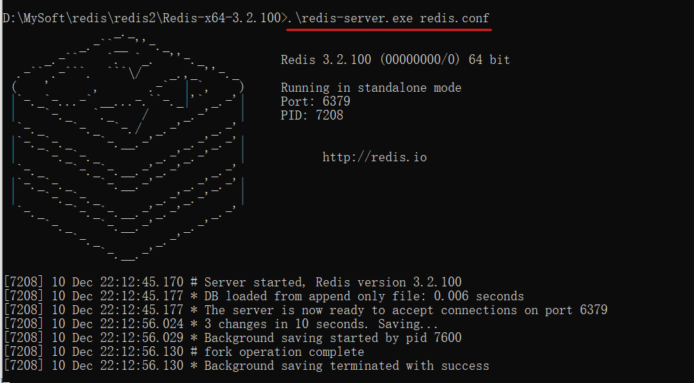


==Ctrl + C==停止Redis服务

双击==redis-cli.exe==即可启动Redis客户端，默认连接的是本地的Redis服务，而且不需要认证即可连接成功。


退出客户端可以输入==exit==或者==quit==命令。


### 1.5 使用可视化工具连接redis服务器端

通过上述演示我们发现通过命令行可以连接redis数据库服务器，但是在命令行中操作redis稍微麻烦一些。我们平时可以使用可视化工具操作redis服务器。

1.在今日下发资料的软件中找到如下文件，进行一步步安装即可。

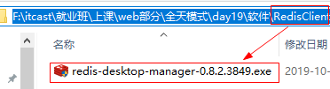

欢迎页面

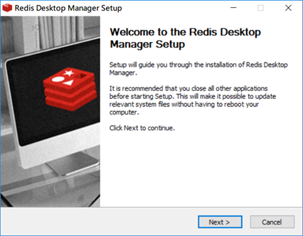 

软件的许可协议，接受即可

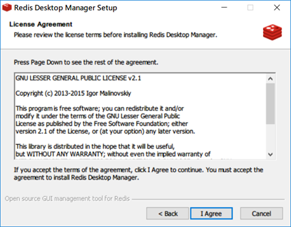 

选择安装的位置

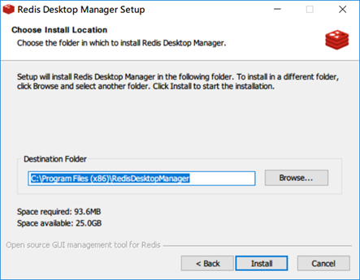 

复制文件

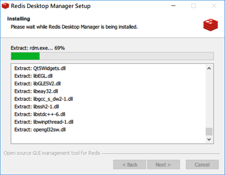 

完成安装

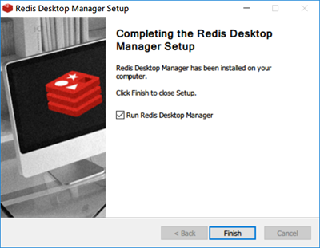

2.安装好之后的界面：

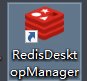

3.打开可视化工具，创建链接：

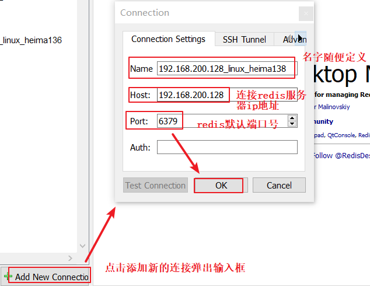

4.打开防火墙

我们发现使用可视化工具连接linux的redis服务器，会报错

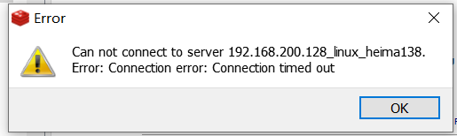


如需远程连接redis，需配置redis端口6379在Linux防火墙中开放

```
#开放的端口永久保存到防火墙
firewall-cmd --zone=public --add-port=6379/tcp --permanent

#重启防火墙
systemctl restart firewalld
```

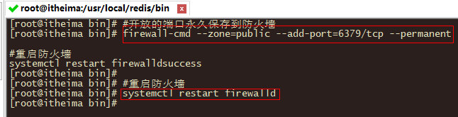

使用windows下的客户端软件连接，发现客户端依然无法连接redis，这是由于redis本身安全机制的限制，默认只允许本机访问

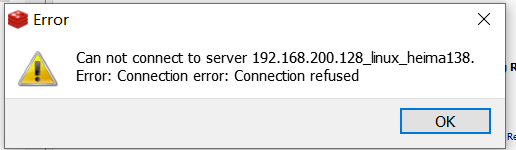


5.修改配置允许其它机器访问

1. **默认redis只允许本机访问，如果想要其它机器访问，需要编辑redis.conf配置内容如下，添加当前Linux局域网的IP地址。**

```
bind 127.0.0.1 192.168.18.128
或者直接插入：
bind 0.0.0.0  
# 使用0.0.0.0表示使用本地localhost 127  192.168.200.129都可以访问
```

 说明：上述是绑定本地回环ip地址和外网访问的虚拟机ip地址的映射关系。

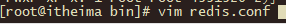

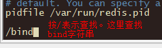

说明：输入完bind之后按回车，然后按字母n查找bind.到文件末尾输入o换行插入。**一定要把注释符号#删除。**

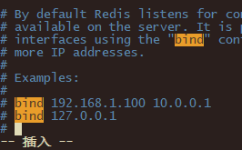

插入内容：

~~~
bind 0.0.0.0 
~~~


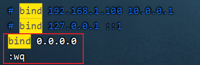

注意：一定将下图中的注释掉否则使用客户端不会连接上redis服务器端

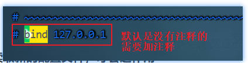

保存退出。

**2.关闭redis，再重新启动Redis读取新的配置文件，才会起作用**

```
./redis-cli shutdown
./redis-server redis.conf
```

 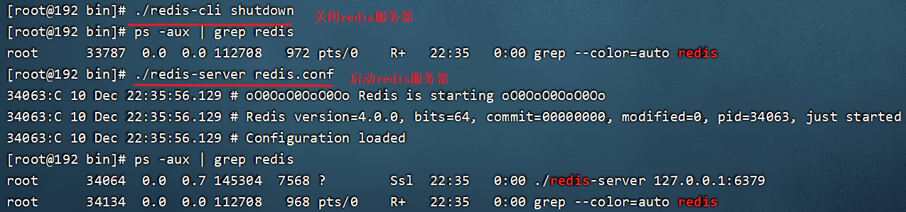

**3.在Windows下使用Redis客户端访问Linux服务器上的Redis服务器**

​    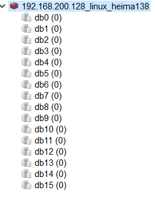

创建好连接之后就会看到redis默认的数据库：


redis默认含有16个数据库。默认使用第一个数据库。我们可以在连接192.168.200.128_linux_heima138上右键进行命令行操作redis数据库。

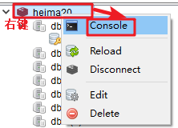

5.在其他数据库上存储数据

我们发现默认使用第一个数据库，我们可以使用select命令进行切换数据库，语法：

~~~
select 数据库索引 
~~~

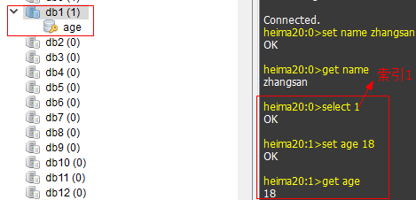


说明：一个Redis服务器可以包括多个数据库，客户端可以只连接Redis中某个数据库，就好比一个mysql服务器中创建多个数据库，客户端连接时指定连接到哪个数据库。
​	Redis中有db0-db15编号的16个数据库。我们不能创建新的数据库，也不能删除数据库。数据库中也没有表的结构，客户端默认连接第0个数据库。

## 2. Redis的数据类型【重点】

### 1、数据类型介绍

#### 1.1Redis的5种数据类型

redis是一种高级的key-value的存储系统，键是string类型，其中value支持五种数据类型，对于键和值的描述如下所示：

**键(key)：**

​	【1】键不能重复

​	【2】作用：标识存储的数据

​	【3】数据类型：string

​	【4】命名规则：

​			1）不能太长：因为查询的效率低，查询起来不方便

​			2）不能太短：容易重复，同时可读性也差

​			3）按照规范：HEIMA_STU_LIST

**值(value)：**支持5种数据类型

| 值的数据类型    | 值的格式说明                                           |
| --------------- | ------------------------------------------------------ |
| string          | 字符串类型，类似于Java中String                         |
| hash            | 由键值对组成，类似于Java中Map                          |
| list            | 列表类型，类似于Java中List，元素是存取有序，可以重复。 |
| set             | 集合类型，类似于Java中Set，元素是存取无序，不可重复    |
| sorted set/zset | 有序的集合类型，每个元素有一个分数用来决定它的顺序。   |

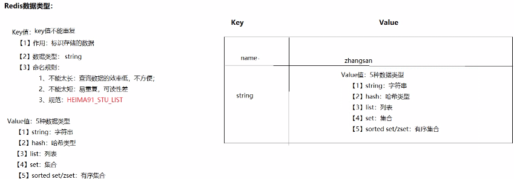


### 2、string类型的操作命令

#### 目标

​	学习操作String类型数据的命令

#### 字符串类型string

字符串类型是Redis中最为基础的数据存储类型，它在Redis中以二进制保存。无论存入的是字符串、整数、浮点类型都会以字符串写入。

**在Redis中字符串类型的值最多可以容纳的数据长度是512M**，这是以后最常用的数据类型。

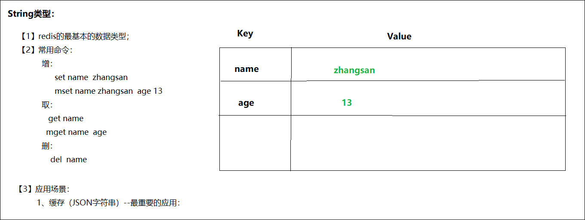 

#### 常用命令


更多命令可以参考Redis中文网：https://www.redis.net.cn

| 命令                                 | 功能                                                         |
| ------------------------------------ | ------------------------------------------------------------ |
| set 键 值                            | 添加或修改一个键和值，键不存在就是添加，存在就是修改         |
| get 键                               | 获取值，如果存在就返回值，不存在返回nil(就是C语言中NULL)     |
| del 键                               | 删除指定的键和值，返回删除的个数                             |
| **SETEX** key seconds value          | 设置指定key的值，并将 key 的过期时间设为 seconds 秒。此处的value是指key对应的value值。等价于：SET key value  ex seconds |
| EXPIRE key seconds                   | 如果一个key已经存在，要设置一个过期时间                      |
| **SETNX** key value/set key value nx | 保存键值对，如果key存在则不保存，不存在则保存                |

~~~html
补充：
批量操作：
mset  name lisi   addr sh
mget name  age addr
del  name age 
~~~

#### 命令演示

1. 添加一个键为name，值为zhangsan

2. 再设置一个键为age，值为13

3. 得到name和age的值

4. 删除name

5. 批量添加name lisi addr sh

6. 批量获取name age addr的值

7. 批量删除name age

8. 修改addr的值为bj

9. 设置name2值为lisi，且存活5s，5秒后，内存销毁

10. 也可通过set实现过期机制，ex 10表示存活10秒，例如设置name3值为zhaoliu，且存活5s，5秒后，内存销毁

11. 使用set命令添加name4并赋值为wangwu,然后使用EXPIRE 设置过期时间。

12. 如果键存在则不保存，不存在则保存。

  ​    

#### 执行效果

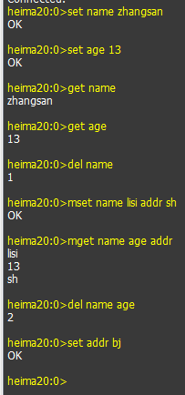

9.设置name2值为lisi，且存活5s，5秒后，内存销毁


10.也可通过set实现过期机制，ex 10表示存活10秒，例如设置name3值为zhaoliu，且存活5s，5秒后，内存销毁

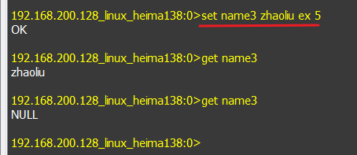

11.使用set命令添加name4并赋值为wangwu,然后使用EXPIRE 设置过期时间。

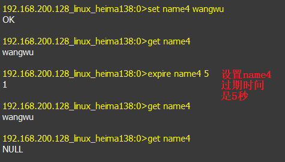

12.如果键存在则不保存，不存在则保存。

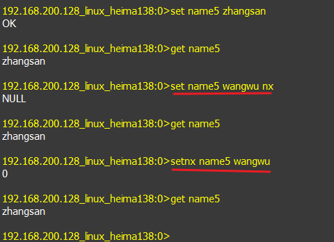

使用场景举例：

- 用户登录后端保存短信验证码,并设置失效时间；
- 代替后端session功能，实现分布式缓存(是将数据[分散存储](https://baike.baidu.com/item/分散存储?fromModule=lemma_inlink)在多台独立的设备上)等；

#### 小结

1. 添加值： set 键 值
2. 获取值：get 键
3. 删除值：del 键


### 3、hash类型的操作命令

#### 目标

学习hash类型的几个操作命令

#### 概述

Redis中的Hash类型可以看成是键和值都是String类型的Map容器，每一个Hash可以存储4G个键值对。

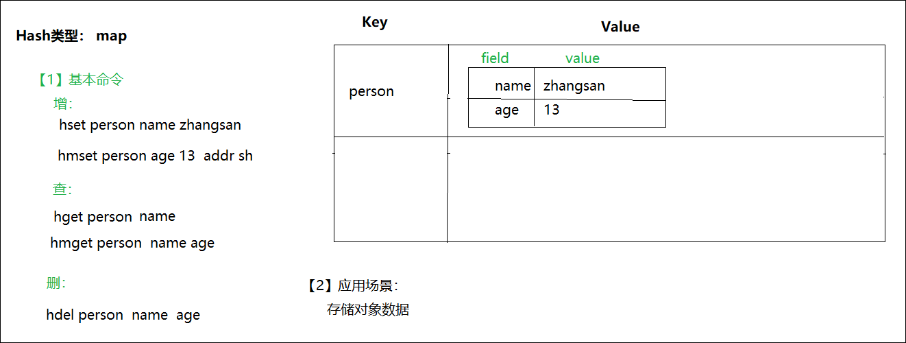 

​	该类型非常适合于存储对象的信息。如一个用户有姓名，密码，年龄等信息，则可以有username、password和age等键。它的存储结构如下：

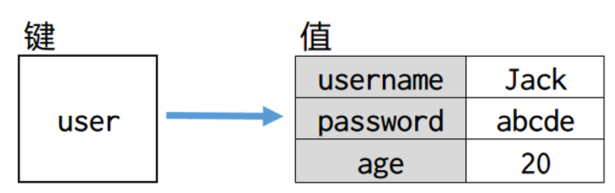 

#### 常用命令

| 命令                     | 功能                               |
| ------------------------ | ---------------------------------- |
| hset 键 字段 值          | 添加键，字段，值                   |
| hget 键 字段             | 通过键，字段得到值                 |
| hmset 键 字段 值 字段 值 | multiply多个，一次添加多个字段和值 |
| hmget 键 字段 字段       | 通过键，获取多个字段和值           |
| hdel 键 字段 字段        | 删除一个或多个字段的值             |
| hgetall 键               | 得到这个键下所有的字段和值         |
| HKEYS 键                 | 获取哈希表中所有字段               |
| HVALS 键                 | 获取哈希表中所有值                 |


#### 命令演示

1. 创建hash类型的键为person，并且添加一个字段为name，值为zhangsan
2. 向person中添加字段为age，值为13
3. 向person中批量添加字段为addr，值为sh;字段为company,值为heima
4. 分别得到person中的name、age的字段值
5. 批量得到person中的name、age和addr的字段值
6. 获取person中所有的字段以及对应的值
7. 删除person中的name
8. 批量删除person中的age、addr以及company 

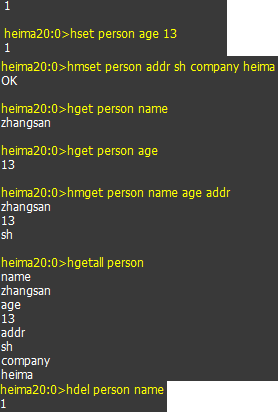


Hash数据结构的应用场景：


- 购物车

> 以用户id为key，商品id为field，商品数量为value，恰好构成了购物车的3个要素，如下图所示
>
> 

#### 小结

| 功能             | hash类型的操作命令 |
| ---------------- | ------------------ |
| 添加值           | hset               |
| 得到值           | hget               |
| 删除值           | hdel               |
| 添加多个字段     | hmset              |
| 得到多个字段值   | hmget              |
| 得到所有字段的值 | hgetall            |

### 4、list类型的操作命令

#### 目标

​	学习list类型的操作命令

#### 概述

​	在Redis中，List类型是按照插入顺序排序的字符串链表。和数据结构中的普通链表一样，我们可以在其左部(left)和右部(right)添加新的元素。在插入时，如果该键并不存在，Redis将为该键创建一个新的链表。与此相反，如果链表中所有的元素均被移除，那么该键也将会被从数据库中删除。List中可以包含的最大元素数量是4G个。

 

#### 常用命令

| 命令                            | 行为                                                         |
| ------------------------------- | ------------------------------------------------------------ |
| lpush 键 元素 元素...           | left 从左边向指定的键中添加1个或多个元素，返回列表中元素的个数 |
| rpush 键 元素 元素...           | right 从右边向指定的键中添加1个或多个元素                    |
| lpop 键                         | 从左边删除一个元素，返回被删除的元素                         |
| rpop 键                         | 从右边删除一个元素，返回被删除的元素                         |
| lrange 键 开始 结束             | 得到键中指定范围的元素的数据<br />每个元素都有一个索引号，从左向右0~n<br />从右向左索引号：-1~-(n+1)，每个元素有2个索引号<br />如果要取出整个列表中所有的元素，索引号应该是：0~-1 |
| lindex 键 索引值                | 查询指定索引的元素                                           |
| llen 键                         | 获取列表的长度                                               |
| **BRPOP** key1 [key2 ] timeout  | 移出并获取列表的最后一个元素， 如果列表没有元素会阻塞列表直到等待超时或发现可弹出元素为止，超时时间单位默认是秒 |
| LREM  key 删除元素个数  value值 | 从表头删除指定个数的元素                                     |


#### 命令演示


1. 向mylist键的列表中，从左边添加a b c三个元素

2. 从右边添加one two three三个元素

3. 查询索引0到2的数据

4. 查询所有的元素

5. 查询索引是2的数据

6. 从右边添加一个重复的元素three

7. 删除最左边的元素c

8. 删除最右边的元素three

9. 获取列表中元素的个数

10. 向列表list1中添加数据，并移除列表中最后一个元素，如果列表中没有该元素则等待指定时间

11. 向列表list1中添加元素: a b c b b. 然后删除2个b元素

    **【效果】**

    

10.向列表list1中添加数据，并移除列表中最后一个元素，如果列表中没有该元素则等待指定时间


11.向列表list1中添加元素: a b c b b. 然后删除2个b元素。


使用场景：

- 微信朋友圈点赞，要求按照点赞顺序显示点赞好友信息。如果取消点赞，移除对应好友信息。
- list类型的lrange命令可以分页查看队列中的数据。可将每隔一段时间计算一次的排行榜存储在list类型中，如京东每日的手机销量排行、学校每次月考学生的成绩排名等，下图是酷狗音乐“K歌擂台赛”的昨日打擂金曲排行榜，每日计算一次，存储在list类型中。


#### 小结

1. 从左边添加元素:  lpush
2. 从右边添加元素：rpush
3. 从左边删除元素：lpop
4. 从右边删除元素：rpop
5. 得到指定范围的元素：lrange
6. 得到列表的长度：llen


### 5、set类型的操作命令

#### 目标

​	学习set类型的操作命令

#### 概述

​	在Redis中，我们可以将Set类型看作为没有排序的字符集合，和List类型一样，我们也可以在该类型的数据值上执行添加、删除或判断某一元素是否存在等操作。Set可包含的最大元素数量是4G，和List类型不同的是，Set集合中不允许出现重复的元素。


#### 常用命令

| 命令                 | 行为                                                   |
| -------------------- | ------------------------------------------------------ |
| sadd 键 元素 元素... | 向一个键中添加1个或多个元素                            |
| smembers 键          | 得到这个集合中所有的元素                               |
| sismember 键 元素    | 判断指定的元素在集合中是否存在，存在返回1，不存在返回0 |
| srem 键 元素 元素... | 通过键删除一个或多个元素                               |
| sinter key1 [key2]   | 返回给定所有集合的交集（集合中都共有的部分）           |


#### 命令演示

~~~
1. 向myset集合中添加A B C 1 2 3 六个元素
2. 再向myset中添加B元素，看能否添加成功
3. 显示所有的成员，发现与添加的元素顺序不同，元素是无序的
4. 删除其中的C这个元素，再查看结果
5. 判断A是否在myset集合中
6. 判断D是否在myset集合中
7. 向两个集合中添加数据，查看两个集合的交集
~~~


1. 向myset集合中添加A B C 1 2 3 六个元素

2. 再向myset中添加B元素，看能否添加成功

3. 显示所有的成员，发现与添加的元素顺序不同，元素是无序的

4. 删除其中的C这个元素，再查看结果

    

5. 判断A是否在myset集合中

6. 判断D是否在myset集合中

    

 7.向两个集合中添加数据，查看两个集合的交集


应用场景：

- 需要去重的少量信息，比如：身份证信息、手机号码等作为黑名单|白名单;

- 共同好友查询，使用set的交集;

  - eg:  zhang:{11,22,33,44}  lisi:{22,33,66,88}

    ​	zhangsan和lisi共同的好友：交集取22 33即可.

#### 小结

1. 添加元素：sadd
2. 删除元素：srem
3. 得到所有元素：smembers
4. 判断元素是否存在：sismember


### 6、zset/sorted set类型的操作命令

#### 目标

学习zset命令的操作

#### 概述

Redis 有序集合（sorted set）和set集合一样也是无序不可以重复。不同的是每个元素都会关联一个分数(排序因子)。

redis正是通过分数来为集合中的成员进行从小到大的排序。

有序集合的成员是唯一的,但分数(score)却可以重复，每个集合可存储40多亿个成员。


#### 命令 

| **命令**                                        | **行为**                                        |
| ----------------------------------------------- | ----------------------------------------------- |
| **zadd** **键** **分数** **值** **分数** **值** | 添加1个或多个元素，每个元素都有一个分数         |
| **zrange** **键** **开始索引** **结束索引**     | 获取指定范围的元素，得到所有的元素，索引是0到-1 |
| **zrange 键 开始索引 结束索引 withscores**      | 查询指定的元素和对应的分数                      |
| **zrevrange 键 开始索引 结束索引 withscores**   | 按照分数倒叙获取指定的元素和对应的分数          |
| **zrem 键 值 值**                               | 删除一个或多个值                                |
| **zcard** **键**                                | 得到元素个数                                    |
| **zrank** **键** **值**                         | 得到元素的索引号                                |
| **zscore 键 值**                                | 得到元素的分数                                  |

#### 操作

1. 添加键country，分数是10，值是Japan

2. 添加键country，分数是5，值是USA，添加键country，分数是50，值是Russia

3. 添加键country，分数是1，值是China，分数是120，值是Korea

4. 查询country中所有的元素

    

5. 查询所有的元素和对应的分数

6. 按照分数倒叙获取所有的元素和对应的分数

   

7. 查询索引是0 到 1的值

   

8. 查询Japan的索引号(从0开始)

9. 删除值为USA的元素

10. 查询country中还有多少个元素

11. 显示Russia的分数值

     

应用场景：

> 1.b站视频点击量排名
>
> 2.新浪热点文章点击量、收藏量等排名

#### 小结

| **命令**   | **行为** |
| ---------- | -------- |
| **zadd**   | 添加     |
| **zrange** | 查询     |
| **zrem**   | 删除     |
| **zcard**  | 个数     |
| **zrank**  | 索引号   |
| **zscore** | 得到分数 |


## 3. Redis的其他操作

### 1、Redis的通用命令

#### 目标

学习redis中通常的操作命令

#### 常用命令

| **命令**                       | **功能**                                                     |
| ------------------------------ | ------------------------------------------------------------ |
| **keys 匹配字符**              | 查询所有的键，可以使用通配符<br />***** 匹配多个字符<br />**?** 匹配1个字符 |
| **del** **键1** **键2**        | 删除任何的值类型，而且可以同时删除多个键                     |
| **exists** **键**              | 判断指定的键是否存在，不存在返回0  存在返回1                 |
| **type** **键**                | 判断指定的键，值的类型。返回是类型的名字                     |
| **select** **数据库编号**      | 选择其它的数据库                                             |
| **move** **键** **数据库编号** | 将当前数据库中指定的键移动到另一个数据库中                   |
| **TTL** key                    | 返回给定 key 的剩余生存时间(TTL, time to live)，以秒为单位<br/>从Redis2.8开始：如果key不存在或者已过期，返回-2；如果key存在并且没有设置过期时间(永久有效)，返回-1 |
| flushall                       | redis的flushall命令用来清空redis所有的库,测试可以使用，开发中最好不要用。 |


#### 命令演示

1. 添加字符串name的值为zhangsan， myset 的值为20

2. 显示所有的键

3. 显示所有以my开头的键

4. 显示所有my后面有三个字符的键

5. 添加一个字符串：name2 lisi

6. 添加一个list：name3 a b c d

    

7. 显示所有的键

8. 一次删除name2和name3这两个键，其中name2和name3是不同的类型，显示所有键

9. 分别判断name和name2是否存在

    

10. 分别判断name user myset mylist分别是什么类型

11. 切换数据库到15，向15中添加一个name2 wangwu，得到name2的值显示。

12. 将15中的name2移到0中

13. 切换到数据库0，显示所有的键

 

14.返回给定 key 的剩余生存时间(TTL, time to live)，以秒为单位


#### 小结

1. **keys：找到所有的键，通配符：* ?**
2. exists：判断指定的键是否存在
3. type：判断指定键值的类型
4. **select：切换数据库默认是0-15**
5. move：将键移动另一个数据库
6. **del:  删除多个键**


## 4. 在Java中操作Redis

### 4.1 介绍

前面我们讲解了Redis的常用命令，这些命令是我们操作Redis的基础，那么我们在java程序中应该如何操作Redis呢？这就需要使用Redis的Java客户端，就如同我们使用JDBC操作MySQL数据库一样。

Redis 的 Java 客户端很多，官方推荐的有三种：

- Jedis
- Lettuce
- Redisson

Spring 对 Redis 客户端进行了整合，提供了 Spring Data Redis，在Spring Boot项目中还提供了对应的Starter，即 spring-boot-starter-data-redis。

### 4.2 Jedis(理解)

#### 1.Jedis使用介绍

Jedis 是 Redis 的 Java 版本的客户端实现。

maven坐标：

~~~xml
<dependency>
	<groupId>redis.clients</groupId>
	<artifactId>jedis</artifactId>
	<version>2.8.0</version>
</dependency>
~~~

使用 Jedis 操作 Redis 的步骤：

1. 获取连接
2. 执行操作
3. 关闭连接

#### 2. Jedis类常用方法

注：每个方法就是redis中的命令名，方法的参数就是命令的参数。

在每次访问Redis数据库的时候，都需要创建一个Jedis对象。每个Jedis对象似于JDBC中Connection对象，类似于mybatis中session对象。

| **连接和关闭**              | **功能**                                                     |
| --------------------------- | ------------------------------------------------------------ |
| **new Jedis(host,   port)** | 创建Jedis连接对象，参数：<br />host: 服务器地址<br />port：端口号6379 |
| **void close()**            | 关闭连接                                                     |


| **对string操作的方法**           | **说明**               |
| -------------------------------- | ---------------------- |
| **set(String key,String value)** | 添加字符串类型的键和值 |
| **String get(String key)**       | 通过键得到字符串的值   |
| **del(String ... keys)**         | 删除一个或多个键       |


| **对hash操作的方法**                           | **说明**                              |
| ---------------------------------------------- | ------------------------------------- |
| **hset(String key,String field,String value)** | 添加一个hash类型的键，字段和值        |
| **Map<String,String> hgetall(String key)**     | 通过一个键得到所有的字段和值，返回Map |

| **对list操作的方法**                                     | **说明**                 |
| -------------------------------------------------------- | ------------------------ |
| **lpush(String key,String...values)**                    | 从左边添加多个值到list中 |
| **List\<String> lrange(String key,long start,long end)** | 通过键得到指定范围的元素 |

| **对set操作的方法**                   | **说明**                 |
| ------------------------------------- | ------------------------ |
| **sadd(String key,String...values)**  | 添加一个或多个元素       |
| **Set\<String> smembers(String key)** | 通过键得到集合所有的元素 |

| 对zset操作的方法                                          | 说明                   |
| --------------------------------------------------------- | ---------------------- |
| **zadd(String key, double score, String member)**         | 添加一个键，分数和值   |
| **Set\<String> zrange(String key, long start, long end)** | 查询一个指定范围的元素 |


#### 3、案例：Jedis的基本操作

##### 目标

使用Jedis上面的方法来访问Redis，向服务器中写入字符串、hash和list类型，并且取出打印到控制台上。

##### 操作步骤：

**1.导入依赖**

~~~xml
<dependency>
	<groupId>redis.clients</groupId>
	<artifactId>jedis</artifactId>
	<version>2.8.0</version>
</dependency>
~~~

**2.创建测试类，书写操作redis数据库的代码，代码一共分为三步：**

​		【1】创建jedis对象，连接redis数据库服务器 new Jedis(host,port)

​		【2】 操作数据

​		【3】 关闭连接

【1.下面是操作字符串数据的代码】：

~~~java
package com.itheima.sh.jedis_test_01;

import org.junit.Test;
import redis.clients.jedis.Jedis;

import java.util.List;

public class JedisTest01 {
    /*
        jedis入门
     */
    @Test
    public void test01(){
        //1.创建jedis对象，连接redis数据库服务器 new Jedis(host,port)
        Jedis jedis = new Jedis("127.0.0.1",6379);
        //2.操作数据
        //【1】字符串
        jedis.set("username", "柳岩");
        //获取
        String username = jedis.get("username");
        System.out.println("username = " + username);
        //一次性添加多个数据 mset(key1,value1,key2,value2,...)
        jedis.mset("addr", "sh", "company", "黑马");
        //获取所有的数据
        List<String> values = jedis.mget("username", "addr", "company");
        System.out.println("values = " + values);
        //3.关闭连接
        jedis.close();
    }
}
~~~

控制台输出结果：


小结：

1.一次性添加多个字符串数据,使用的方法如下：

~~~java
mset(key1,value1,key2,value2,...)
~~~

2.一次性获取所有的字符串：

~~~java
List<String> mget(key1,key2,key3...);
~~~

【2.下面是操作hash数据的代码】：

~~~java
package com.itheima.sh.jedis_test_01;
import org.junit.Test;
import redis.clients.jedis.Jedis;
import java.util.HashMap;
import java.util.List;
import java.util.Map;
public class JedisTest01 {
    /*
        jedis入门
     */
    @Test
    public void test01(){
        //1.创建jedis对象，连接redis数据库服务器 new Jedis(host,port)
        Jedis jedis = new Jedis("127.0.0.1",6379);
        //2.操作数据
       //【2】hash
        jedis.hset("person", "username", "锁哥");
        //存储多个数据 注意这里map集合的键和值都是String类型
        Map<String, String> map = new HashMap<>();
        map.put("age", "18");
        map.put("height", "180");
        jedis.hmset("person", map);
        //获取hash中的所有的数据
        Map<String, String> map1 = jedis.hgetAll("person");
        System.out.println(map1);
        //3.关闭连接
        jedis.close();
    }
}
~~~

控制台输出结果：


小结：

1.向hash中添加一个数据：

~~~java
jedis.hset(key, field, value);
~~~

2.向hash中添加多个数据：

~~~java
jedis.hset(key, map集合);
~~~

3.获取hash中所有的数据：

~~~java
Map<String, String> map1 = jedis.hgetAll(key);
~~~


### 4.3 Spring Data Redis(掌握)

#### 4.3.1 介绍

Spring Data Redis 是 Spring 的一部分，提供了在 Spring 应用中通过简单的配置就可以访问 Redis 服务，对 Redis 底层开发包进行了高度封装。在 Spring 项目中，可以使用Spring Data Redis来简化 Redis 操作。

网址：https://spring.io/projects/spring-data-redis


maven坐标：

~~~xml
<dependency>
	<groupId>org.springframework.data</groupId>
	<artifactId>spring-data-redis</artifactId>
	<version>2.4.8</version>
</dependency>
~~~

Spring Boot提供了对应的Starter，maven坐标：

~~~xml
<dependency>
	<groupId>org.springframework.boot</groupId>
	<artifactId>spring-boot-starter-data-redis</artifactId>
</dependency>
~~~

Spring Data Redis中提供了一个高度封装的类：**RedisTemplate**，针对类似 Jedis 客户端中大量api进行了归类封装,将同一类型操作封装为operation接口，具体分类如下：

- ValueOperations：简单K-V操作(String类型)
- SetOperations：set类型数据操作
- ZSetOperations：zset类型数据操作
- HashOperations：针对hash类型的数据操作
- ListOperations：针对list类型的数据操作

#### 4.3.2 使用方式

##### 4.3.2.1 环境搭建

直接导入素材中的代码到idea中即可：


第一步：创建maven项目springdataredis_demo，配置pom.xml文件

~~~xml
<?xml version="1.0" encoding="UTF-8"?>
<project xmlns="http://maven.apache.org/POM/4.0.0"
         xmlns:xsi="http://www.w3.org/2001/XMLSchema-instance"
         xsi:schemaLocation="http://maven.apache.org/POM/4.0.0 http://maven.apache.org/xsd/maven-4.0.0.xsd">
    <modelVersion>4.0.0</modelVersion>
    <parent>
        <groupId>org.springframework.boot</groupId>
        <artifactId>spring-boot-starter-parent</artifactId>
        <version>2.4.5</version>
        <relativePath/>
    </parent>
    <groupId>com.itheima</groupId>
    <artifactId>springdataredis_demo</artifactId>
    <version>1.0-SNAPSHOT</version>
    <properties>
        <java.version>1.8</java.version>
    </properties>
    <dependencies>
        <dependency>
            <groupId>org.springframework.boot</groupId>
            <artifactId>spring-boot-starter-test</artifactId>
            <scope>test</scope>
        </dependency>
        <dependency>
            <groupId>junit</groupId>
            <artifactId>junit</artifactId>
        </dependency>
        <dependency>
            <groupId>org.springframework.boot</groupId>
            <artifactId>spring-boot-starter-data-redis</artifactId>
        </dependency>
    </dependencies>
    <build>
        <plugins>
            <plugin>
                <groupId>org.springframework.boot</groupId>
                <artifactId>spring-boot-maven-plugin</artifactId>
                <version>2.4.5</version>
            </plugin>
        </plugins>
    </build>
</project>
~~~

第二步：编写启动类

~~~java
package com.itheima;

import org.springframework.boot.SpringApplication;
import org.springframework.boot.autoconfigure.SpringBootApplication;

@SpringBootApplication
public class App {

    public static void main(String[] args) {
        SpringApplication.run(App.class,args);
    }

}
~~~

第三步：配置application.yml

~~~yaml
spring:
  #Redis相关配置
  redis:
    host: 192.168.200.128 # 连接linux系统的redis
    port: 6379 # 端口号
    database: 0 #操作的是0号数据库

~~~

解释说明：

> spring.redis.database：指定使用Redis的哪个数据库，Redis服务启动后默认有16个数据库，编号分别是从0到15。
>
> 可以通过修改Redis配置文件来指定数据库的数量。

第四步：提供测试类

~~~java
package com.itheima.test;

import org.junit.runner.RunWith;
import org.springframework.beans.factory.annotation.Autowired;
import org.springframework.boot.test.context.SpringBootTest;
import org.springframework.test.context.junit4.SpringRunner;

@SpringBootTest
public class SpringDataRedisTest {

    @Autowired
    private RedisTemplate redisTemplate;
    
}
~~~


##### 4.3.2.2 操作字符串类型数据


需求：

> 1.存入数据和取出数据
>
> 2.存值并设置过期时间
>
> 3.如果存在值则不执行任何操作

~~~java
  /**
     * 操作String类型的数据
     */
    @Test
    public void test01String(){
        //获取操作String类型的接口对象
        ValueOperations valueOperations = redisTemplate.opsForValue();
        //存值
        valueOperations.set("city123","beijing");

        //取值
        String value = (String) valueOperations.get("city123");
        System.out.println(value);

        //存值，同时设置过期时间   TimeUnit：超时时间单位
        /*
            void set(K key, V value, long timeout, TimeUnit unit);
                key ：字段key
                value：key对应的值
                timeout：超时时间
                TimeUnit：超时时间单位
         */
        valueOperations.set("username","suoge",10, TimeUnit.SECONDS);

        //存值，如果存在则不执行任何操作
        Boolean aBoolean = valueOperations.setIfAbsent("city1234", "nanjing");
        System.out.println(aBoolean);
    }
~~~

上述操作完毕之后，在客户端查看键，如下所示：


因为默认的key序列化器为JdkSerializationRedisSerializer，导致我们存到Redis中后的数据和原始数据有差别。如果我们想要存储的key是正常的key,我们可以使用如下配置类，当前配置类不是必须的，因为 Spring Boot 框架会自动装配 RedisTemplate 对象。

配置类：

~~~java
package com.itheima.config;

import org.springframework.cache.annotation.CachingConfigurerSupport;
import org.springframework.context.annotation.Bean;
import org.springframework.context.annotation.Configuration;
import org.springframework.data.redis.connection.RedisConnectionFactory;
import org.springframework.data.redis.core.RedisTemplate;
import org.springframework.data.redis.serializer.StringRedisSerializer;

/**
 * Redis配置类
 */
@Configuration
public class RedisConfig extends CachingConfigurerSupport {
    /*
        1.RedisConnectionFactory 是获取RedisConnection对象的，RedisConnection相当于jdbc中的连接对象Connection表示和
            Redis进行连接
     */
    @Bean
    public RedisTemplate<Object, Object> redisTemplate(RedisConnectionFactory connectionFactory) {
        //创建Redis模板对象
        RedisTemplate<Object, Object> redisTemplate = new RedisTemplate<>();
        //默认的Key序列化器为：JdkSerializationRedisSerializer
        //StringRedisSerializer支持字符串类型的转化，而且默认使用UTF-8编码
        //下面代码的意思是使用StringRedisSerializer序列化器替换默认的Key序列化器JdkSerializationRedisSerializer
        redisTemplate.setKeySerializer(new StringRedisSerializer());
        redisTemplate.setHashKeySerializer(new StringRedisSerializer());

        redisTemplate.setConnectionFactory(connectionFactory);
        return redisTemplate;
    }

}
~~~


##### 4.3.2.3 操作哈希类型数据


需求：

> 1.存储几个哈希类型的数据
>
> 2.获取哈希类型的数据
>
> 3.根据键获取哈希类型中的所有字段
>
> 4.获得hash结构中的所有值


~~~java
/**
 * 操作Hash类型数据
*/
@Test
public void testHash(){
       //获取操作Hash类型的接口对象
        HashOperations hashOperations = redisTemplate.opsForHash();
        //存值 下面的代码相当于命令:hset person name xiaoming
        //pseron表示键，name表示字段名  xiaoming表示字段值
        hashOperations.put("person","name","xiaoming");
        hashOperations.put("person","age","20");
        hashOperations.put("person","address","bj");

        //取值
        //下面的代码相当于执行命令：hget 键 字段===》hget person age===>表示根据键和字段名获取字段值
        String age = (String) hashOperations.get("person", "age");
        System.out.println(age);
        //获得hash结构中的所有字段
        //下面的代码相当于执行命令：HKEYS 键===》HKEYS person
        Set keys = hashOperations.keys("person");
        for (Object key : keys) {
            System.out.println(key);
        }

        //获得hash结构中的所有值
        //HVALS 键
        List values = hashOperations.values("person");
        for (Object value : values) {
            System.out.println(value);
        }
}
~~~


##### 4.3.2.4 操作列表类型数据


需求：

> 1.向列表中添加数据
>
> 2.查询列表中所有数据


~~~java
/**
 * 操作List类型的数据
*/
@Test
public void testList(){
       //获取操作列表类型的接口对象
        ListOperations listOperations = redisTemplate.opsForList();

        //存值
        //命令lpush 键 元素 元素...
        listOperations.leftPush("mylist","a");
        listOperations.leftPushAll("mylist","b","c","d");

        //取值
        //命令：lrange 键 开始 结束
        //下面的代码是查询所有
        List<String> mylist = listOperations.range("mylist", 0, -1);
        for (String value : mylist) {
            System.out.println(value);
        }

        //获得列表长度 命令：llen 键
        Long size = listOperations.size("mylist");
        for (int i = 0; i < size; i++) {
            //出队列
            //命令：rpop 键
            //从右边删除一个元素，返回被删除的元素
            String element = (String) listOperations.rightPop("mylist");
            System.out.println(element);
        }
}
~~~


##### 4.3.2.5 操作set集合类型数据


需求:

> 1.向set集合中添加数据
>
> 2.获取指定set集合的所有的元素
>
> 3.删除指定set集合的数据


~~~java
/**
 * 操作Set类型的数据
*/
@Test
public void testSet(){
        //获取操作set类型的接口对象
        SetOperations setOperations = redisTemplate.opsForSet();

        //存值
        //sadd 键 元素 元素...
        setOperations.add("myset","a","b","c","a");

        //取值
        //smembers 键 : 得到这个集合中所有的元素
        Set<String> myset = setOperations.members("myset");
        for (String o : myset) {
            System.out.println(o);
        }

        //删除成员
        //srem 键 元素 元素...
        setOperations.remove("myset","a","b");

        //取值
        myset = setOperations.members("myset");
        for (String o : myset) {
            System.out.println(o);
        }

}
~~~


##### 4.3.2.6 操作有序集合类型数据


需求:

> 1.向zset中添加数据
>
> 2.从zset中取出数据
>
> 3.对某个值的分数进行加20
>
> 4.删除数据


~~~java
/**
 * 操作ZSet类型的数据
*/
@Test
public void testZset(){
        //获取操作zSet类型的接口对象
        ZSetOperations zSetOperations = redisTemplate.opsForZSet();

        //存值
        //Boolean add(K var1, V var2, double var3)  var1 表示键  var2 表示值   var3表示分数
        zSetOperations.add("myZset","a",10.0);//myZset 表示键  a 表示值   10.0 表示分数
        zSetOperations.add("myZset","b",11.0);
        zSetOperations.add("myZset","c",12.0);
        zSetOperations.add("myZset","a",13.0);

        //取值
        //命令：zrange 键 开始索引 结束索引
        //获取指定范围的元素，得到所有的元素，索引是0到-1
        Set<String> myZset = zSetOperations.range("myZset", 0, -1);
        for (String s : myZset) {
            System.out.println(s);
        }
        //修改分数
        //下面的方法表示在原来分数上进行加20
        zSetOperations.incrementScore("myZset","c",20.0);

        //删除成员
        zSetOperations.remove("myZset","a","b");

        //取值
         Set<ZSetOperations.TypedTuple> myZset = zSetOperations.rangeWithScores("myZset", 0, -1);
        for (ZSetOperations.TypedTuple typedTuple : myZset) {
            Double score = typedTuple.getScore();
            Object value = typedTuple.getValue();
            System.out.println(score+"---"+value);
        }
}
~~~


##### 4.3.2.7 通用操作


需求：

> 1.获取Redis中所有的key
>
> 2.判断某个key是否存在
>
> 3.删除指定key
>
> 4.获取指定key对应的value的数据类型


~~~java
/**
 * 通用操作，针对不同的数据类型都可以操作
*/
@Test
public void testCommon(){
       //获取Redis中所有的key
        Set<String> keys = redisTemplate.keys("*");
        for (String key : keys) {
            System.out.println(key);
        }

        //判断某个key是否存在
        Boolean itcast = redisTemplate.hasKey("itcast");
        System.out.println(itcast);

        //删除指定key
        redisTemplate.delete("myZset");

        //获取指定key对应的value的数据类型
        DataType dataType = redisTemplate.type("myset");
        System.out.println(dataType.name());

}
~~~

##### 4.3.2.8 整合连接池(能够理解连接池参数即可)

关于redis连接池并没有什么效果，配置好之后会优化获取连接性能。

pom引入依赖：

~~~xml
<!-- redis创建连接池，默认不会创建连接池 -->
<dependency>
    <groupId>org.apache.commons</groupId>
    <artifactId>commons-pool2</artifactId>
</dependency>
~~~

配置连接池：

~~~yaml
# 配置redis环境
spring:
  redis:
    # 默认连接本地localhost,如果仅仅连接本地redis服务，则可不写
    host: 192.168.200.128
    # 默认端口是6379，则省略不写
    port: 6379
    # redis实例中分为16分片库，索引位从0~15，默认操纵的是0
    database: 0
    lettuce:
      pool:
        max-active: 8 # 连接池最大连接数（使用负值表示没有限制）
        max-wait: -1ms # 连接池最大阻塞等待时间（使用负值表示没有限制）
        max-idle: 8 # 连接池中的最大空闲连接
        min-idle: 1  # 连接池中的最小空闲连接
~~~


## 5.Redis持久化机制-扩展

### 1、Redis持久化[了解]

#### 问题

**问：把服务端关闭了，再重新开启服务器，数据会不会丢失？**

```
会部分丢失，因为默认redis服务器每隔一段时间写入一次内存中数据到硬盘上。
```


#### 概述

##### 什么是Redis的持久化：

Redis是一个内存存储的数据库，内存必须在通电的情况下才能够对数据进行存储。如果 ，在使用redis的过程中突然发生断电，数据就会丢失。为了防止数据丢失，redis提供了数据持久化的支持。

~~~
持久化：把内存中的数据保存到硬盘上。
作用：防止数据在断电的情况下丢失。
~~~


redis是一个支持持久化的内存数据库，也就是说redis需要经常将内存中的数据同步到磁盘来保证持久化。redis支持两种持久化方式，一种是RDB(快照)也是默认方式，另一种是Append Only File(缩写AOF)的方式。下面分别介绍：

**注意：redis将内存中数据，写在硬盘文件上。服务器关闭，电脑重启数据也不会丢失。**

##### Redis持久化的两种方式：

1. RDB：Redis DataBase 默认的持久化方式，以二进制的方式将数据写入文件中。每隔一段时间写入一次。
2. AOF：Append Only File 以文本文件的方式记录用户的每次操作，数据还原时候，读取AOF文件，模拟用户的操作，将数据还原。


### 2、RDB持久化介绍[了解]

RDB是默认的持久化方式。这种方式就是将内存中数据以快照的方式写入到二进制文件中，默认的文件名为：**dump.rdb。**

补充：快照：当前内存中数据的状态。


​	可以通过配置设置自动做快照持久化的方式。如下面配置的是RDB方式数据持久化时机，必须两个条件都满足的情况下才进行持久化的操作：

| **关键字** | **时间(秒)** | **修改键数** | **解释**                                 |
| ---------- | ------------ | ------------ | ---------------------------------------- |
| **save**   | **900**      | **1**        | 到了15分钟修改了1个键，则发起快照保存    |
| **save**   | **300**      | **10**       | 到了5分钟修改了10个键，则发起快照保存    |
| **save**   | **60**       | **10000**    | 到了1分钟，修改了1万个键，则发起快照保存 |


 	缺点:
 			可能导致数据丢失。因为RDB是每隔一段时间写入数据，所以系统一旦在定时持久化之前出现宕机现象，此前没有来得及写入磁盘的数据都将丢失。
 	优点:
 			持久化效率高,持久化的是内存中的数据
 			数据库宕机后，数据恢复的效率要更高；


### 3、AOF的存储方式[了解]

#### AOF持久化简介

​	由于快照方式是在一定间隔时间做一次的，所以如果redis宕机，就会丢失最后一次快照后的所有修改。如果应用要求不能丢失任何修改的话，可以采用AOF持久化方式。

​	AOF指的是Append only file,使用AOF持久化方式时，redis会将每一个收到的写命令都通过write函数追加到文件中(默认是appendonly.aof).当redis重启时会通过重新执行文件中保存的写命令来在内存中重建整个数据库的内容。


AOF包含一个格式清晰、易于理解的日志文件用于记录所有的修改操作。也可以通过该文件完成数据的重建。该机制可以带来更高的数据安全性，所有的操作都是异步完成的。

| **Redis中提供了3种同步策略** | **说明**                     |
| ---------------------------- | ---------------------------- |
| **每秒同步**                 | 每过一秒记录一次             |
| **每修改同步**               | 每次修改(增删改)都会记录一次 |
| **不同步**                   | 由系统记录操作               |

#### AOF持久化机制配置

##### 开启AOF持久化

AOF默认是关闭的，首先需要开启AOF模式

| **参数配置**            | **说明**                                      |
| ----------------------- | --------------------------------------------- |
| **appendonly   no/yes** | 默认是no，关闭。如果要打开，设置成yes。<br /> |

##### AOF持久化时机

| **关键字**      | **持久化时机** | **解释**                                   |
| --------------- | -------------- | ------------------------------------------ |
| **appendfsync** | **everysec**   | 每秒记录                                   |
| **appendfsync** | **always**     | 每修改记录                                 |
| **appendfsync** | **no**         | 完全依赖操作系统，性能最好，持久化无法保证 |

**everysec**：每秒钟写入磁盘一次，在性能和持久化方面做了很好的折中。

**always**：收到写命令就立即写入磁盘，最慢，但是保证完全的持久化。

**no**：完全依赖操作系统，性能最好，持久化无法保证。

##### 演示：AOF的持久化

1. 打开AOF的配置文件redis.conf，设置appendonly yes

   

   

   

2. 通过./redis-server redis.conf启动服务器，在服务器目录下出现appendonly.aof文件。大小是0个字节。

   

   

3. 添加3个键和值

    

4. 打开appendonly.aof文件，查看文件的变化。会发现文件记录了所有操作的过程。     

                                   


说明：

~~~java
1.*2表示有两个命令  select 0 选择第一个数据库
2.$6表示select 有六个字符 1 表示0有一个字符
~~~


**小结**

1. AOF是的格式：文本文件
2. 文件名: appendonly.aof
3. 三种配置策略
   1. 每秒记录
   2. 每修改记录
   3. 不记录


### 4.Redis持久化机制RDB和AOF的区别

#### 1.RDB持久化机制优点和缺点

##### 优点

1)  方便备份与恢复

2) 启动效率更高

相比于AOF机制，如果数据集很大，RDB的启动效率会更高。因为RDB文件中存储的是数据，启动的时候直接加载数据即可，而AOF是将操作数据库的命令存放到AOF文件中，然后启动redis数据库服务器的时候会将很多个命令执行加载数据。如果数据量特别大的时候，那么RDB由于直接加载数据启动效率会比AOF执行命令加载数据更高。

3) 性能最大化

​	对于Redis的服务进程而言，在开始持久化时，会在后台开辟子线程，由子线程完成这些持久化的工作，这样就可以极大的避免服务进程执行IO操作了。

##### 缺点

1)  不能完全避免数据丢失

因为RDB是每隔一段时间写入数据，所以系统一旦在定时持久化之前出现宕机现象，此前没有来得及写入磁盘的数据都将丢失。

2)  会导致服务器暂停的现象

由于RDB是通过子线程来协助完成数据持久化工作的，因此当数据集较大时，可能会导致整个服务器停止服务几百毫秒，甚至是1秒钟。

就是数据量过大，会开辟过多的子线程进行持久化操作，那么会占用服务器端的大量资源，那么有可能会造成服务器端卡顿。同时会造成服务器停止几百毫秒甚至一秒。

####  2.AOF持久化机制优点和缺点

##### 优点

AOF包含一个格式清晰、易于理解的日志文件用于记录所有的修改操作。也可以通过该文件完成数据的重建。该机制可以带来更高的数据安全性，所有的操作都是异步完成的。

##### 缺点

1)  运行效率比RDB更慢：根据同步策略的不同，AOF在运行效率上往往会慢于RDB。

2)  文件比RDB更大：对于相同数量的数据集而言，AOF文件通常要大于RDB文件。

**一般在企业开发中两种持久化机制会配合着使用。**
