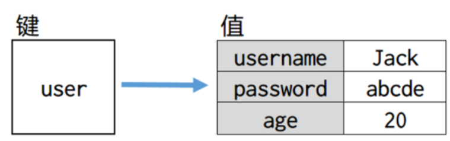
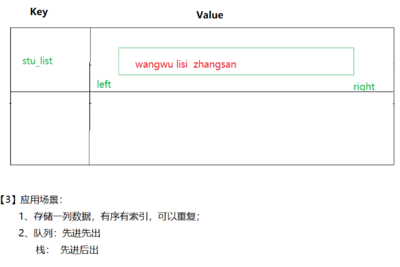
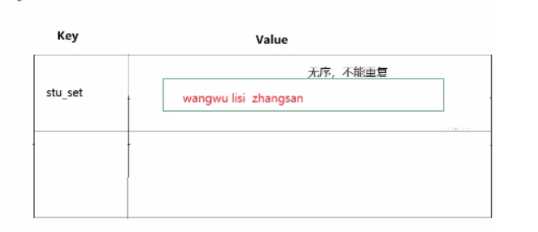
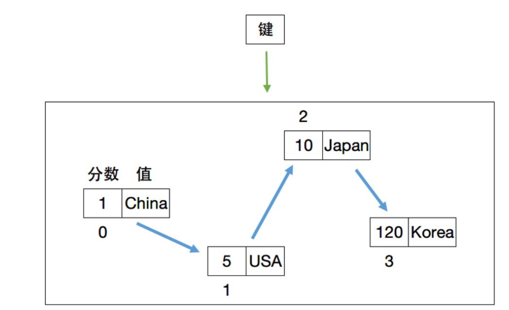
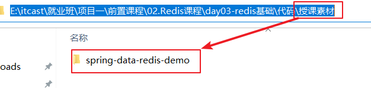
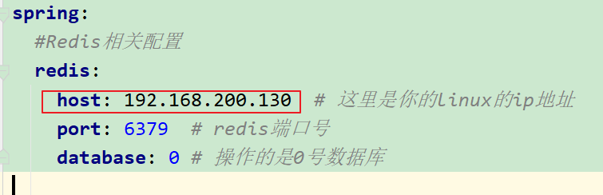

# 随堂笔记

# 1.Redis介绍（理解）

【1】redis属于非关系型数据库，存储的数据位于内存中，一般用来查询次数较多的数据，这样可与提高查询效率

【2】redis数据库存储的数据都是有key-value形式存储的

【3】实际开发中我们先到mysql数据库查询(经历磁盘IO),然后将查询的数据放到redis中，以后查询相同数据直接到redis即内存中查询，这样效率高

# 2.Redis存储的数据(掌握)

【1】Redis存储的数据都是key-value类型

【2】key都是字符串即string，并且唯一

【3】value有五种类型：

> 1.字符串 string
>
> 2.hash类型 类似map
>
> 3.list类型 存取有序，可以重复
>
> 4.set类型 存取无序，数据唯一
>
> 5.zset:可以排序

# 3.Redis的value的常见数据类型的命令(掌握)

## 1.Redis的value的类型_string类型

| 命令                                 | 功能                                                         |
| ------------------------------------ | ------------------------------------------------------------ |
| set 键 值                            | 添加或修改一个键和值，键不存在就是添加，存在就是修改         |
| get 键                               | 获取值，如果存在就返回值，不存在返回nil(就是C语言中NULL)     |
| del 键                               | 删除指定的键和值，返回删除的个数                             |
| **SETEX** key seconds value          | 设置指定key的值，并将 key 的过期时间设为 seconds 秒。此处的value是指key对应的value值。等价于：SET key value  ex seconds |
| EXPIRE key seconds                   | 如果一个key已经存在，要设置一个过期时间                      |
| **SETNX** key value/set key value nx | 保存键值对，如果key存在则不保存，不存在则保存                |

~~~java
批量操作：
mset  name lisi   addr sh
mget name  age addr
del  name age   # 删除命令没有m
~~~

面试：value是string类型可以存储512M

## 2.Redis的value的类型_hash类型的操作命令

| 命令                     | 功能                               |
| ------------------------ | ---------------------------------- |
| hset 键 字段 值          | 添加键，字段，值                   |
| hget 键 字段             | 通过键，字段得到值                 |
| hmset 键 字段 值 字段 值 | multiply多个，一次添加多个字段和值 |
| hmget 键 字段 字段       | 通过键，获取多个字段和值           |
| hdel 键 字段 字段        | 删除一个或多个字段的值             |
| hgetall 键               | 得到这个键下所有的字段和值         |
| HKEYS 键                 | 获取哈希表中所有字段               |
| HVALS 键                 | 获取哈希表中所有值                 |

## 3.Redis的value的类型_list类型的操作命令

| 命令                            | 行为                                                         |
| ------------------------------- | ------------------------------------------------------------ |
| lpush 键 元素 元素...           | left 从左边向指定的键中添加1个或多个元素，返回列表中元素的个数 |
| rpush 键 元素 元素...           | right 从右边向指定的键中添加1个或多个元素                    |
| lpop 键                         | 从左边删除一个元素，返回被删除的元素                         |
| rpop 键                         | 从右边删除一个元素，返回被删除的元素                         |
| lrange 键 开始 结束             | 得到键中指定范围的元素的数据 每个元素都有一个索引号，从左向右0~n 从右向左索引号：-1~-(n+1)，每个元素有2个索引号 如果要取出整个列表中所有的元素，索引号应该是：0~-1 |
| lindex 键 索引值                | 查询指定索引的元素                                           |
| llen 键                         | 获取列表的长度                                               |
| **BRPOP** key1 [key2 ] timeout  | 移出并获取列表的最后一个元素， 如果列表没有元素会阻塞列表直到等待超时或发现可弹出元素为止，超时时间单位默认是秒 |
| LREM  key 删除元素个数  value值 | 从表头删除指定个数的元素                                     |

## 4.Redis的value的类型_set类型的操作命令

【1】存取无序，数据唯一

| 命令                 | 行为                                                   |
| -------------------- | ------------------------------------------------------ |
| sadd 键 元素 元素... | 向一个键中添加1个或多个元素                            |
| smembers 键          | 得到这个集合中所有的元素                               |
| sismember 键 元素    | 判断指定的元素在集合中是否存在，存在返回1，不存在返回0 |
| srem 键 元素 元素... | 通过键删除一个或多个元素                               |
| sinter key1 [key2]   | 返回给定所有集合的交集（集合中都共有的部分）           |

## 5.Redis的value的类型_zset类型的操作命令

【1】zset或者sorted set通过分数排序。每个值都有对应的分数

| **命令**                                        | **行为**                                        |
| ----------------------------------------------- | ----------------------------------------------- |
| **zadd** **键** **分数** **值** **分数** **值** | 添加1个或多个元素，每个元素都有一个分数         |
| **zrange** **键** **开始索引** **结束索引**     | 获取指定范围的元素，得到所有的元素，索引是0到-1 |
| **zrange 键 开始索引 结束索引 withscores**      | 查询指定的元素和对应的分数                      |
| **zrevrange 键 开始索引 结束索引 withscores**   | 按照分数倒叙获取指定的元素和对应的分数          |
| **zrem 键 值 值**                               | 删除一个或多个值                                |
| **zcard** **键**                                | 得到元素个数                                    |
| **zrank** **键** **值**                         | 得到元素的索引号                                |
| **zscore 键 值**                                | 得到元素的分数                                  |

# 4.其他命令操作  掌握

| **命令**                       | **功能**                                                     |
| ------------------------------ | ------------------------------------------------------------ |
| **keys 匹配字符**              | 查询所有的键，可以使用通配符 ***** 匹配多个字符 **?** 匹配1个字符 |
| **del** **键1** **键2**        | 删除任何的值类型，而且可以同时删除多个键                     |
| **exists** **键**              | 判断指定的键是否存在，不存在返回0  存在返回1                 |
| **type** **键**                | 判断指定的键，值的类型。返回是类型的名字                     |
| **select** **数据库编号**      | 选择其它的数据库                                             |
| **move** **键** **数据库编号** | 将当前数据库中指定的键移动到另一个数据库中                   |
| **TTL** key                    | 返回给定 key 的剩余生存时间(TTL, time to live)，以秒为单位 从Redis2.8开始：如果key不存在或者已过期，返回-2；如果key存在并且没有设置过期时间(永久有效)，返回-1 |
| flushall                       | redis的flushall命令用来清空redis所有的库,测试可以使用，开发中最好不要用。 |

# 5.Jedis （掌握）

【1】Jedis 属于java技术的客户端操作redis服务器

【2】代码演示：

> 1.操作的是string类型
>
> ~~~java
> /**
>      * TODO:使用jedis操作redis数据库的value类型是string类型
>      */
>     @Test
>     public void testString() {
>         //1.获取和redis数据库的连接
>         //192.168.200.130 redis服务器所在linux系统的ip地址
>         //6379是redis数据库的端口号
>         Jedis jedis = new Jedis("192.168.200.130", 6379);
>         //2.使用jedis对象调用方法向redis中存储字符串数据
> //        String s = jedis.set("username", "锁哥");
> //        System.out.println("s = " + s);
> //
> //        //3.获取值
> //        String username = jedis.get("username");
> //        System.out.println("username = " + username);
> 
> 
>         //删除
>         Long count = jedis.del("username");
>         System.out.println("count = " + count);
>         //释放资源
>         jedis.close();
>     }
> ~~~
>
> 小结：
>
> 1.导入依赖
>
> ~~~xml
>  <!--jedis依赖-->
> <dependency>
>     <groupId>redis.clients</groupId>
>     <artifactId>jedis</artifactId>
>     <version>2.8.0</version>
> </dependency>
> ~~~
>
> 2.创建核心类对象和redis服务器建立连接
>
>  Jedis jedis = new Jedis("ip地址", redis端口号);
>
> 3.使用Jedis 对象调用方法操作数据
>
> 4.释放资源
>
> ~~~java
> jedis对象.close();
> ~~~

> 2.使用jedis操作redis的value类型是hash类型的数据
>
> ~~~java
>  /**
>      * TODO:使用jedis操作redis数据库的value类型是hash类型
>      */
>     @Test
>     public void testHash() {
>         //1.创建Jedis对象和redis服务器建立连接
>         Jedis jedis = new Jedis("192.168.200.130", 6379);
>         //2.使用jedis对象调用方法向redis中存储hash类型的数据
>         jedis.hset("user", "username", "柳岩");
>         jedis.hset("user", "password", "1234");
>         //3.获取
>         //参数user是hash类型的键名，value值是字段 + 值，封装到map中，map的key就是字段，map的value就是值
>         Map<String, String> map = jedis.hgetAll("user");
>         map.forEach((field,value)->{
>             System.out.println(field+"---"+value);
>         });
> 
>         //4.释放资源
>         jedis.close();
>     }
> ~~~
>
> 

# 6.Spring Data Redis(掌握)

## 1.环境准备

将下面的代码素材导入idea中即可

> 注意：
>
> ​	1.修改maven仓库地址
>
> ​	2.修改yml文件中的linux的ip地址
>
> 

## 2.代码实现

### 1.操作字符串类型数据

~~~java
@SpringBootTest
public class SpringDataRedisTest {
    //自动装配：从SpringIOC容器中获取RedisTemplate模板对象
    @Autowired
    private RedisTemplate redisTemplate;
    /**
     * 操作String类型的数据
     */
    @Test
    public void test01String(){
        /*
            需求：
                1.存入数据和取出数据
                2.存值并设置过期时间
                3.如果存在值则不执行任何操作
         */
        //1.存入数据和取出数据
        //1.1.根据模板对象redisTemplate获取操作string类型的接口ValueOperations对象,ValueOperations接口对象操作string类型
        ValueOperations valueOperations = redisTemplate.opsForValue();
        //1.2.使用valueOperations对象调用方法
//        valueOperations.set("username","杨幂");
//        //1.3.获取数据
//        Object value = valueOperations.get("username");
//        System.out.println("value = " + value);

        //2.存值并设置过期时间
        //2.1使用valueOperations调用方法设置过期时间
        /*
            TODO:
                第一个参数： "address" 表示键
                第二个参数： "上海" 表示值
                第三个参数：15 设置键的过期时间是15秒
                第四个参数：是枚举类型
                    public enum TimeUnit {}
                     TimeUnit.SECONDS表示这里的过期时间的单位是秒
         */
//        valueOperations.set("address","上海",15, TimeUnit.SECONDS);

        //3.如果存在值则不执行任何操作
        /*
        	Present :存在
            setIfPresent :如果存在则执行代码将数据覆盖之前的value值，如果不存在则不执行代码
         */
//        Boolean boo = valueOperations.setIfPresent("username", "20");
//        System.out.println("boo = " + boo);
        /*
        	Absent 表示缺席
            TODO:setIfAbsent 表示如果值不存在则存储，如果存在则不存储
         */
        Boolean boo2 = valueOperations.setIfAbsent("age", "30");
        System.out.println("boo2 = " + boo2);

        Object value = valueOperations.get("age");
        System.out.println("value = " + value);

    }
}
~~~

### 2.操作hash类型数据

~~~java
   /**
     * 操作hash类型的数据
     */
    @Test
    public void test02Hash(){
        //需求：
        //获取操作hash类型数据的接口对象
        HashOperations hashOperations = redisTemplate.opsForHash();
        //1.存储几个哈希类型的数据
        /*
            TODO:
                1.第一个参数：person表示redis的key
                2.第二个参数：name表示字段
                3.第三个参数："锁哥" 表示值
         */
//        hashOperations.put("person","name","锁哥");//相当于 hset person name 锁哥
//        hashOperations.put("person","pwd","1234");
        //2.获取哈希类型的数据
        /*
            TODO:
                1.第一个参数：person表示redis的key
                2.第二个参数：name表示字段
         */
//        Object value = hashOperations.get("person", "name");
//        System.out.println("value = " + value);
        //3.根据键获取哈希类型中的所有字段
        //TODO:参数person表示hash的键，下面的方法表示根据键获取字段
//        Set set = hashOperations.keys("person");
//        for (Object o : set) {
//            System.out.println("o = " + o);//o = name o = pwd
//        }
        //4.获得hash结构中的所有值
        List list = hashOperations.values("person");
        for (Object o2 : list) {
            /*
                o2 = 锁哥
                o2 = 1234
             */
            System.out.println("o2 = " + o2);
        }
    }
~~~

### 3. 操作列表类型数据

~~~java
 /**
     * 操作List类型的数据
     */
    @Test
    public void testList(){
        //需求：
        //获取操作redis服务器的value类型是list类型的接口对象
        ListOperations listOperations = redisTemplate.opsForList();
        //1.向列表中添加数据
        //第一个参数list1表示键
        //"柳岩", "杨幂", "李沁", "迪丽热巴" 表示将list中添加的值
        listOperations.leftPushAll("list1", "柳岩", "杨幂", "李沁", "迪丽热巴");
        //2.查询列表中所有数据
        //第一个参数list1表示键
        //第二个参数0表示列表的起始索引
        //第三个参数-1 表示最大索引
        List list = listOperations.range("list1", 0, -1);
        for (Object o : list) {
            System.out.println("o = " + o);
        }
    }
~~~

### 4.操作Set类型的数据

~~~java
 /**
     * 操作Set类型的数据
     */
    @Test
    public void testSet(){
        //需求:
        //获取操作redis服务器的value类型是set类型的接口对象
        SetOperations setOperations = redisTemplate.opsForSet();
        //1.向set集合中添加数据
//        setOperations.add("myset", "数学", "语文", "英语");
//        //2.获取指定set集合的所有的元素
//        Set myset = setOperations.members("myset");//参数myset表示键
//        for (Object o : myset) {
//            System.out.println("o = " + o);
//        }
        //3.删除指定set集合的数据
        Long count = setOperations.remove("myset", "语文");
        System.out.println("count = " + count);

        Set myset = setOperations.members("myset");//参数myset表示键
        for (Object o : myset) {
            System.out.println("o = " + o);
        }
    }
~~~

### 5.操作ZSet类型的数据

~~~java
/**
     * 操作ZSet类型的数据
     */
    @Test
    public void testZset(){
        //需求:
        //获取操作redis服务器的value类型是zset类型的接口对象
        ZSetOperations zSetOperations = redisTemplate.opsForZSet();
        //1.向zset中添加数据
//        zSetOperations.add("country", "中国", 1);//键： "country", 值： "中国", 分数： 1
//        zSetOperations.add("country", "小日本", 100);
//        //2.从zset中取出数据
//        Set set = zSetOperations.range("country", 0, -1);//键："country",开始索引： 0, 最大索引：-1
//        for (Object o : set) {
//            System.out.println("o = " + o);
//        }
        //3.对某个值的分数进行加20
//        zSetOperations.incrementScore("country", "小日本", 20);
        /*

            TODO:
              1.zSetOperations.rangeWithScores("country", 0, -1); 表示获取 country键对应的值和分数放到
               Set<ZSetOperations.TypedTuple>集合中，属于ZSetOperations.TypedTuple
              2.使用ZSetOperations.TypedTuple的对象调用函数：
                1）getScore() 获取分数
                2）getValue() 获取值
         */
        Set<ZSetOperations.TypedTuple> set = zSetOperations.rangeWithScores("country", 0, -1);
        for (ZSetOperations.TypedTuple tt : set) {
            Double score = tt.getScore();
            Object value = tt.getValue();
            /*
                1.0----中国
                140.0----小日本
             */
            System.out.println(score+"----"+value);
        }

        //4.删除数据
        zSetOperations.remove("country", "小日本");

    }
~~~

### 6.通用命令演示

~~~java
/**
     * 通用操作，针对不同的数据类型都可以操作
     */
    @Test
    public void testCommon(){
        //需求：
        //1.获取Redis中所有的key
        Set keys = redisTemplate.keys("*");
        for (Object key : keys) {
            System.out.println("key = " + key);
        }

        //2.判断某个key是否存在
        Boolean boo = redisTemplate.hasKey("country");//country表示键
        System.out.println("boo = " + boo);
        //3.删除指定key
        Boolean boo2 = redisTemplate.delete("name");
        System.out.println("boo2 = " + boo2);
        //4.获取指定key对应的value的数据类型
        DataType myset = redisTemplate.type("myset");
        System.out.println("myset = " + myset);
    }
~~~

注意：这里直接使用模板对象RedisTemplate调用方法即可。

# 每日反馈和作业

面试：

> 1.redis的value的数据类型由哪些？
>
> ​	五种 string hash list set zset
>
> 2.string大概是512M

~~~java
掌握Redis服务的启动和停止命令
    启动：在bin目录：./redis-server redis.conf
    停止：1）在客户端：输入命令shutdown   2)kill -9 redis进程号  ps -aux | grep redis 查看进程
掌握Redis的数据类型
    	五种 string hash list set zset
掌握Redis的常用命令 
    	学习网站：https://www.redis.net.cn
掌握Spring Data Redis操作Redis的常用方法
    1）导入依赖：
    	 <dependency>
            <groupId>org.springframework.boot</groupId>
            <artifactId>spring-boot-starter-data-redis</artifactId>
        </dependency>
    2）在yml配置文件中配置：
    	spring:
  			#Redis相关配置
          redis:
            host: 192.168.200.130  # 这里是你的linux的ip地址
            port: 6379  # redis端口号
            database: 0 # 操作的是0号数据库
    3）创建模板对象
    	 @Autowired
    		private RedisTemplate redisTemplate;
	4）使用模板对象调用方法获取操作五种value类型的接口对象
    5）使用接口对象调用方法
~~~

