# 微服务部署

前面我们介绍基于SpringBoot开发的微服务项目，特点是快速构建web服务，但是我们需要在项目开发完之后可以立即快速构建统一的运行环境，并且还可以快速的部署项目上线。所以Docker在设计起初就希望开发者将微服务项目部署至容器中运行。

## 1 基于DockerMaven插件构建镜像部署

对于数量众多的微服务，手动部署无疑是非常麻烦的做法，并且容易出错。所以我们这里学习如何自动部署，这也是企业实际开发中经常使用的方法。
Maven插件自动部署步骤：

1. 修改宿主机的docker配置，让其可以远程访问

   ```shell
    vi /lib/systemd/system/docker.service
   ```

   替换ExecStart 一行配置:

   ```shell
   ExecStart=/usr/bin/dockerd -H tcp://0.0.0.0:2375 -H unix:///var/run/docker.sock
   ```

   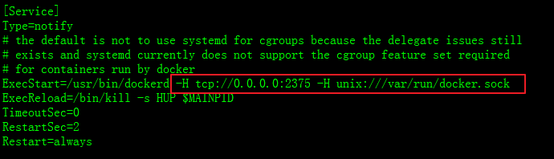

2. 刷新配置，重启服务

   ```shell
   ## 1 如果没有搭建则创建并启动容器 
   docker run -id --name=registry -p 5000:5000 registry
   ## 2 配置私有仓库地址
   vi /etc/docker/daemon.json
   {
     "registry-mirrors": ["https://pasw6qxp.mirror.aliyuncs.com"],
     "insecure-registries": ["192.168.200.130:5000"]
   }
   ## 3 重启docker
   systemctl daemon-reload
   systemctl restart docker
   docker start registry eureka
   ```

3. 在`eureka`工程的pom.xml 文件中添加一下配置

   ```xml
   <build>
           <!--修改app.jar-->
           <finalName>app</finalName>
           <plugins>
               <plugin>
                   <groupId>org.springframework.boot</groupId>
                   <artifactId>spring-boot-maven-plugin</artifactId>
               </plugin>
               <!-- docker的maven插件，官网：https://github.com/spotify/docker-maven-plugin -->
               <plugin>
                   <groupId>com.spotify</groupId>
                   <artifactId>docker-maven-plugin</artifactId>
                   <version>1.2.2</version>
                   <configuration>
                       <!--镜像的名称 跳过上传到私有仓库-->
                       <imageName>192.168.200.130:5000/${project.artifactId}:${project.version}</imageName>
                       <!--上传到私有仓库-->
                       <!--<imageName>106.14.241.224:5000/${project.artifactId}:${project.version}</imageName>-->
                       <!--依赖一个基础镜像 带JDK 1.8-->
                       <baseImage>java:8-alpine</baseImage>
                       <!--java -jar app.jar -->
                       <entryPoint>["java", "-jar", "/${project.build.finalName}.jar"]</entryPoint>
                       <resources>
                           <resource>
                               <targetPath>/</targetPath>
                               <directory>${project.build.directory}</directory>
                               <include>${project.build.finalName}.jar</include>
                           </resource>
                       </resources>
                       <dockerHost>http://192.168.200.130:2375</dockerHost>
                   </configuration>
               </plugin>
           </plugins>
       </build>
   ```

> 需要注意：
>
> 1. 保证当前有私服并开启
> 2. 要基于jdk使用
> 3. 使用spring-boot-maven-plugin打包插件需要，当前父工程继承spring-boot-starter-parent工程

以上配置会自动生成Dockerfile     	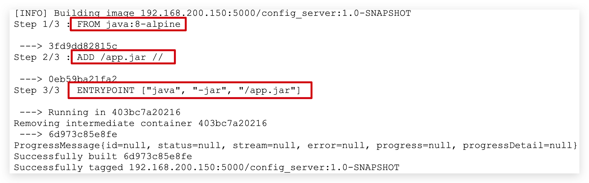

1. 在windows的命令提示符下，进入eureka工程所在的目录，输入以下命令，进行打包和上传镜像

   ```shell
   # 打包并且将镜像上传到私有注册中心中
   mvn clean package docker:build -DpushImage
   # 跳过上传
   mvn clean package docker:build -DskipDockerPush
   ```

   执行后，会有如下输出，代码正在上传

   ​	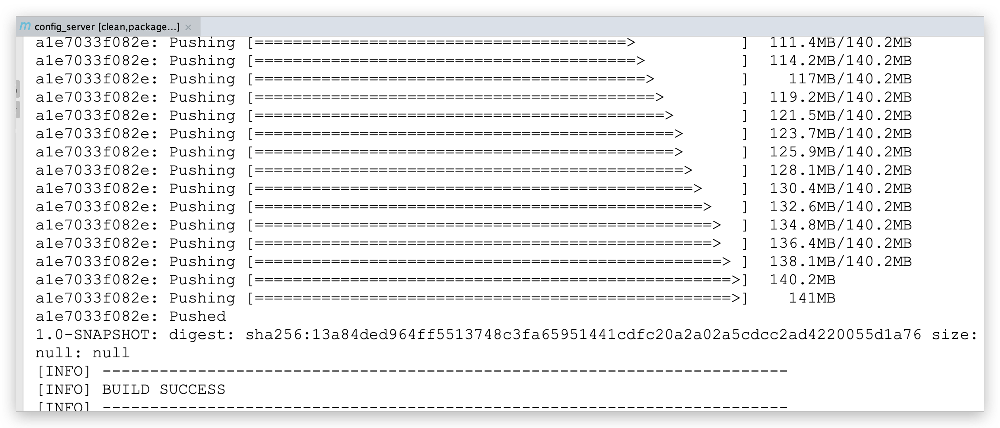

   浏览器访问<http://192.168.200.130:5000/v2/_catalog> 查看镜像列表

2. 启动容器

   ```shell
   docker run -id --name=eureka eureka:1.0
   ```


## 2 基于Idea一键构建容器部署

1. Idea安装Docker插件

   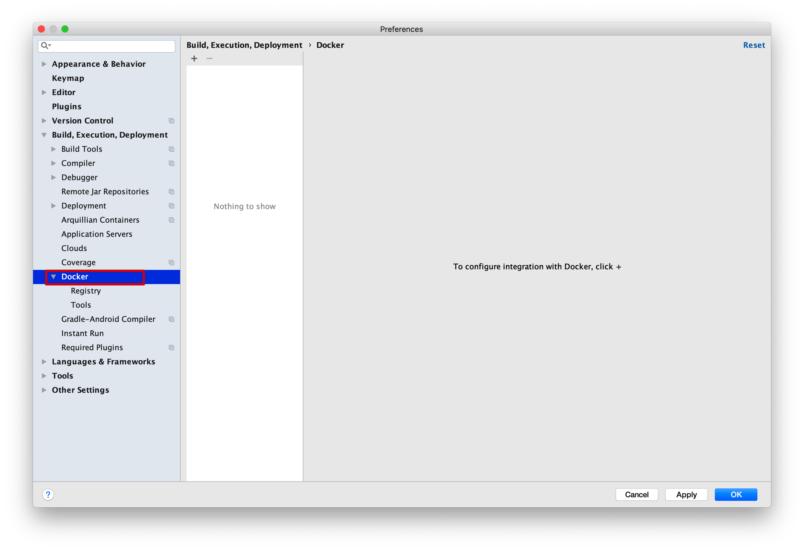

2. 配置连接远程Docker

   配置远程的地址为：tcp://192.168.200.130:2375

   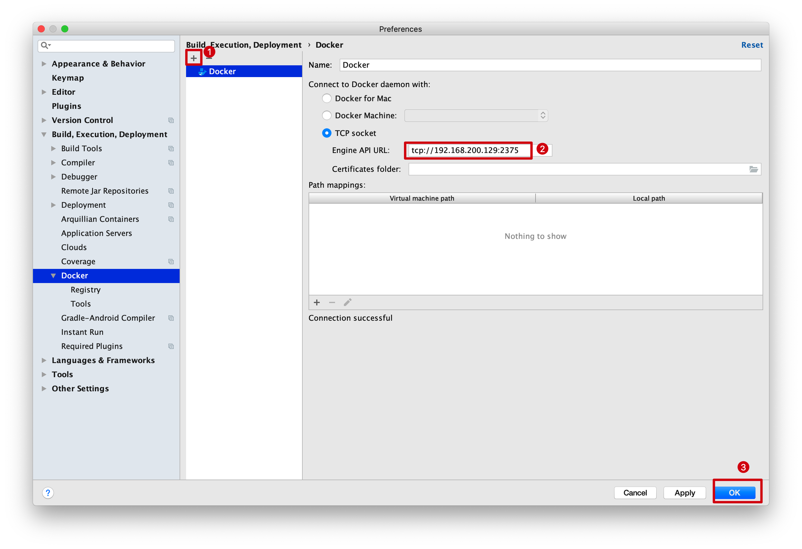

3. 开始建立连接

   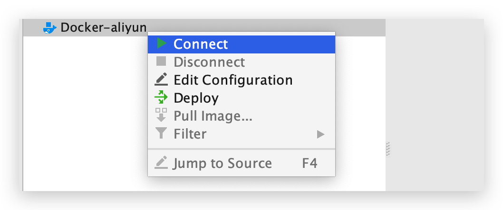

   > 注意：需要开启远程Docker访问权限

4. 在`eureka`项目的根目录下 添加Dockerfile文件，添加内容如下：

   ```dockerfile
   # 设置JAVA版本
   FROM java:8-alpine
   # 指定存储卷, 任何向/tmp写入的信息都不会记录到容器存储层
   VOLUME /tmp
   COPY /target/app.jar /app.jar
   # 设置JVM运行参数， 这里限定下内存大小，减少开销
   ENV JAVA_OPTS="\
   -server \
   -Xms256m \
   -Xmx512m \
   -XX:MetaspaceSize=256m \
   -XX:MaxMetaspaceSize=512m"
   # 入口点， 执行JAVA运行命令
   ENTRYPOINT ["java", "-jar", "/app.jar"]
   ```

   完整结构：

   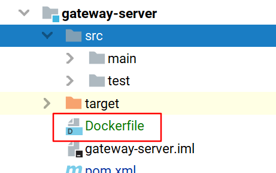

5. 编辑项目启动的配置

6. 选择Dockerfile创建容器，配置如下：

   ​     **右键虚拟机连接: 选择部署**

   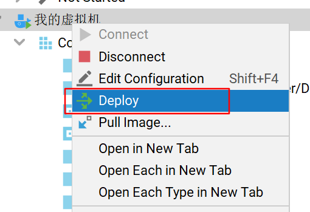

      **选择基于Dockerfile部署**

   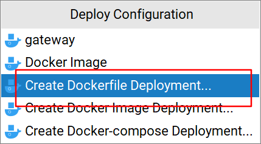


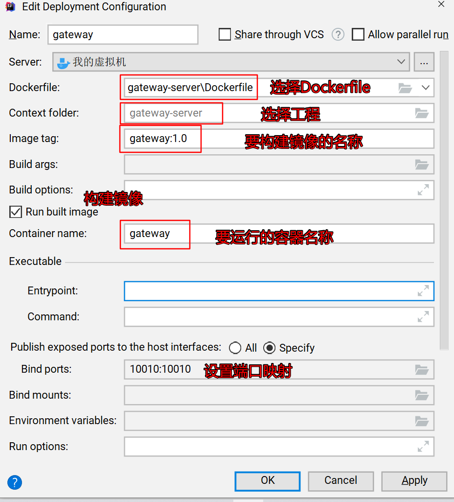

保存有 右键该配置选择Deploy 部署运行

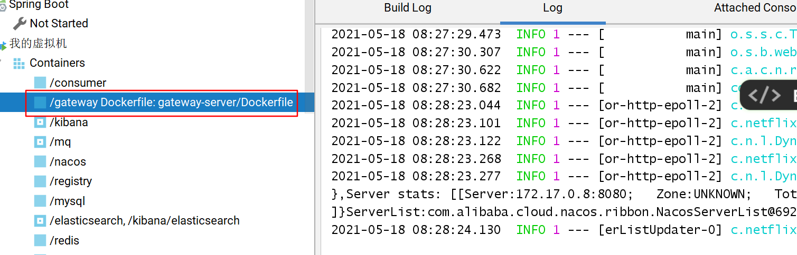

