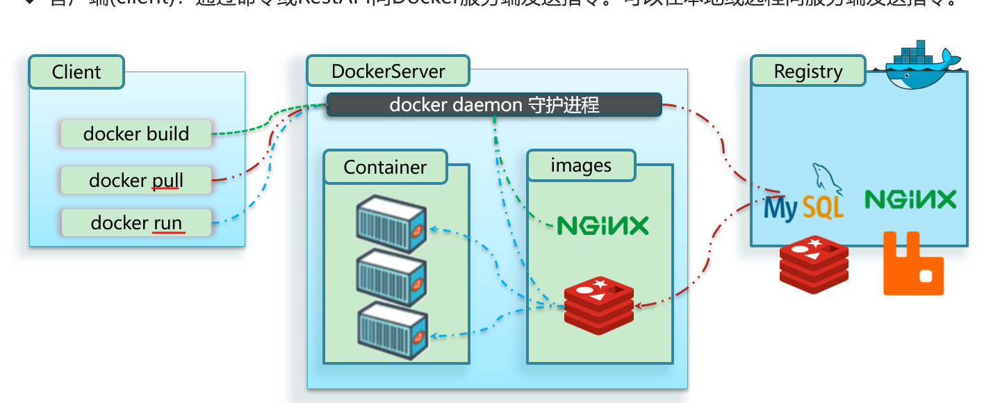
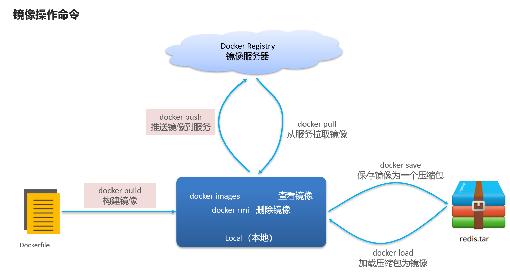
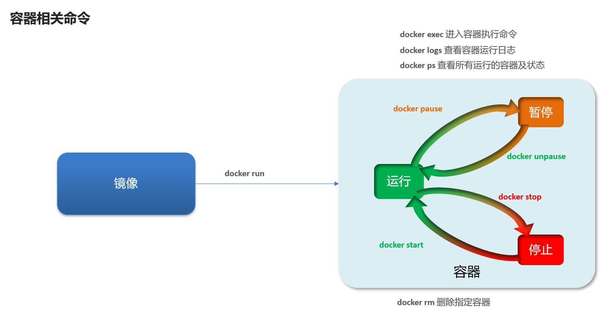
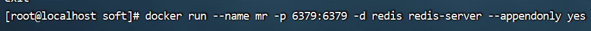
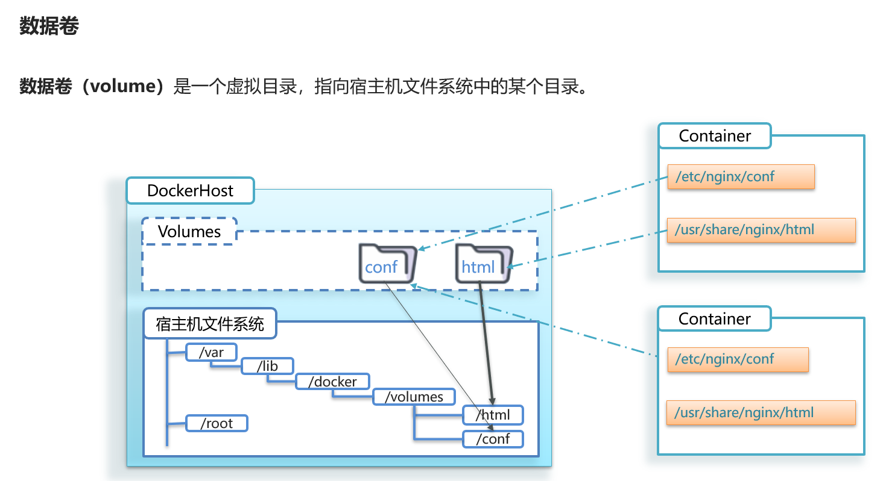
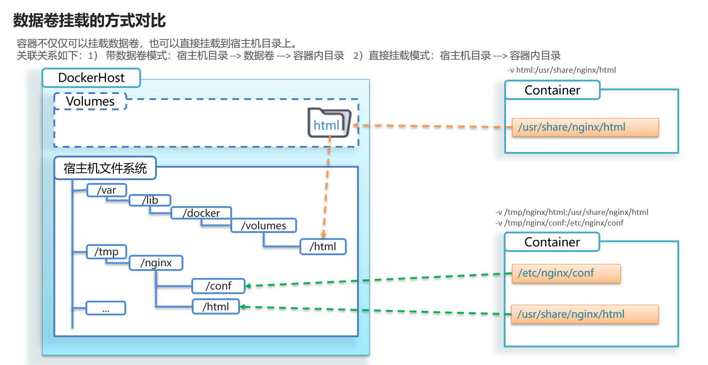
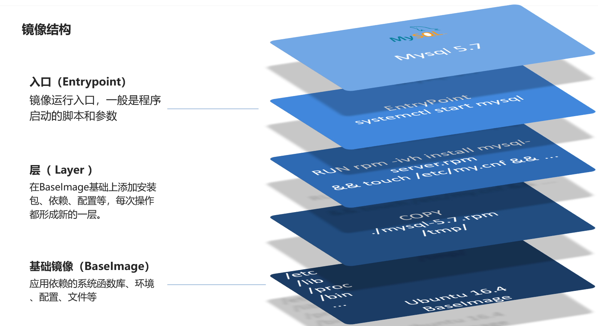

~~~java
DockerHub网址
https://hub.docker.com/
~~~

# 随堂笔记

# 1.docker介绍

我们以前直接在linux发行版(centos)安装软件，这样弊端是安装和卸载麻烦，并且不同软件由于版本问题带来兼容问题，同时在不同发行版上移植能力比较差。

docker可以解决上述所有问题：

> 1.docker将某个软件 mysql 软件的函数库 依赖以及配置文件进行打包
>
> 2.docker还可以将当前软件所在的系统的函数库等进行打包

这样使用docker就可以实现在不同linux发行版的系统上进行使用。

# 2.Docker相关概念

【1】镜像 Iamge

> 将某个软件的所需要的函数库 依赖 配置文件以及系统环境打包称为镜像

【2】容器 container

> 基于镜像创建的进程，一个镜像可以有多个容器

【3】DockerHub

> 远程托管镜像的平台，我们可以使用国内的阿里云 网易云，实际开发中使用公司自己搭建的私有云

【4】docker中的CS架构

# 3.操作docker镜像的命令(掌握)

【1】从远程仓库拉取镜像到本地

> docker pull 镜像名(repository:tag)

【2】查看镜像

> docker images

【3】将本地的镜像打包成文件

> docker save -o 文件名 镜像名
>
> o:out put 输出

【4】将本地的文件加载到本地镜像

> docker load -i 文件名
>
> i:in put 输入

【5】删除镜像

> docker rmi 镜像名

# 4.操作docker的容器命令(掌握)

【1】创建并运行docker容器

> docker run --name 容器名 -p 宿主机端口号:容器的内部端口号 -d 镜像名
>
> 宿主机端口号 ：我们可以通过宿主机端口号在外部访问该容器

【2】查看当前的容器状态

> docker ps

【3】进入docker容器 了解

> docker exec -it 容器名 bash
>
> bash的意思是进入到容器中可以使用部分的linux命令

【4】暂停容器

> docker pause 容器名

【5】从暂停到运行

> docker unpause 容器名

【6】停止容器

> docker stop 容器名

【7】启动容器

> docker start容器名

【8】查看所有的容器

> docker ps -a

【9】删除容器

> docker rm -f 容器名
>
> -f可以省略，如果删除的运行的容器必须加-f

【10】查看日志 了解

> docker  logs -f 容器名
>
> -f表示动态查询，可以省略

# 5.使用docker安装某个软件步骤 （掌握）

1.去远程服务器拉取镜像

2.在本地创建和启动docker容器

# 6.数据卷 掌握

## 1.通过数据卷方式将容器目录挂载到宿主机指定目录

> 1.创建数据卷
>
> docker volume create 数据卷名
>
> 2.查看数据卷
>
> docker volume ls
>
> 3.查看具体某个数据卷的详细信息
>
> docker volume inspect 数据卷名
>
> 4.挂载数据卷 创建启动容器挂载
>
> docker run --name 容器名 **-v 数据卷名:容器的目录** -p 宿主机端口号:容器的端口号  -d 镜像名

## 2.直接将容器目录挂载到宿主机指定目录

1.拉取镜像

> 这里老师采用docker load方式加载镜像
>
> docker load -i mysql.tar 

2.关闭之前开启的mysql服务器

> systemctl stop mysqld

3.创建并启动mysql容器并挂载目录

> docker run --restart=always -p 3306:3306 --name mysql -v /tmp/mysql/data:/var/lib/mysql  -e MYSQL_ROOT_PASSWORD=1234 -d mysql:5.7.25

4.在windows系统中连接mysql数据库

> mysql -h你的linux的ip地址 -P3306 -uroot -p你的数据库密码

# 7.自定义镜像 

【1】镜像结构

# 今日作业

1.熟悉操作镜像的命令

> 1)查看镜像：docker images
>
> 2)拉取镜像到本地：docker pull 镜像名
>
> 3）推送镜像到远程服务器 docker push ...
>
> 4)删除镜像 docker rmi 镜像名(repository:tag)
>
> 5)将镜像打包 docker save -o 文件名 镜像名
>
> 6）将打包的镜像加载到本地 docker load -i 文件名
>
> 

2.熟悉容器的命令

> 1)查看容器 docker ps -a
>
> 2)创建并运行 docker run --name 容器名  -p 宿主机端口号:容器内部端口号 -d 镜像名
>
> 3）暂停容器 docker pause 容器名
>
> 4）从暂停到运行容器 docker unpause 容器名
>
> 5）停止容器 docker stop 容器名
>
> 6）开启容器 docker start 容器名
>
> 7）删除容器 docker rm -f 容器名 。。。
>
> 8）查看日志 docker -f logs

3.数据卷

> 1.起到宿主机的目录或者文件和容器中的目录或者文件一个连接桥梁，有了数据卷我们可以直接修改宿主机的内容即可，不用到容器中修改文件或者目录
>
> 2.创建数据卷 docker volume create
>
> 3.查看数据卷 docker volume ls
>
> 4.详细查看某个数据卷 docker volume inspect 数据卷名
>
> 5.挂载数据卷
>
> docker run --name 容器名 -v 数据卷名:容器目录或者文件 -p 宿主机端口号:容器内部端口号 -d 镜像名
>
> docker run --name 容器名 -v 宿主机目录或者文件:容器目录或者文件 -p 宿主机端口号:容器内部端口号 -d 镜像名

4.Docker-Compose 开发必用

> 1.可以快速安装并启动容器，利用Docker-Compose 的文本文件Compose 文件管理容器
>
> 2.执行命令：docker-compose up -d 