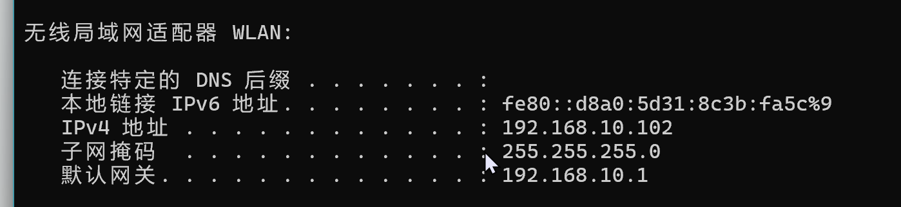
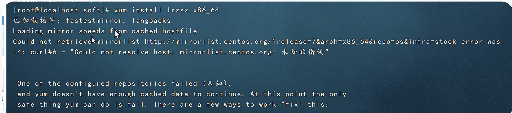
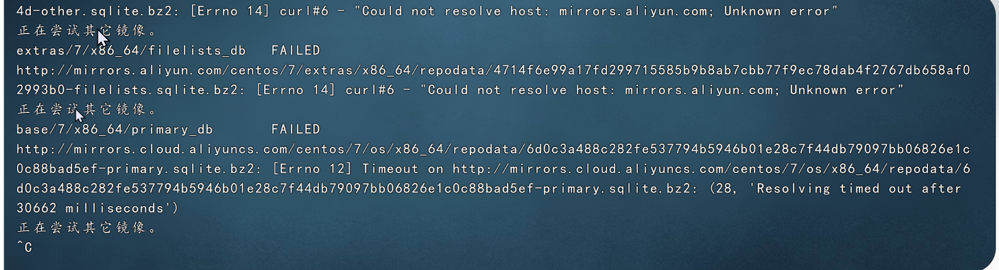

centos 中的linux系统如何root密码忘记了怎么办？

目前的办法是重新在设置一个

2026年2月13日01:28:49

目前的问题是无法应shell对虚拟机进行连接

手动设置静态ip

```bash
sudo vi /etc/sysconfig/network-scripts/ifcfg-ens33
```

修改以下内容

2026年2月15日01:33:50

目前来看下面的设置有问题，我们就设置固定ip: BOOTPROTO 和 IPADDR=192.168.10.100, 然后把网关，内网掩码和dns本地匹配全部丢掉

这是因为我尝试动态ip的时候是可以用shell连接的，但是加了下面的这些就无法连接了

2026年2月16日20:32:33

问题找到了，需要将网络适配器的模式调整成为桥接模式

如图：


原因：桥接模式和net模式的区别就是桥接模式支持ssh连接，而nat不支持；

    桥接模式支持外部的ping，而net模式不支持

```bash
TYPE=Ethernet
BOOTPROTO=static  #固定ip
DEFROUTE=yes
NAME=ens33
DEVICE=ens33
ONBOOT=yes    #开机自启动
IPADDR=192.168.10.100
NETMASK=255.255.255.0
GATEWAY=192.168.10.2
DNS1=8.8.8.8
DNS2=114.114.114.114
```

保存后重启网络

```bash
sudo systemctl restart network
```

再查ip

```bash
ip addr show ens33
```

应该可以看到

```bash
inet 192.168.10.100/24 brd 192.168.10.255 scope global ens33
```

验证是否成功

```bash
ping www.baidu.com
```

在Windows上测试

```bash
ping 192.168.10.100
```

如果能通说明网络正常

复制粘贴功能怎么弄？

```bash
虚拟机 → 安装 VMware Tools
```

进入终端，输入以下命令

```bash
cd /media/cdrom
sudo ./vmware-tools-distrib/install

按提示完成安装（一路回车）
```

安装完成后虚拟机重启

```bash
sudo reboot
```

遇到的问题：

为什么ping www.baidu.com不成功

回答：

应该是icmp防火墙的原因，百度设置的无法访问

怎么测试网络通不通？

```bash
curl -v http://www.baidu.com
```

返回html网页就通了

如何配置网关统一

第一：cmd中输入ipconfig命令然后查看网络的ip和网关ip



虚拟机的ipaddr必须要和主机在同一网段之下，比如我的ipaddr = 192.169.10.100

第二：虚拟机的默认网关必须和主机一致gateway=192.168.10.1



这个问题是YUM包管理器无法连接远程仓库镜像源的错误，核心原因是：

> "Could not resolve host"**: mirrorlist.centos.org——无法解析主机名**


在执行

```bash
yum install lrzsz.x86_64
```

系统尝试从CentOS官方镜像（mirrorlist.centos.org）但失败了：

```bash
Could not retrieve mirrorlist http://mirrorlist.centos.org/?release=7&arch=x86_64&repo=os&infra=stock 
error was 14: curl#6 - "Could not resolve host: mirrorlist.centos.org; 未知的错误"
```

说明：服务器DNS解析失败或网络不通，导致无法访问mirrorlist.centos.org

由于centos的镜像源在centos7之后已停更，官方源不可用，建议切换为阿里源

步骤

1.备份原repo文件

```bash
cd /etc/yum.repos.d/

mkdir backup

mv *.repo backup/
```

2.下载阿里云centos 7镜像源配置：

```bash
curl -o /etc/yum.repos.d/CentOS-Base.repo https://mirrors.aliyun.com/repo/Centos-7.repo
```

3.清理缓存并重建

```bash
yum clean all
yum makecache
```

4.再次安装

```bash
yum install lrzsz.x86_64
```

**尝试镜像失败的问题（我这里是因为几个点**

1. **第一是ens33的conf文件中Type=这里写错了**

1. **第二是修改ens33的配置文件后没有重启**

**）**



核心问题定位：虽然在/etc/sysconfig/network-scripts/ifcfg-ens33中配置了

```bash
DNS1=8.8.8.8
DNS2=114.114.114.114
```

但是NetworkManager没有正确应用这些DNS配置，或者网络服务未开启

“Could not resolve host” 指的是DNS解析失败

“TimeOut on ... Resolve timed out” 说明DNS请求发送后无响应

第一步：确认网卡配置文件已经修改并且保存

```bash
vi /etc/sysconfig/network-scripts/ifcfg-ens33
```

确保内容正确

```bash
TYPE=Ethernet          # ← 必须是 Ethernet，不是 Eehernet！
BOOTPROTO=static
DEFROUTE=yes
NAME=ens33
DEVICE=ens33
ONBOOT=yes
IPADDR=192.168.10.100
NETMASK=255.255.255.0
GATEWAY=192.168.10.1
DNS1=8.8.8.8
DNS2=114.114.114.114
```

修改后需要reload ens33的配置

```bash
sudo systemctl restart network
```

第二步：强制重载NetworkManager配置并重启连接

```bash
nmcli connection reload
nmcli connection down ens33
nmcli connection up ens33
```

第三步：验证DNS是否真的生效

```bash
cat /etc/resolv.conf
```

应该看到

```bash
nameserver 8.8.8.8
nameserver 114.114.114.114
```

如果没有就说明 networkmanager没有生效（我的是到这里就解决了）