# Linux-Day01

## 课程内容

- Linux简介
- Linux安装
- Linux常用命令


## 1. 前言

### 1.1 什么是Linux

 

Linux是一套免费使用和自由传播的操作系统。说到操作系统，大家比较熟知的应该就是Windows和MacOS操作系统，我们今天所学习的Linux也是一款操作系统。


### 1.2 为什么要学Linux

那么我们为什么要学习Linux呢，主要出于两个方面的原因。

**1). 企业用人要求**

以下，是从知名招聘网站上搜索的java开发工程师的岗位要求，在很多的岗位要求中都提到了Linux操作系统的经验。

 

为什么作为javaEE开发工程师，企业还要求我们会Linux操作系统的相关知识呢?

这是因为Linux操作系统提供了很多稳定的发行版本，广泛的应用在我们的各种服务器操作系统领域，我们将来开发出来的项目，最终要上线运行，就需要将项目部署在Linux服务器中。


**2). 个人发展需要**

 

我们作为javaEE开发工程师，将来在企业中开发时会涉及到很多的数据库、中间件等技术，比如MySQL、Redis、MQ等技术，而这些应用软件大多都是需要安装在Linux系统中使用的。我们做为开发人员，是需要通过远程工具连接Linux操作系统，然后来操作这些软件的。而且一些小公司，可能还需要我们自己在服务器上安装这些软件。


所以，不管从企业的用人需求层面，还是个人发展需要层面来讲，我们作为服务端开发工程师，Linux的基本使用是我们必不可少的技能。


### 1.3 学完Linux能干什么

学习完Linux操作系统课程之后，我们可以做以下几个方面的事情： 

 

**1). 环境搭建**

系统安装 : 一般我们不会直接将Linux系统安装在本机电脑上，而会安装在公司的一台专门的服务器上。 

远程连接 : 那么我们要想使用服务器，一般都是通过远程连接工具连接Linux系统进行操作。


**2). 常用命令**

连接上服务器之后，我们可以通过所学习的相关指令， 来操作Linux服务器，在Linux服务器中可以执行如下操作： 

A. 文件、目录的基本操作(查看,删除,创建等)

B. 文件及文件夹的拷贝、移动、重命名

C. 文件的打包、压缩、解压缩操作

D. 文本的编辑


**3). 安装软件**

基本的常用指令学会操作之后，我们可以在Linux服务器中安装我们开发常用的软件，比如： JDK、Tomcat、MySQL的安装及配置。


**4). 项目部署**

把基础的软件及环境安装配置好之后，我们就可以将我们开发的项目部署在服务器中进行运行并测试。


对于我们学习Linux操作系统时，Linux命令是基础，也是学习Linux系统的重点内容，虽然Linux的指令有很多，但是我们常用的指令并不多，大家在学习的时候，主要掌握这部分常用的指令就可以了，对于其他的指令，以后我们用到的时候，知道怎么查询即可。


**对于Linux的常用指令的学习，最好的学习方法就是：<font color='red' size=7>多敲</font>**

### 小结

```java
为什么需要学习Linux:
	Linux相当的安全稳定,是程序代码运行的最佳环境.
    将来我们需要把自己编写的项目运行在Linux服务器上.
    安全: 在Linux中内置防火墙，默认只公布了22端口(只能通过22端口访问Linux)
```


## 2. Linux简介

### 2.1 主流操作系统

不同领域的主流操作系统，主要分为以下这么几类： 桌面操作系统、服务器操作系统、移动设备操作系统、嵌入式操作系统。接下来，这几个领域中，代表性的操作系统是那些?

1). 桌面操作系统

| 操作系统    | 特点                      |
| ------- | ----------------------- |
| Windows | 用户数量最多                  |
| MacOS   | 操作体验好，办公人士首选            |
| Linux   | 用户数量少(桌面操作系统,Linux使用较少) |


2). 服务器操作系统

部署应用软件的操作系统：

| 操作系统           | 特点            |
| -------------- | ------------- |
| Unix           | 安全、稳定、付费      |
| Linux          | 安全、稳定、免费、占有率高 |
| Windows Server | 付费、占有率低       |


3). 移动设备操作系统

| 操作系统    | 特点                                   |
| ------- | ------------------------------------ |
| Android | 基于 Linux 、开源，主要用于智能手机、平板电脑和智能电视      |
| IOS     | 苹果公司开发、不开源，用于苹果公司的产品，例如：iPhone、 iPad |


4). 嵌入式操作系统

| 操作系统  | 特点          |
| ----- | ----------- |
| Linux | 机顶盒、路由器、交换机 |


### 2.2 Linux发展历史

  

时间：1991年

地点：芬兰赫尔辛基大学

人物：Linus Torvalds（21岁）

语言：C语言、汇编语言

logo：企鹅

特点：免费、开源(源代码开放)、多用户(同时允许多个用户操作同一个Linux系统)、多任务(同时允许多个任务执行)


### 2.3 Linux系统版本

Linux系统的版本分为两种，分别是： 内核版 和 发行版。

**1). 内核版**

- 由Linus Torvalds及其团队开发、维护

- 免费、开源

- 负责控制硬件


**2). 发行版**

- 基于Linux内核版进行扩展

- 由各个Linux厂商开发、维护

- 有收费版本和免费版本


我们使用Linux操作系统，实际上选择的是Linux的发行版本。在linux系统中，有各种各样的发行版本，具体如下： 

| 发行版本     | Logo                                     | 特点               |
| -------- | ---------------------------------------- | ---------------- |
| Ubuntu   |  | 以桌面应用为主          |
| RedHat   |  | 应用最广泛、收费         |
| CentOS   |  | RedHat的社区版、免费    |
| openSUSE |  | 对个人完全免费、图形界面华丽   |
| Fedora   |  | 功能完备、快速更新、免费     |
| 红旗Linux  |  | 北京中科红旗软件技术有限公司开发 |

除了上述罗列出来的发行版，还有很多Linux发行版，这里，我们就不再一一列举了。


## 3. Linux安装

### 3.1 安装方式介绍

Linux系统的安装方式，主要包含以下两种：

 

| 方式    | 概述               | 场景                                      |
| ----- | ---------------- | --------------------------------------- |
| 物理机安装 | 直接将操作系统安装到服务器硬件上 | 企业开发中，我们使用的服务器基本都是采用这种方式                |
| 虚拟机安装 | 通过虚拟机软件安装        | 我们在学习阶段，没有自己服务器，而我们又需要学Linux，就可以安装在虚拟机上 |


**虚拟机**（Virtual Machine）指通过**软件**模拟的具有完整硬件系统功能、运行在完全隔离环境中的完整计算机系统。常用虚拟机软件： 

- VMWare 
- VirtualBox

那么我们就可以在课程中将Linux操作系统安装在虚拟机中，我们课上选择的虚拟机软件是VMware。


### 3.2 安装VMware

 

在我们的课程资料中提供了VMware的安装程序。直接双击运行VMware安装程序，根据提示完成安装即可。

 

 

安装完成，桌面就会启动图标，双击


第1次运行，如下图，输入注册码，或者试用30天

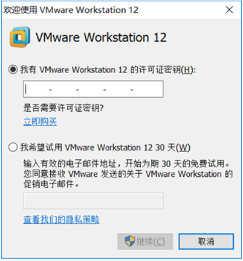

可以使用了

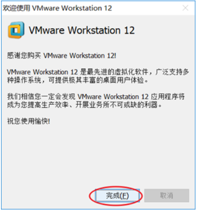

> 注意：
>
> ​	1.以上就是VMware在安装时的每一步操作，基本上就是点击 "下一步" 一直进行安装。
>
> ​	2.安装路径不要有中文

### 3.3 安装Linux

VMware虚拟机安装完毕之后，我们就可以打开VMware，并在上面来安装Linux操作系统。具体步骤如下： 

**1). 选择创建新的虚拟机**

 


**2). 选择"典型"配置**

 


**3). 选择"稍后安装操作系统(S)"**

 


**4). 选择"Linux"操作系统,"CentOS7 64位"版本**

 


**5). 设置虚拟机的名称及系统文件存放路径**

 


**6). 设置磁盘容量**

 


**7). 自定义硬件信息**

 


**8). 启动上述创建的新虚拟机**

  


**9). 选择"Install CentOS7"**

 

> 进入到Linux系统里面, 我们发现光标无法移动到windows操作系统中了, 这个时候, 我们可以通过快捷键 "Ctrl+Alt" 切换光标到windows系统中。


**10). 选择语言为 "简体中文"**

 


**11). 选择"自动配置分区"**

  


12). 选择"基础网页服务器"


 

13).设置外网网卡打开 很重要


**14).设置网卡自动连接**

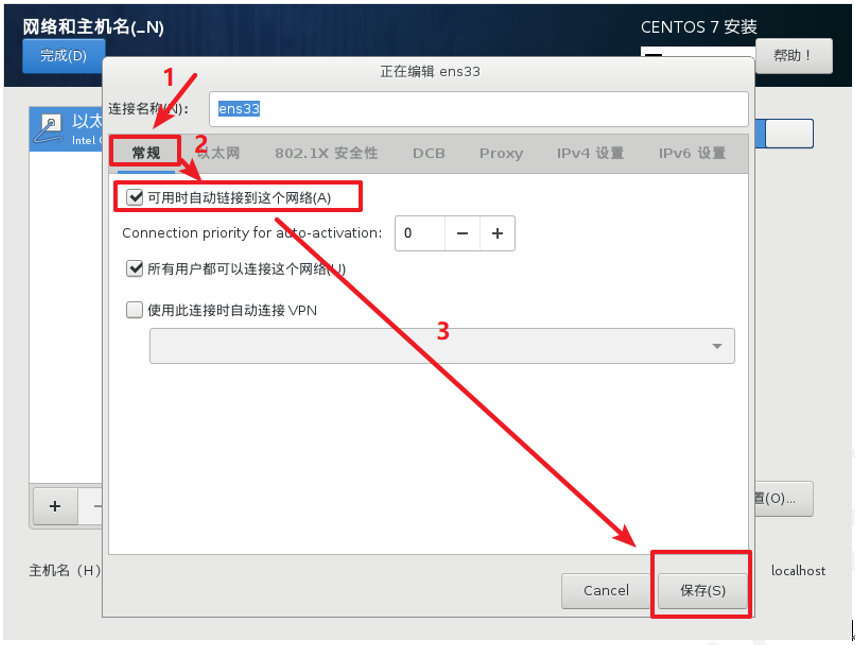

注意：这里一定要将可用时自动链接到这个网络(A)勾选上。否则系统装好之后网卡不会开启。勾选上之后网卡就会自动开启。网卡启动之后就可以连接外网了。

15).网络配置完成

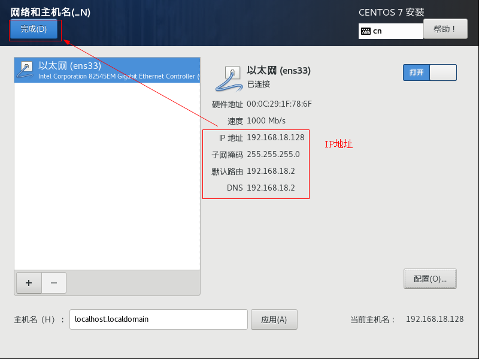

16).配置完成，点开始安装系统

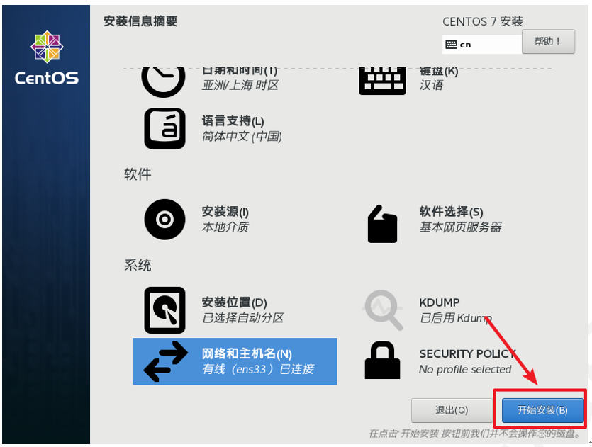 

17).复制文件的过程中可以设置root管理员密码

   

18).密码设置为123456，因为密码太短，点完成两次

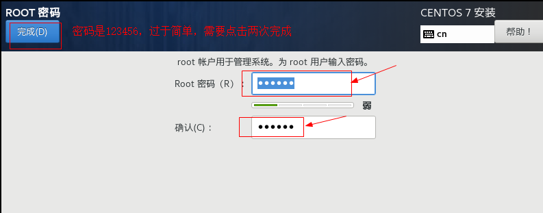

 

19).重新引导系统

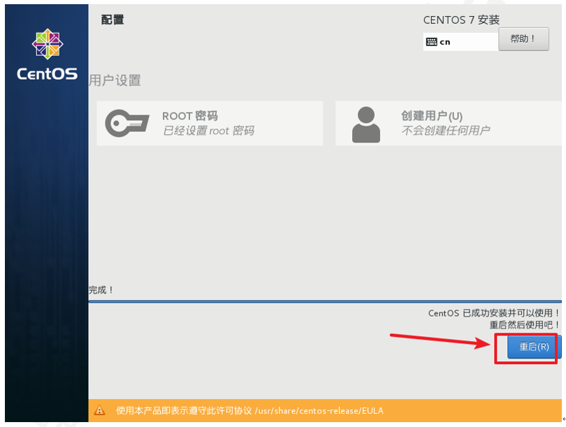


**20). 登录系统**

 

> 注意 : 在Linux系统中，在命令行中输入密码信息，为了保证安全性，密码是不显示的(看似没有输入，实际已经输入了)；


### 3.4 网卡设置(其实我们在上述安装已经开启加载网卡了，如果能够查看到ip不需要操作这一步)

服务器重启完成之后，我们可以通过linux的指令 `ip addr` 来查询Linux系统的IP地址，具体信息如下: 

 

从图中我们可以看到，并没有获取到linux系统的IP地址，这是为什么呢？这是由于启动服务器时未加载网卡，导致IP地址初始化失败而造成的。那么接下来我们就需要来修改网络初始化配置，设定网卡在系统启动时初始化。

**具体操作步骤如下：** 

1). 修改网卡的配置项

```java
cd /				进入根目录
cd etc				进入etc目录
cd sysconfig		进入sysconfig目录
cd network-scripts	进入network-scripts
vim ifcfg-ens33		编辑ifcfg-ens33文件

cd /etc/sysconfig/network-scripts
vim ifcfg-ens33   
    
进入文件后执行如下操作: 
①. 按 i 键 		 进入编辑状态
②. 按↑↓键来移动光标, 删除no,输入yes 
③. 按 ESC 键
④. 输入 :wq
⑤. 按 ENTER	保存退出
```

 


> 备注: 在上述的操作中用到了Linux中的相关指令, 目前大家不用深究, 后面会详细讲解, 目前大家只需要把这个文件的配置项ONBOOT的值有no改为yes即可。


2). 重新启动虚拟机

 

重启之后, 再次输入root的用户名密码，登录到Linux系统之后，可以通过指令 `ip addr` 来查看IP地址。

 

说明：

如果开启后，没有显示ip地址，则需要重启网卡设置：

~~~shell
service network restart
~~~


### 3.5 安装SSH连接工具

#### 3.5.1 SSH连接工具介绍

Linux已经安装并且配置好了，接下来我们要来学习Linux的基本操作指令。而在学习之前，我们还需要做一件事情，由于我们企业开发时，Linux服务器一般都是在远程的机房部署的，我们要操作服务器，不会每次都跑到远程的机房里面操作，而是会直接通过SSH连接工具进行连接操作。

 

SSH（Secure Shell）安全外壳协议，建立在应用层基础上的安全协议。常用的SSH连接工具: 

| SSH工具      | Logo                                     | 说明                      |
| ---------- | ---------------------------------------- | ----------------------- |
| putty      |  | 免费, 界面简单, 功能单一          |
| secureCRT  |  | 收费, 功能强大                |
| xshell     |  | 收费版/免费版                 |
| finalshell |  | 免费, 功能强大, 界面效果好 (课程中采用) |


#### 3.5.2 FinalShell安装

在课程资料中，提供了finalShell的安装包

 

双击.exe文件，然后进行正常的安装即可。

 


#### 3.5.3 连接Linux

**1). 打开finalShell**

 


**2). 建立连接**

 

  


### 3.6 Linux目录结构

登录到Linux系统之后，我们需要先来熟悉一下Linux的目录结构。在Linux系统中，也是存在目录的概念的，但是Linux的目录结构和Windows的目录结构是存在比较多的差异的 。在Windows目录下，是一个一个的盘符(C盘、D盘、E盘)，目录是归属于某一个盘符的。Linux系统中的目录有以下特点： 

**A. / 是所有目录的顶点**

**B. 目录结构像一颗倒挂的树**


**Linux 和 Windows的目录结构对比:** 

 


Linux的目录结构，如下： 

 


根目录/ 下各个目录的作用及含义说明:  

| 编号   | 目录    | 含义                      |
| ---- | ----- | ----------------------- |
| 1    | /bin  | 存放二进制可执行文件              |
| 2    | /boot | 存放系统引导时使用的各种文件          |
| 3    | /dev  | 存放设备文件                  |
| 4    | /etc  | 存放系统配置文件★               |
| 5    | /home | 存放系统用户的文件(普通用户的存储信息位置)★ |
| 6    | /lib  | 存放程序运行所需的共享库和内核模块       |
| 7    | /opt  | 额外安装的可选应用程序包所放置的位置      |
| 8    | /root | 超级用户目录                  |
| 9    | /sbin | 存放二进制可执行文件，只有root用户才能访问 |
| 10   | /tmp  | 存放临时文件                  |
| 11   | /usr  | 存放系统应用程序★               |
| 12   | /var  | 存放运行时需要改变数据的文件，例如日志文件★  |


## 4. Linux常用命令

### 4.1 Linux命令初体验

#### 4.1.1 常用命令演示

在这一部分中，我们主要介绍几个常用的命令，让大家快速感受一下Linux指令的操作方式。主要包含以下几个指令： 

| 序号   | 命令          | 对应英文                 | 作用           |
| ---- | ----------- | -------------------- | ------------ |
| 1    | ls [目录名]    | list                 | 查看当前目录下的内容   |
| 2    | pwd         | print work directory | 查看当前所在目录     |
| 3    | cd [目录名]    | change directory     | 切换目录         |
| 4    | touch [文件名] | touch                | 如果文件不存在,创建文件 |
| 5    | mkdir [目录名] | make directory       | 创建目录         |
| 6    | rm [文件名]    | remove               | 删除指定文件       |

接下来，我们快速的来演示一下这些常用的指令。流水


##### **1). ls**

 

> 指令解读: 
>
> ​	ls 	查看当前目录下的内容(文件及目录)
>
> ​	ls /usr   查看指定目录(/usr)下的内容


##### **2). pwd**

 

> 指令解读: 
>
> ​	pwd	查看当前所在目录


##### **3). cd**

 

> 指令解读: 
>
> ​	cd  /		切换到根目录
>
> ​	cd  /root	切换到/root目录
>
> ​	cd .. 切换到上一级目录
>
> ​    cd ./aa 切换到当前目录下的aa目录下


##### **4). touch**

 

> 指令解读: 
>
> ​	touch  1.txt    在当前目录下创建文件1.txt
>
> ​	touch  2.txt 3.txt 4.txt   一次性创建文件2.txt,3.txt,3.txt
>
> 本质是构建了一个空的文件；


##### **5). mkdir**

 

> 指令解读: 
>
> ​	mkdir 01 	创建文件夹01 


##### **6). rm**

 

> 指令解读: 
>
> ​	rm  4.txt	删除文件 (删除文件时,需要确认,输入y, 代表确定)

==注意:== 

​	 

​	**在执行Linux命令时，提示信息如果显示为乱码，如上图所示。这是由于编码问题导致，只需要修改Linux的编码即可，命令如下：**

~~~markdown
# 1.把LANG="en_us.UTF-8"的配置追加到etc/profile配置文件:
	echo 'LANG="en_US.UTF-8"' >> /etc/profile
	说明：echo表示输出的意思
# 2.追加完后重新加载etc/profile
	source /etc/profile
~~~


#### 4.1.2 Linux命令使用技巧

在我们使用Linux系统命令时，可以使用以下几个技巧： 

1). Tab键自动补全

2). 连续两次Tab键，给出操作提示

3). 使用上下箭头快速调出曾经使用过的命令

4). 使用clear命令或者Ctrl+l快捷键实现清屏


**操作示例:** 

A. 执行指令的时候，对于操作的文件/目录，按一下Tab会自动补全:

 


B. 如果上述以 "1." 开头的文件有多个，可以按两下Tab键，给出操作提示:

 


C. 使用clear命令或者Ctrl+l快捷键实现清屏:


清屏之后，界面就变得干净了: 

 

#### 4.1.3 Linux命令格式

```
command [-options] [parameter]
	
说明: 
	command: 命令名
	[-options]:  选项，可用来对命令进行控制，也可以省略
	[parameter]: 传给命令的参数，可以是零个、一个或者多个
	
注意: 
	[] 	 代表可选
	命令名、选项、参数之间有空格进行分隔
```


**操作示例:** 

 


### 4.2 文件目录操作命令

#### 4.2.1 ls

```
作用: 显示指定目录下的内容 list
语法: ls [-al] [dir]
说明: 
	-a 显示所有文件及目录 (. 开头的隐藏文件也会列出)-all
	-l 除文件名称外，同时将文件型态(d表示目录，-表示文件， l表示软件连的文件)、权限、拥有者、文件大小等信息详细列出
	
注意: 
	由于我们使用ls命令时经常需要加入-l选项，所以Linux为ls -l命令提供了一种简写方式，即ll
	
常见用法: 
	ls -al 	查看当前目录的所有文件及目录详细信息
	ls -al /etc   查看/etc目录下所有文件及目录详细信息
	ll  	查看当前目录文件及目录的详细信息 
```

注意：无论是window或者linux，目录以.开头，则默认隐藏

**操作示例:**

> 1.查看当前目录下所有内容（包含隐藏的）
>
> 2.查看文件详细信息
>
> 3.加参数-a -l查看目录结构
>
> 4.查看指定目录etc下面的目录详细信息
>
> 5.简写查看目录详细信息

 

 


 


 


#### 4.2.2 cd

change directory

```
作用: 用于切换当前工作目录，即进入指定目录
语法: cd [dirName]
	
特殊说明: 
	~	表示用户的home目录
		如果当前用户是root，则切换到root用户下，普通用户则切换到home目录下
	. 	表示目前所在的目录
	.. 	表示目前目录位置的上级目录
	
举例: 
	cd 	..		切换到当前目录的上级目录
	cd 	~		切换到用户的home目录
	cd 	/usr/local	切换到/usr/local目录
```

> 备注: 
>
> ​	用户的home目录 
>
> ​	root用户	/root
>
> ​	其他用户	/home/xxx


操作示例: 

> 1.切换到01目录下
>
> 2.切换到当前目录下即root
>
> 3.切换到上一级目录

 

 

cd .. 切换到当前目录位置的上级目录; 可以通过 cd ../.. 来切换到上级目录的上级目录。

#### 4.2.3 cat

```
作用: 用于显示文件内容
特点：一次性全量查看文件内容
使用场景：一般用在小文件读取的场景（大文件不适用）
语法: cat [-n] fileName

说明:
	-n: 由1开始对所有输出的行数编号(显示行号-number)

举例:
	cat /etc/profile		查看/etc目录下的profile文件内容
	cat -n /etc/profile
```


**操作演示:** 

> 1.使用cat命令查看/etc/profile文件内容

 

cat 指令会一次性查看文件的所有内容，如果文件内容比较多，这个时候查看起来就不是很方便了，这个时候我们可以通过一个新的指令more。

注意事项：如果内容比较少，使用cat命令比较方便。但是如果内容比较多（成百上千行）则不建议使用cat（cat读取数据是全量读取的）；


#### 4.2.4 more

```
作用: 以分页的形式显示文件内容
语法: more fileName
特点：独占一个命令终端窗口，并且适合读取大的文件内容，且按照百分比加载展示；
使用场景：读取一些大文件，且从头开始读取的场景
操作说明:
    回车键 	向下滚动一行
    空格键 	向下滚动一屏
    b 		返回上一屏
    q或者Ctrl+C	退出more
	
举例：
	more /etc/profile		以分页方式显示/etc目录下的profile文件内容
```


**操作示例：**

> 1.使用more命令查看 /etc/profile 文件内容

 

当我们在查看一些比较大的文件时，我们可能需要经常查询文件尾部的数据信息，那这个时候如果文件很大，我们要一直向下翻页，直到最后一页，去看最新添加的数据，这种方式就比较繁琐了，此时，我们可以借助于tail指令。

思考问题：

​	如果某个文本比较大，而查询的内容比较靠前，则使用more比较合适，但是如果要查询的内容在文件的末尾，使用tail比较合适

​	如果是小文件查询，则使用cat比较合适


#### 4.2.5 tail

```
作用: 查看文件末尾的内容
语法: tail [-f] fileName
使用场景：可以实时查看文件末尾行的动态变化，方便实时追踪
说明:
	-f : 实时的动态读取文件末尾内容并显示，通常用于日志文件的内容输出
	
举例: 
tail /etc/profile		显示/etc目录下的profile文件末尾10行的内容
tail -20 /etc/profile	显示/etc目录下的profile文件末尾20行的内容
tail -f /itcast/my.log	动态读取/itcast目录下的my.log文件末尾内容并显示
				一旦使用-f后，命令会独占一个终端窗口；
				使用ctrl+c退出
```


**操作示例：** 

>       1.默认查询文件尾部10行记录
>
> 2. 可以通过指定参数设置查询尾部指定行数的数据
> 3. 动态读取文件尾部的数据


A. 默认查询文件尾部10行记录

 

B. 可以通过指定参数设置查询尾部指定行数的数据

 

C. 动态读取文件尾部的数据

 

在窗口1中执行指令 `tail -f 1.txt` 动态查看文件尾部的数据。然后在顶部的标签中右键选择 "复制标签"，打开新的窗口2 , 此时再新打开的窗口2中执行指令 `echo 1 >> 1.txt` , 往1.txt文件尾部追加内容，然后我们就可以在窗口1中看到最新的文件尾部的数据。

如果我们不想查看文件尾部的数据了，可以直接使用快捷键 Ctrl+C ， 结束当前进程。

说明：echo 内容 >> 文件名称 ：将指定内容写在指定文件的末尾；

​		

#### 4.2.6 mkdir

```
作用: 创建目录
语法: mkdir [-p] dirName

说明: 
	-p: 确保目录名称存在，不存在的就创建一个。通过此选项，可以实现多层目录同时创建

举例: 
    mkdir itcast  在当前目录下，建立一个名为itcast的子目录
    mkdir -p itcast/test   在工作目录下的itcast目录中建立一个名为test的子目录，若itcast目录不存在，则建立一个
```


**操作演示:**

> 1.创建itcast目录
>
> 2.创建itheima/java目录

 


#### 4.2.7 rmdir

```
作用: 删除空目录 （remove directory）
语法: rmdir [-p] dirName

说明:
	-p: 当子目录被删除后使父目录为空目录的话，则一并删除
		反之，如果父目录不为空，则不删除

举例:
    rmdir itcast   删除名为itcast的空目录
    rmdir -p itcast/test   删除itcast目录中名为test的子目录，若test目录删除后itcast目录变为空目录，则也被删除
    rmdir itcast*   删除名称以itcast开始的空目录
```


**操作演示:** 

> 1.删除空目录
>
> 2.删除非空目录
>
> 3.使用*通配符删除目录


A. 删除空目录

 


B. 删除非空目录

 


C. 使用*通配符删除目录

 

> *: 是一个通配符，代表任意字符； 
>
> rmdir  itcast* : 删除以itcast开头的目录
>
> rmdir  *itcast : 删除以itcast结尾的目录


#### 4.2.8 rm

```
作用: 删除文件或者目录
语法: rm [-rf] name

说明: 
    -r: 将目录及目录中所有文件（目录）逐一删除，即递归删除
    -f: 无需确认，直接删除（force）
	
举例: 
    rm -r itcast/     删除名为itcast的目录和目录中所有文件，删除前需确认
    rm -rf itcast/    无需确认，直接删除名为itcast的目录和目录中所有文件
    		     可删除一切的目录和文件，无需确认
    rm -f hello.txt   无需确认，直接删除hello.txt文件
    rm -rf *.log  删除当前路径下以log结尾的目录或者文件
```


**操作示例:** 

> 1.递归强制删除itheima目录下所有的文件及目录

 

==注意: 对于 rm -rf xxx 这样的指令，在执行的时候，一定要慎重，确认无误后再进行删除，避免误删。==

### 4.3 拷贝移动命令

#### 4.3.1 cp

```
作用: 用于复制文件或目录（copy）
语法: cp [-r] source dest
	-r:表示对目录递归复制
	source：源文件/目录
	dest：目的地

说明: 
	-r: 如果复制的是目录需要使用此选项，此时将复制该目录下所有的子目录和文件

举例: 
    cp hello.txt itcast/            将hello.txt复制到itcast目录中
    cp hello.txt ./hi.txt           将hello.txt复制到当前目录，并改名为hi.txt
    cp -r itcast/ ./itheima/    	将itcast目录和目录下所有文件复制到itheima目录下
    cp -r itcast/* ./itheima/ 	 	将itcast目录下所有文件复制到itheima目录下
```

注意事项：在linux下的文件中没有后缀，我们一般自己添加一个后缀是为了可读性；例如hi.txt 这个文件，一看就是普通文件了。 .txt 也是文件名的一部分。再比如123.c显然这里面很可能写的是c代码。

操作示例: 

> 1.在当前目录下将1.txt 复制一份，命名为001.txt
>
> 2.将001.txt 拷贝一份，放到itcast目录下
>
> 3.拷贝itcast目录，命名为itheima

 

 

 

如果拷贝的内容是目录，需要加上参数 -r 

经典场景：我们做一些配置修改时，怕把原始的文件改错，那么一般通过cp命令先备份一份，如果出问题，还可使用备份的文件；

#### 4.3.2 mv

```
作用: 为文件或目录改名、或将文件或目录移动到其它位置（move）
语法: mv source dest

举例: 
    mv hello.txt hi.txt                 将hello.txt改名为hi.txt(移动hello.txt到当前位置，并重命名=重命名)
    mv hi.txt itheima/                  将文件hi.txt移动到itheima目录中
    mv hi.txt itheima/hello.txt   		将hi.txt移动到itheima目录中，并改名为hello.txt
    mv itcast/ itheima/                 如果itheima目录不存在，将itcast目录改名为itheima
    mv itcast/ itheima/                 如果itheima目录存在，将itcast目录移动到itheima目录中
```


**操作示例:** 

mv 命令既能够改名，又可以移动，具体是改名还是移动,系统会根据我们输入的参数进行判定(如果第二个参数dest是一个已存在的目录,将执行移动操作,其他情况都是改名)

> 1.将001.txt改名为a.txt
>
> 2.将itheima改名为heima
>
> 3.将a.txt移动到01目录下


 

### 4.4 打包压缩命令

```
作用: 对文件进行打包、解包、压缩、解压
语法: tar  [-zcxvf]  fileName  [files]
    约定：
    	包文件后缀为.tar表示只是完成了打包，并没有压缩
    	包文件后缀为.tar.gz表示打包的同时还进行了压缩

说明:
    -z: z代表的是gzip，通过gzip命令处理文件，gzip可以对文件压缩或者解压
    -c: c代表的是create，即创建新的包文件(打包)--》（如果c与z参数配合，则表示打包并压缩）
    -x: x代表的是extract，实现从包文件中还原文件(拆包)-->(如果x与z参数配合，则表示解压并拆包)
    -v: v代表的是verbose，显示命令的执行过程
    -f: f代表的是file，用于指定包文件的名称
    注意点：命令中x与c二选一，如果z配合c一块使用，表示打包并压缩
    		如果z配合x一块使用，表示解压并拆包

举例：
    打包
        tar -cvf hello.tar ./*		  		将当前目录下所有文件打包，打包后的文件名为hello.tar
        tar -zcvf hello.tar.gz ./*		  	将当前目录下所有文件打包并压缩，打包后的文件名为hello.tar.gz
		
    解包
        tar -xvf hello.tar		  			将hello.tar文件进行解包，并将解包后的文件放在当前目录
        tar -zxvf hello.tar.gz		  		将hello.tar.gz文件进行解压，并将解压后的文件放在当前目录
        tar -zxvf hello.tar.gz -C /usr/local     将hello.tar.gz文件进行解压，并将解压后的文件放在/usr/local目录

```

```sh
打包: 
	tar  -cf  ziliao.tar a.txt b.txt
	tar  -cvf  ziliao.tar a.txt b.txt
	tar  -zcvf  ziliao.tar.gz a.txt b.txt  **************
解压:
      tar -xf ziliao.tar
      tar -zxf ziliao.tar.gz
      tar -zxvf ziliao.tar.gz  **************
```

注意：

​	指令f一定放到最后

**操作示例:** 

> 1.打包,将itcast目录打包，打包为itcast.tar
>
> 2.将itcast目录打包并压缩，生成压缩包itcast.tar.gz
>
> 3.将itcast.tar解包。需要删除当前目录中的itcast目录
>
> 4.将压缩包itcast.tar.gz解压到当前目录下
>
> 5.将压缩包itcast.tar.gz解压到指定目录01下

A. 打包

 


B. 打包并压缩

 


C. 解包

 


D. 解压

 

解压到指定目录,需要加上参数 -C

 


### 4.5 文本编辑命令

文本编辑的命令，主要包含两个: vi 和 vim，两个命令的用法类似，我们课程中主要讲解vim的使用。


#### 4.5.1 vi&vim介绍

作用: vi命令是Linux系统提供的一个文本编辑工具，可以对文件内容进行编辑，类似于Windows中的记事本

语法: vi fileName

说明: 
  1). vim是从vi发展来的一个功能更加强大的文本编辑工具，编辑文件时可以对文本内容进行着色，方便我们对文件进行编辑处理，所以实际工作中vim更加常用。
  2). 对于vim命令，如果在你的linux系统上没有安装，需要我们自己安装。可以使用下面的命令来完成安装：`yum install vim`


#### 4.5.2 vim安装(如果linux系统没有需要安装，已经存在了就不需要安装)

命令： yum install vim

 

安装过程中，会有确认提示，此时输入 y，然后回车，继续安装：

 

 


#### 4.5.3 vim使用

#### 【1】vim介绍

作用: 对文件内容进行编辑，vim其实就是一个文本编辑器
语法: vim fileName
说明: 
	1). 在使用vim命令编辑文件时，如果指定的文件存在则直接打开此文件。如果指定的文件不存在则新建文件。
	2). vim在进行文本编辑时共分为三种模式，分别是 命令模式（Command mode），编辑模式（Insert mode）和底行模式（Last line mode）。这三种模式之间可以相互切换。我们在使用vim时一定要注意我们当前所处的是哪种模式。

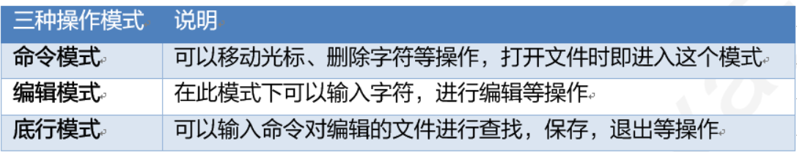


#### 【2】vim三种模式的切换


#### 【3】vim操作语法

##### 1）在命令模式下进入编辑模式的按键

| **命令** | **描述**               |
| -------- | ---------------------- |
| **i**    | 在光标的前面插入字符   |
| **a**    | 在光标的后面添加入字符 |
| **o**    | 在光标下一行插入字符   |

#####  2）命令模式下常用的编辑命令

| **命令**    | **描述**                                                |
| ----------- | ------------------------------------------------------- |
| **yy**      | 复制当前行                                              |
| **p**       | 粘贴                                                    |
| **dd**      | 删除当前行                                              |
| **u**       | 撤销                                                    |
| **/字符串** | 搜索字符串的内容<br />n： 查找下一个<br />N：查找前一个 |

##### 3）在命令模式下进入底行模式的按键

| 命令     | 描述                       |
| -------- | -------------------------- |
| **:wq**  | write  quit 保存退出       |
| **:q!**  | 强制退出，不保存           |
| **:wq!** | 强制保存退出，用于只读文件 |

​	

#### 【4】vim操作

##### 操作1：在HelloWorld.java文件输出语句中添加itcast

1. 将课下资料中的HelloWorld.java文件导入到linux系统中root目录下

   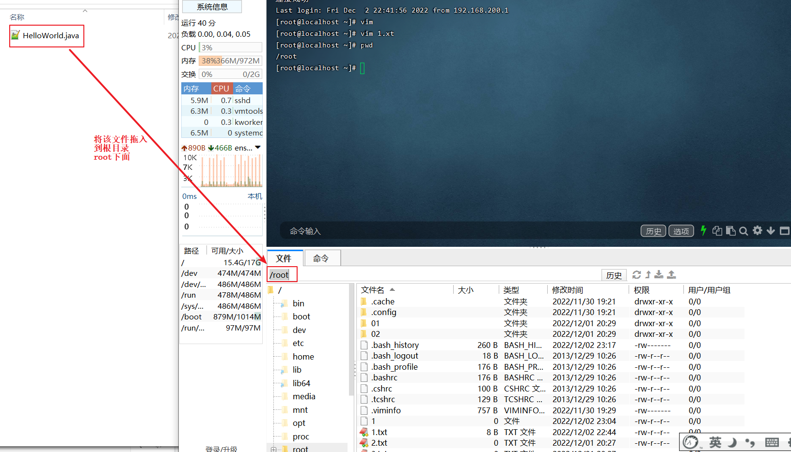

2. 在命令行中切换到root目录下，然后查看文件和子目录

   

3. vim HelloWorld.java  用vim编辑器打开HelloWorld.java文件，这时进入命令模式。

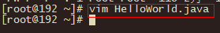


​	4.命令行模式只能对内容的整行操作，不能单独修改内容，要想修改必须进入到编辑模式。进入到编辑模式有三种，分别是按字母：i(在当前光标前插入)  a(在当前光标后插入)  o(换行插入)  .  

​	这里按i键，进入编辑模式，按向下和左右键在双引号后面输入itcast：

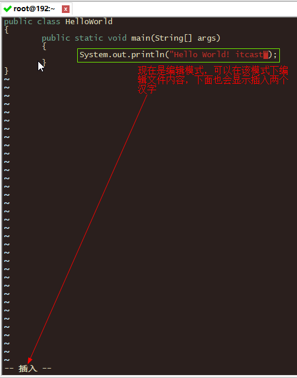

注意：编辑模式只能编辑。                               

​	5.按Esc键，进入**命令模式**，按冒号进入**底行模式**

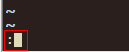

​	6.输入:wq回车，表示保存并退出

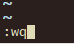

​	7.使用cat HelloWorld.java查看文件的内容


##### 操作2在HelloWorld.java文件中演示复制 粘贴 删除行同时编辑内容不保存

1. 使用vim打开HelloWorld.java文件，进入命令模式。
2. 将光标移动到System.out这一行，按yy复制
3. 按3次p，粘贴这一行三次

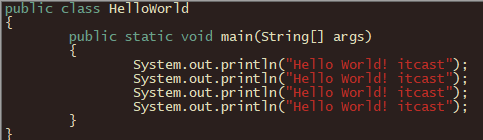

​                                                   

​	4.按dd删除最后一行

​	5.按i进入编辑模式

​	6.再任意输入一些内容 黑马

​	7.在按Esc进入命令，按冒号进入底行模式

​	8.输入q!回车，不存盘强行退出。

​	9.使用cat HelloWorld.java发现HelloWorld.java没有变化


#### 小结

1. 三种操作模式：

   命令行模式，编辑模式  ，底行模式

   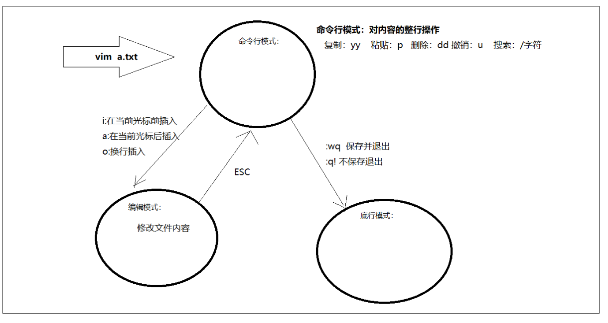

2. 命令模式-> 编辑模式：i,a,o

3. 编辑模式-> 命令模式：ESC

   1. yy：复制当前行
   2. p  ：粘贴
   3. dd  删除当前行

4. 命令模式-> 底行模式： :

   1. wq ： 保存并退出
   2. q! ：强制退出
   3. wq! : 强制退出并保存 


### 4.6 查找命令

#### 4.6.1 find

作用: 在指定目录下根据文件的名称递归查找文件

| `find [目录名][-name '查询字符串']` | 功能                                  |
| ----------------------------------- | ------------------------------------- |
| **无参名**                          | 搜索当前目录下所有的文件和子目录      |
| **目录名**                          | 搜索指定目录下所有的文件和子目录      |
| **-name '查询字符串'**              | 指定要搜索的字符串 ***** 匹配多个字符 |

```
作用: 在指定目录下根据文件的名称递归查找文件
语法: find dirName -option fileName
举例:
    find  .  –name "*.java"			在当前目录及其子目录下查找.java结尾文件
    find  /itcast  -name "*.java"	在/itcast目录及其子目录下查找.java结尾的文件
```

**操作示例:** 

> 1.root目录下创建多个.txt文件，查找txt文件

 


#### 4.6.2 grep

grep是一种强大的文本搜索工具，它能使用字符串搜索文本，并把匹配的行和行号打印出来。

- find命令：查找文件或目录(搜索文件夹和整个文件)
- grep命令：搜索文件内容的字符串

**语法格式**

| **grep  [参数]** **字符串** **文件名** | 参数说明                       |
| -------------------------------------- | ------------------------------ |
| **作用**                               | 从指定的文件中搜索指定的字符串 |
| **-n**                                 | 显示行号                       |
| **-v**                                 | 显示不匹配的行                 |
| **-i**                                 | 忽略大小写查找                 |

**操作演示**


>1.在Demo.java中搜索close字符串
>
>2.在Demo.java中搜索close字符串，并且显示行号
>
>3.在Demo.java中忽略大小写搜索insert字符串并且显示行号
>
>4.在Demo.java中搜索没有close的行和行号

1. 在Demo.java中搜索close字符串


​	2.在Demo.java中搜索close字符串，并且显示行号

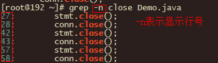

​	3.在Demo.java中忽略大小写搜索insert字符串并且显示行号

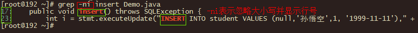

​	4.在Demo.java中搜索没有close的行和行号


小结：

~~~
grep 参数 搜索的字符串 搜索的文件
说明：
	1.在文件外部就可以进行字符串的搜索行
	2.参数：
		i:忽略大小写
		n:行号
		v:不匹配
	3.搜索的内容所属的文件必须存在当前目录中
~~~


